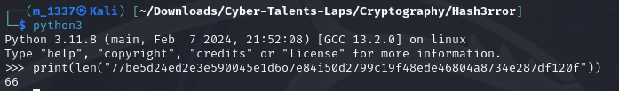
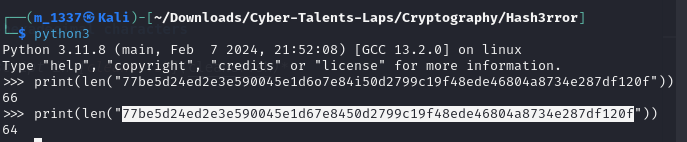

# solve hash3rror
#### https://cybertalents.com/challenges/cryptography/hash3rror

### Find hash length

Note: SHA-1 is **40** hexadecimal digits. Also the hash has non-hexadecimal characters.

### Remove nob-hexadecimal characters
*use the bash script in [cleaner.sh](cleaner.sh)*

Note: SHA256 is **64** hexadecimal digits.

Crack the hash `s3cr3tpassword`

Note: password = sha-1(hash-result)

### Create a sha1
`printf "s3cr3tpassword" | sha1sum`
The flag is the output

### Recourses 
[sha256 cracker](https://www.dcode.fr/sha256-hash)

>Find More on ==> github.com/MedhatHassan