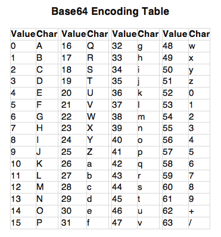

# Solve Postbase 
### https://cybertalents.com/challenges/cryptography/postbase

R[corrupted]BR3tCNDUzXzYxWDdZXzRSfQ==
Note that the flag is encoded base64 and length `26`

Base64 must be a multiple of 4 if not we add padding with `=` with the maximum number of `=` is 3

We can gess that we have 2 corrupted characters

Write a python script to bruteforce the missing characters
*the script is in [decoder](decoder.py) file*

>Find More on ==> github.com/MedhatHassan