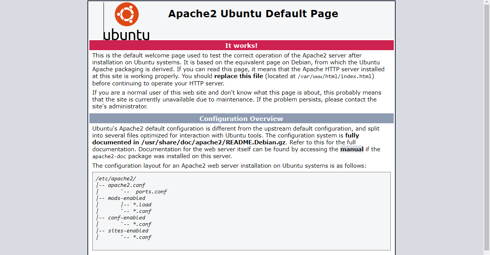
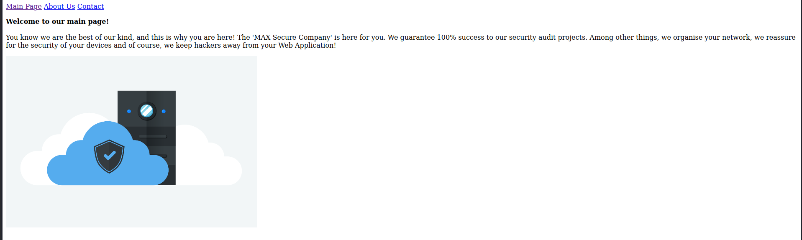
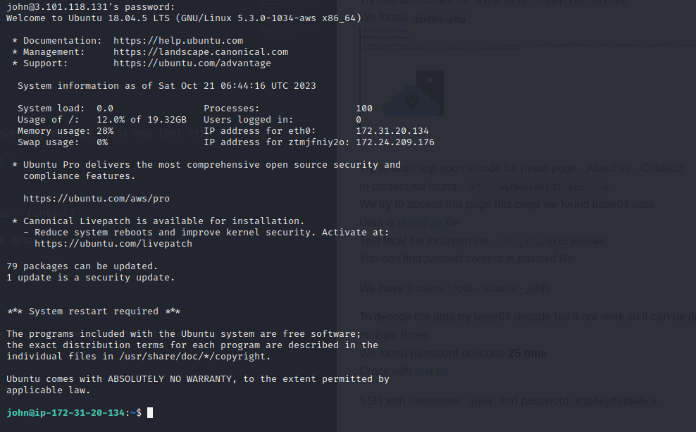
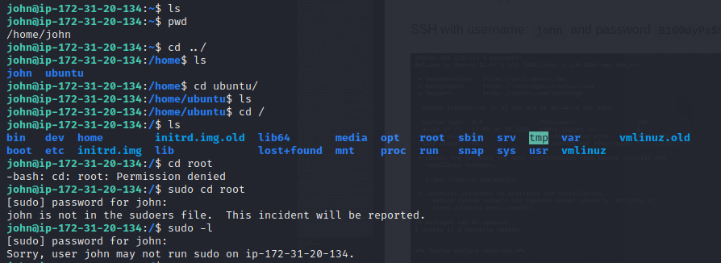

# Solve Shadower 
#### https://cybertalents.com/challenges/machines/Shadower

open IP on browser

Apache2 Ubuntu Default Page

Run nmap scan via `nmap -A -T5 13.56.150.8`
*You can find output in nmap file*

The version of webserver is `apache2.4.29` and we have only port 22 (ssh) and (80) http

Try find directories via `dirb http://184.169.231.94` 
We found `index.php`

Try to scan app source code for (main page - About us - Contact)
In contact we found : `<!-- my0wns3cr3t.sec -->`
We try to access this page this page we found base64 data
*Data is in text.py file*
Test local file inclusion via `../../../etc/passwd`
*You can find passwd content in passwd file*

We have 3 users : root - ubuntu - john

To decode the data try base64 decode but it not work so it can be decoded multiple times.
We found password decoded **25 time**.
*Crack with text.py*

SSH with username: `john` and password `B100dyPa$$w0rd`

Try to investigate the machine
