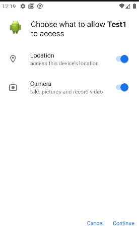
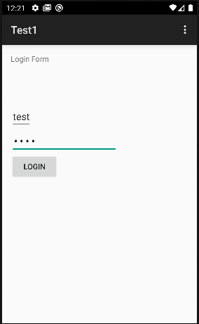

# Solve Android101
### https://cybertalents.com/challenges/mobile-security/android101

## Run the app 
### Run the app on android studio emulator 

it asks to access location and camera

it has a simple login form 

## Static code analysis 

### Decompile APK with apktool

``` bash
apktool d app.apk 
```

### Strart with  `Manifest.xml`

The app is taking access to `ACCESS_NETWORK_STATE , ACCESS_COARSE_LOCATION , CAMERA`

#### Search for any sensitive data in `/res/values/strings.xml`
We found search function with queries and a login form 

### Decompile APK with jadx-Gui

#### analyze the MainActivity Class
```
public class MainActivity extends ActionBarActivity {
    public int weezy = 152;

    private String getUser() {
        String resp = this.weezy > 152 ? "Legolas" : "Aragon";
        this.weezy += 100;
        return resp;
    }

    private String getPass() {
        return this.weezy > 152 ? "Saruman" : "Gandalf";
    }
```
MainActivity Class extends ActionBarActivity, providing backward-compatible action bar features.

public weezy is an integer field initialized to 152.
getUser() method returns "Legolas" if weezy is greater than 152, otherwise returns "Aragon". It increments weezy by 100 anyway.
getPass() method returns "Saruman" if weezy is greater than 152, otherwise returns "Gandalf".

#### Login Logic
When the button is clicked:

1. Username and password are retrieved from the EditText fields.
2. Logs the entered credentials.
3. Compares the entered username and password with values returned by `getUser()` and `getPass()`.
4. If they match *(have a value of 0)*, it logs "granted access", shows a **"access granted!"** toast, and starts MainActivity2.
5. If they don't match, it shows an **"access denied!"** toast.

The `getUser()` function will be called first.
The string str will have the value `Legolas`.
The value of the weezy variable will be increased by 100, so the value will be **252**.
The `getPass()` function will be called.
Since the current value of the variable weezy is **252**, the `getPass()` function will have the value `Saruman`.

So the credentials are LegolasSaruman 

#### Get the MD5 of the credentials as the challenge description 
``` bash 
echo -n "LegolasSaruman" | md5sum 
```
