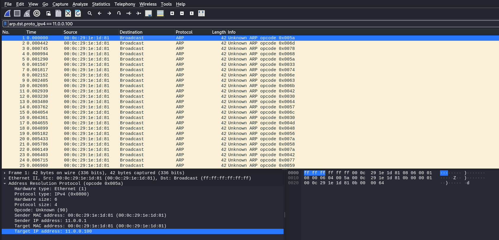

# Solve Arp Storm
### https://cybertalents.com/challenges/network/arp-storm

#### Challenge Description
An attacker in the network is trying to poison the arp table of 11.0.0.100, the admin captured this PCAP.

## Analyze the pcap with wireshark:

### Findings:
- Total Packets: **68** ARP packets.
- Destination IP: All target `11.0.0.100`.
- Opcode: `0x005a` (**non-standard**)
- Attacker's MAC Address: 00:0c:29:1e:1d:81
- Attacker's (sender) IP: `11.0.0.1`

*Note: **Standard** ARP opcodes are `1` (request) and `2` (reply).*

### Extract all the packets with [extract.py](extract.py)
*the script results is in [arp_packet_data.txt](arp_packet_data.txt)*

#### Eaxmple of extracted packets 
```bash
Packet Index: 0
Opcode: 90
Sender MAC: 00:0c:29:1e:1d:81
Sender IP: 11.0.0.1
Target MAC: 00:0c:29:1e:1d:81
Target IP: 11.0.0.100
----------------------------------------
Packet Index: 1
Opcode: 109
Sender MAC: 00:0c:29:1e:1d:81
Sender IP: 11.0.0.1
Target MAC: 00:0c:29:1e:1d:81
Target IP: 11.0.0.100
```

### Extract the flag with [flag.py](flag.py)
Reading the Packets File then extracting `Opcodes` and converting `Opcodes` to ASCII.

```bash
python flag.py   
Extracted ASCII string: ZmxhZ3tnckB0dWl0MHVzXzBwY09kZV8xc19BbHdAeXNfQTZ1U2VkX3QwX3AwMXMwbn0=
```

#### Decodeing Based64 string 
```bash
echo "ZmxhZ3tnckB0dWl0MHVzXzBwY09kZV8xc19BbHdAeXNfQTZ1U2VkX3QwX3AwMXMwbn0=" | base64 -d                                          
flag{gr@tuit0us_0pcOde_1s_Alw@ys_A6uSed_t0_p01s0n}   
```

The Flag is `flag{gr@tuit0us_0pcOde_1s_Alw@ys_A6uSed_t0_p01s0n}`

>Find More on ==> github.com/MedhatHassan