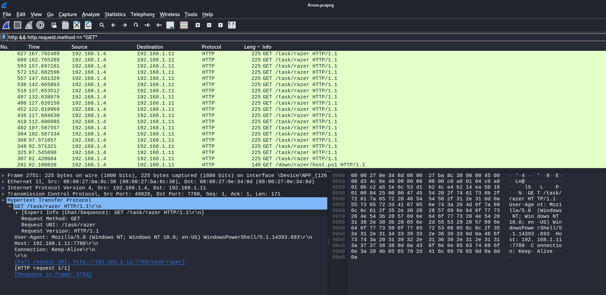
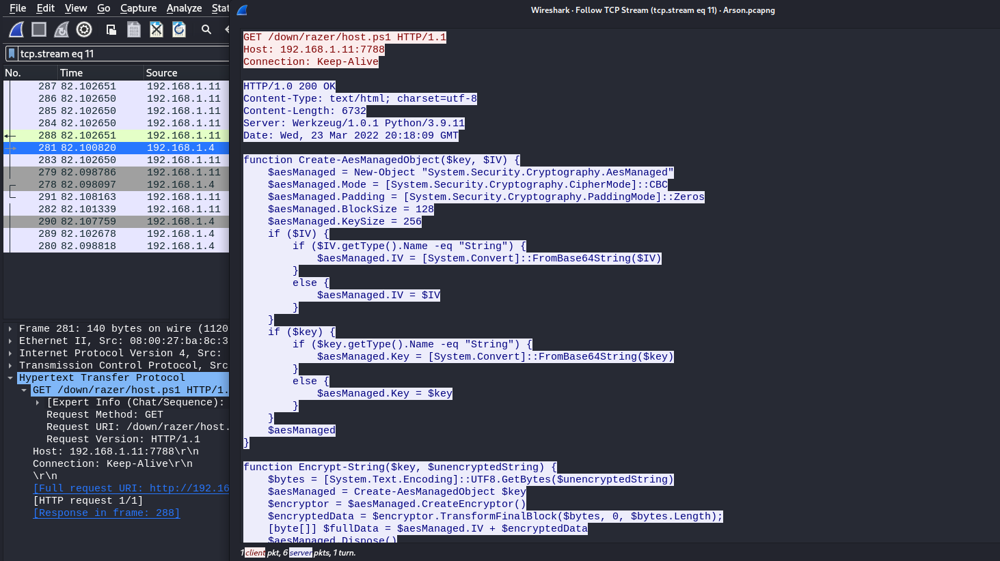
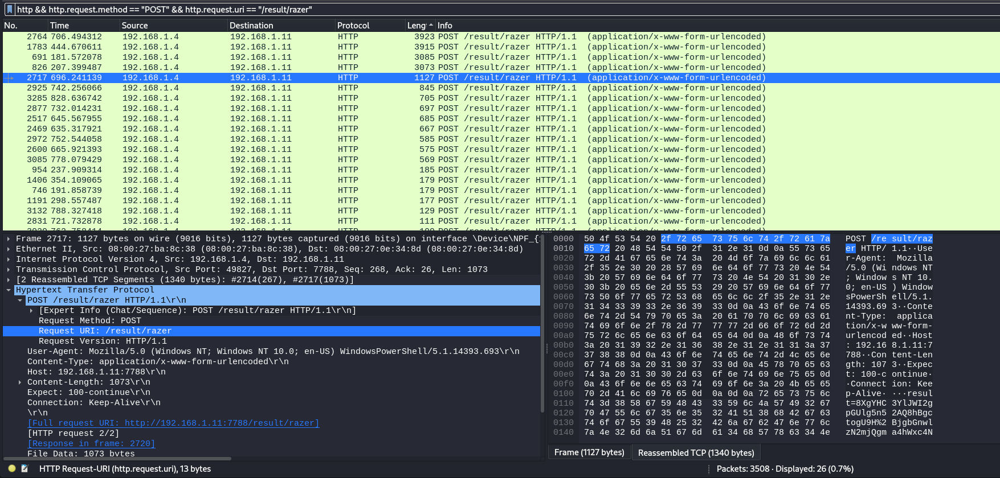

# Solve Arson
### https://cybertalents.com/challenges/network/arson

#### Challenge Description
It's all started when i executed the script that my friend sent to me can you retrieve the flag that was stolen?

## Analyze with wireshark


We found HTTP request that can be used to steal the flag from the pc.
### Extract all http request with [http.py](http.py)

- Source IP: `192.168.1.4` is consistently making requests to `192.168.1.11` on port `7788`. This internal communication could be part of the attack.

- User-Agent: The User-Agent in most requests is `Mozilla/5.0 (Windows NT; Windows NT 10.0; en-US) WindowsPowerShell/5.1.14393.693`, which indicates that **PowerShell** is being used to make these requests. This is unusual for normal HTTP traffic and could be a sign of malicious activity.

#### Analyze HTTP GET Requests
1. The GET requests are repeatedly fetching `/task/razer` and `/down/razer/host.ps1`. The latter (host.ps1) is particularly suspicious as it suggests a **PowerShell script** is being downloaded.
#### Key Components of the Script

*The PowerShell script is in [host.ps1](host.ps1)*
- AES Encryption/Decryption Functions:
  - Create-AesManagedObject: Creates an AES object with CBC mode and zero padding.
  - Encrypt-String: Encrypts a string using AES.
  - Decrypt-String: Decrypts a string using AES.

- Initialization Function:
  - First: Collects system information (hostname, username, and local IPs), encrypts it, and sends it to the C2 server.
- Command Execution Functions:
  - exec: Executes a command or binary and captures the output.
  - Execute: Continuously polls the C2 server for tasks, executes them, and sends the results back to the server.
- Main Execution:
  - The script initializes communication with the C2 server using the First function.
  - It then enters a loop (Execute function) to receive and execute tasks from the server.


1. The repeated requests to `/task/razer` also indicate a **command-and-control (C2) communication**, where the attacker is sending commands to the compromised system.

#### Analyze HTTP POST Requests
The POST requests are sending data to `/record/razer` and `/result/razer`. The `/result/razer` endpoint is particularly interesting as it could be where the stolen data (including the flag) is being sent.

The Content-Length varies, with some requests having **very large** payloads (e.g., 3031, 3861 bytes), which could indicate **exfiltration of data**.

So the flag is likely embedded in one of the POST requests to `/result/razer`

### Analyze post reqests to `/result/razer`

the filter is `http && http.request.method == "POST" && http.request.uri == "/result/razer"`

We found 26 packets.
#### Example
```
POST /result/razer HTTP/1.1
User-Agent: Mozilla/5.0 (Windows NT; Windows NT 10.0; en-US) WindowsPowerShell/5.1.14393.693
Content-Type: application/x-www-form-urlencoded
Host: 192.168.1.11:7788
Content-Length: 1073
Expect: 100-continue
Connection: Keep-Alive

result=8XgYHC3YlJWI2gpGUlg5n52AQ8hBgctogU9H%2BjgbGnwlzN2mjQgma4hWxc4NPJNyEa5SSelSMkjuneI2DTc43zd2iwxKX3KNZ9DjPOHMQ3yveTOTCZl6qayu1yAUgMSUU67VW4YaxBRKuuFgiCOUDeqxbnVFa4K3eT3pfQkQcWDGM1ua0GB%2FycktGdOO7WMpZcNm8y%2BnbXOOG9L2sW%2Bbmeua6xgNVIj4pXzIBhEiUr7UijyqemWg0RaUhBOXqv0Ado%2FVsfar5iPyf7Bx%2BIiPYSjSf95TTH9A96iaTrT9B%2F35vhAgaLMfu0ybX7DM5NwdOt6b76maKySMwwXE8L23NyOTdiIpuKiYg3oWZbQroB28AKZZ7rmhV7kmZpFMMcuz2M03mKAEG2lffw%2BuiJc08%2BoEIKcFT2%2BzvnEvazuSwn1piXOWoU7qO50GNUA1YpfSj%2BIT9fCzylLG5r%2FFWoGpMTiOzKxI1ULXL1zy0AbKTH5ovcMKLYIerbb8ounRP3hie%2F1h7tqi%2B5CbQxdhyCgiw0mP2gsbQm6q%2FgNsUyT4DMKosZg26v3e4reR6YYkBYU8m0EQ8Fo%2Bz%2Bm4KiPgEuud8bURUilk41KVKB%2FpLa7IF31klSdD4bFt1Ob8F3zgtSJgJNzRsEuOAehs8uxRPEl9V25xGC9XZRXwRddn%2FtyGnKf5W3YRarKFUqvcZutQWwB3Jcs3Aa%2BAMB5Rq9zf53IZss13DJjhrFBt9j1nxu3jr9fEGo0vf0R6lSZPRkksKr2b7REC52qc5F3nFROyG%2BeLNuFQba%2BRF3a7xIpc3bZi7R70rVTPt0SL%2B1%2ByUqDGqG66yjuD23v9BA2TtKR5Lr4vErqq7xquP5K1mhgfI2kmB2WFyUmsop4pRLlv3kvg4mR7eRHl%2F2isYP8Rzq8lpt4rovbQjzCBf93QRxGljWxyCpHbMSDbDAloT3NRo55yYDF%2FbT8fOcR4%2FB3aeOaL%2F30lzgI%2F6Ox3v%2BzsOOx4Uyehnw0%3D
```
We Found data of the POST request in `result`. 
### Extract POST data with tshark
```bash
tshark -r Arson.pcapng -Y 'http && http.request.method == "POST" && http.request.uri == "/result/razer"' -T fields -e http.file_data -E separator=, -E header=y
```

extract POST data from packets matching the filter `http && http.request.method == "POST" && http.request.uri == "/result/razer"`

Explanation of the Command
- `-r Arson.pcapng`: Specifies the input PCAP file.
- `-Y 'http && http.request.method == "POST" && http.request.uri == "/result/razer"`: Applies the filter to select only POST requests to `/result/razer`.
- `-T fields`: Specifies that the output should be in field format.
- `-e http.file_data`: Extracts the POST data from the packets.
- `-E separator=,`: Sets the field separator to a comma .
- `E header=y`: Includes a header in the output.

## Decrypt the flag with AES-256-CBC
Using the Key in the powershell script `$key = "llm0xB8WOfv9Ssq9+f0sIMFK6OyQHOzhdenMzRInqXA="`
we can Decrypt all the messages sent to the attacker via post requests *stored in [PostData.txt](PostData.txt)*.
### Use [decrypt.py](decrypt.py) to get all decrypted messages.
#### Example 
```bash 
Original: gP1W7nbZrtDC2ZOrSPs93VnH17ZOHl9BOuyOOOKcMf6bxJRn1dGhMFT1L3LfM88UHwdc6nbyY4O%2BLE8QmdQZxViocaDrOXz6SFV4%2FmR35dPoWgx3FtakLdYAJtLBd4V6t%2Bp9MNi36dGRnZOxW3eb5rMTpGolN%2BcBCSt%2FpdntOw2BDSj9YvE9iH2PTHw%2FSXYSzqzcFHcs3A9IM6C45sN3D3NS9D6Wxu4P1myJEV61Q4MObszgug1mTKi9m8hbN%2FFnQ3MFR0jgpkfcN%2BAoievOPi5pwU3WDBIFm6TnsOgxOX4Q4m%2BOia3FsX3%2F1PCDf%2FxCJCD1J0cqcRjLj6aiEfcXu6qZABk8cQ7BjSJymlOOeAgSxjbdeaauMYqhVJc5s6j9%2BditUN5UDok%2FUZ3ZvETp4wk7wiE3dS6hZqtl%2FY2uO4D%2Bt5c4z8KF5LXBBlN2xsL%2BxDpJ%2ButaPFvLQKJ6R1PKFjnyOVwUELtjQcVbERZtkBvMNpmwyv17SMvLh%2FVIZJH%2F2v%2F2PPyIncmw2RPB7T8YJOrEoEWa6RL%2F1l2DTT7wqKfWviQTTBezHfUT4XZgkX2BeWN0e8U19%2FGszE5Ogg%2BLKkUpV7tF6JlTHAp93sY0qCDA3bWHVTPAYOAUAduvYl7NSON9Br%2FA4%2Bu1yNHwyNnATaOu8AcDLJHlfn8sLcOXXy2xrYK7ezkz1aErs9fWN2IYKyjazuiQDjBDLHOAdSI2b4hLYX3RptuozTZ8CE24i3VTg%2Fh9xfCTJb%2BmIuxrQRoZqaIJNSdYhEuTiT3BfcmR%2FqYI3hnDAMo6mvXjtGZJgEH4iQAWWQSqAFWvZgupTXtbAkEYnImUe%2FsnC0EsC%2FG%2FSqerXdTTYYxFMhA3YIgR4WE3s%2Fq2wIsVgIag7UZhNj31lW1Hp6fr2pBlrNzuvo%2BSZ19YjU1oF0lvwzBBNfgztrhFYtchcSVSj%2BOVKMufQzOWh3dkl8bsVAzTPaPDPxQwWabgQV78D2gYHdLdZZHX7tlQMKg93LeOUV15FrKsQGxSa4UPrcFgN9umix2tKAxH0hQ83ssfHVvCFr8%2FUOxVG%2B8vaDFmpEBcu7l0Gg4NKQw4uj2beO1xTQu2%2B7YTvzP8VKwgGJAcssBYknb7wFI4AJza8w25LP4QIERaWBQKMWit3gaNp0nG9np4RHw8nCfcxbzHSkzWOMLQI4mdTgzLLYKliUWATVT6djJefbrqaBKXcJM275sFxd%2BqlNwQ68qGVSWaefmhzCLt9ESp0gKuM6aNRZfIeen%2FRDEuqZ%2F1FfYj7rHv1YUaVj3%2FCuiTitZSd4vxATS0TJZPpb4ORx8%2FyJ9xGwfW7ydSG%2B%2BBFsKsbZ8NJ1FwyckBigxgsaAmhu7fP4QBSrCG8wFdBMWR0k2UHs%2FLdhX%2BjXEk9jlhSXqg7bbQq6wMYaKm23YIgemfBpYHedH1BHUFlI96EPq8TDpZD15tS%2F0mOboo74Ww8lAGDYWx5I9JuVOVUcM3SHKN%2F%2FrimmLk0QUq1AAhIPhFGXPNIFkX4Jggghetbhu2nxwXETGLyppph463lYDOb6b%2FnwPBRPkYIQVwjhc3F%2FWKMNFN%2BRVydxvYC%2BcglkMNb4p7%2FpRgff5Rl18LD2U%2BDMrjvSbhqqA1po09yl44xdfD3lOXkTBhdBJcSocGXTvyTmmawLO0aLdmArwD1AtvkXbBPBaV9N4Likrb9xeMqjHtBdp7aU2TEwIDwQi8DJgyOxjbBbBag3aVpa5I6JNCYCl1ru6qKiCidouIkZhrWibZ0BsUfrMIkRgRYIWxmUskQQbMhV0jCk50kxA%2Bwzn15xl5wEBSEkS05%2FoZl4Z5OiC5qeZGRG3W91ahgZoLvC0Az1LdT6WIZDejBcLemu1hKN8jfkXGrAuklQ7RdYaXevhFTAeIEzseHKDAT6ZwRaTY3xAWarNwZrYSZkaYTYtbH0fKQL7zlLDbaWrRX89zz5WGye9ETljt1lWdmVLk%2BiywBSBRQNiZXhYMzSK6%2FgQ9isZUSUqSkLkvyPF6Ahv0xxJ1sbmaXG8%2BNb1rYVaaL5vKljvO3Sgq%2F8KJzaLoxbTGm%2F14rut8pVB2CVqCfRHrKhBE3CezEbE0RwVddBL5rTaxHUXJ1XqZUi8%2FGAIXsSW%2B2Bul3Y8dtf%2Ft%2FqQ53hHUdO6aa6arVV2z%2BLJgA2d7iued0ViTDsfwYu7cEH2%2B2O6qvKQe26Kz1RA0%2FDpYr4hBTi8ftpcRa4%2B%2BXfpnlWLO2MrlKHaX%2BeoLdaVPuC5AcJL6SHeDNuhZGSsnRDzboQLkXI0xhVbv%2FgISJh3x5q8XYKUz0E6z%2BKoHAoNUk15RUjKvrquoptHTqAHiJHaK4GTZCbAUbQcMGUZMugZt23McQTkJY%2BXB2xNfsCW36TMbdcDwjstlbXIXd%2Foi%2F4x9tI5ccIwDbO8ZI9b%2FzYt4Q5jxMQgFUTCHLQ8h%2BKfjNiewIflsCO56ZdfE64VESBSOEOCrjofjx2vYV%2FtjG2%2BjnuMsdVXXbn%2BOso0Z%2FymQybfNOJiuWJOJg9X5ynfdUtY8C7L8JtCOcz7B3OHbsVINhiyntaoepKnA2%2BNbqqE5fN%2Bmoj6EXsuepPB2UWVUUX0j206GOvKeUS%2B7RnEx3w3kEmNV0dN0XZDlXMefp8JyaNCqlmOLP5coVFPxOyWJbl4gl0xfKsaMfaYUeibXdw6vW6PWAHamTvoo%2Bfq0wCN%2FhefUM3beXYZqRGs3FdsLLlJACD56rnjS8VcjkJMe8cZ3eMuSbE8Kg49US0gqh9wPk62edTXbFAzdJYz2iO9bgPvL%2Bdl7KDI7AcYVIikPKw9xotPhZnu5jiAi3vrqB%2BQZMp0Nq0LT3J8a5oTzRw%3D%3D
URL Decoded: gP1W7nbZrtDC2ZOrSPs93VnH17ZOHl9BOuyOOOKcMf6bxJRn1dGhMFT1L3LfM88UHwdc6nbyY4O+LE8QmdQZxViocaDrOXz6SFV4/mR35dPoWgx3FtakLdYAJtLBd4V6t+p9MNi36dGRnZOxW3eb5rMTpGolN+cBCSt/pdntOw2BDSj9YvE9iH2PTHw/SXYSzqzcFHcs3A9IM6C45sN3D3NS9D6Wxu4P1myJEV61Q4MObszgug1mTKi9m8hbN/FnQ3MFR0jgpkfcN+AoievOPi5pwU3WDBIFm6TnsOgxOX4Q4m+Oia3FsX3/1PCDf/xCJCD1J0cqcRjLj6aiEfcXu6qZABk8cQ7BjSJymlOOeAgSxjbdeaauMYqhVJc5s6j9+ditUN5UDok/UZ3ZvETp4wk7wiE3dS6hZqtl/Y2uO4D+t5c4z8KF5LXBBlN2xsL+xDpJ+utaPFvLQKJ6R1PKFjnyOVwUELtjQcVbERZtkBvMNpmwyv17SMvLh/VIZJH/2v/2PPyIncmw2RPB7T8YJOrEoEWa6RL/1l2DTT7wqKfWviQTTBezHfUT4XZgkX2BeWN0e8U19/GszE5Ogg+LKkUpV7tF6JlTHAp93sY0qCDA3bWHVTPAYOAUAduvYl7NSON9Br/A4+u1yNHwyNnATaOu8AcDLJHlfn8sLcOXXy2xrYK7ezkz1aErs9fWN2IYKyjazuiQDjBDLHOAdSI2b4hLYX3RptuozTZ8CE24i3VTg/h9xfCTJb+mIuxrQRoZqaIJNSdYhEuTiT3BfcmR/qYI3hnDAMo6mvXjtGZJgEH4iQAWWQSqAFWvZgupTXtbAkEYnImUe/snC0EsC/G/SqerXdTTYYxFMhA3YIgR4WE3s/q2wIsVgIag7UZhNj31lW1Hp6fr2pBlrNzuvo+SZ19YjU1oF0lvwzBBNfgztrhFYtchcSVSj+OVKMufQzOWh3dkl8bsVAzTPaPDPxQwWabgQV78D2gYHdLdZZHX7tlQMKg93LeOUV15FrKsQGxSa4UPrcFgN9umix2tKAxH0hQ83ssfHVvCFr8/UOxVG+8vaDFmpEBcu7l0Gg4NKQw4uj2beO1xTQu2+7YTvzP8VKwgGJAcssBYknb7wFI4AJza8w25LP4QIERaWBQKMWit3gaNp0nG9np4RHw8nCfcxbzHSkzWOMLQI4mdTgzLLYKliUWATVT6djJefbrqaBKXcJM275sFxd+qlNwQ68qGVSWaefmhzCLt9ESp0gKuM6aNRZfIeen/RDEuqZ/1FfYj7rHv1YUaVj3/CuiTitZSd4vxATS0TJZPpb4ORx8/yJ9xGwfW7ydSG++BFsKsbZ8NJ1FwyckBigxgsaAmhu7fP4QBSrCG8wFdBMWR0k2UHs/LdhX+jXEk9jlhSXqg7bbQq6wMYaKm23YIgemfBpYHedH1BHUFlI96EPq8TDpZD15tS/0mOboo74Ww8lAGDYWx5I9JuVOVUcM3SHKN//rimmLk0QUq1AAhIPhFGXPNIFkX4Jggghetbhu2nxwXETGLyppph463lYDOb6b/nwPBRPkYIQVwjhc3F/WKMNFN+RVydxvYC+cglkMNb4p7/pRgff5Rl18LD2U+DMrjvSbhqqA1po09yl44xdfD3lOXkTBhdBJcSocGXTvyTmmawLO0aLdmArwD1AtvkXbBPBaV9N4Likrb9xeMqjHtBdp7aU2TEwIDwQi8DJgyOxjbBbBag3aVpa5I6JNCYCl1ru6qKiCidouIkZhrWibZ0BsUfrMIkRgRYIWxmUskQQbMhV0jCk50kxA+wzn15xl5wEBSEkS05/oZl4Z5OiC5qeZGRG3W91ahgZoLvC0Az1LdT6WIZDejBcLemu1hKN8jfkXGrAuklQ7RdYaXevhFTAeIEzseHKDAT6ZwRaTY3xAWarNwZrYSZkaYTYtbH0fKQL7zlLDbaWrRX89zz5WGye9ETljt1lWdmVLk+iywBSBRQNiZXhYMzSK6/gQ9isZUSUqSkLkvyPF6Ahv0xxJ1sbmaXG8+Nb1rYVaaL5vKljvO3Sgq/8KJzaLoxbTGm/14rut8pVB2CVqCfRHrKhBE3CezEbE0RwVddBL5rTaxHUXJ1XqZUi8/GAIXsSW+2Bul3Y8dtf/t/qQ53hHUdO6aa6arVV2z+LJgA2d7iued0ViTDsfwYu7cEH2+2O6qvKQe26Kz1RA0/DpYr4hBTi8ftpcRa4++XfpnlWLO2MrlKHaX+eoLdaVPuC5AcJL6SHeDNuhZGSsnRDzboQLkXI0xhVbv/gISJh3x5q8XYKUz0E6z+KoHAoNUk15RUjKvrquoptHTqAHiJHaK4GTZCbAUbQcMGUZMugZt23McQTkJY+XB2xNfsCW36TMbdcDwjstlbXIXd/oi/4x9tI5ccIwDbO8ZI9b/zYt4Q5jxMQgFUTCHLQ8h+KfjNiewIflsCO56ZdfE64VESBSOEOCrjofjx2vYV/tjG2+jnuMsdVXXbn+Oso0Z/ymQybfNOJiuWJOJg9X5ynfdUtY8C7L8JtCOcz7B3OHbsVINhiyntaoepKnA2+NbqqE5fN+moj6EXsuepPB2UWVUUX0j206GOvKeUS+7RnEx3w3kEmNV0dN0XZDlXMefp8JyaNCqlmOLP5coVFPxOyWJbl4gl0xfKsaMfaYUeibXdw6vW6PWAHamTvoo+fq0wCN/hefUM3beXYZqRGs3FdsLLlJACD56rnjS8VcjkJMe8cZ3eMuSbE8Kg49US0gqh9wPk62edTXbFAzdJYz2iO9bgPvL+dl7KDI7AcYVIikPKw9xotPhZnu5jiAi3vrqB+QZMp0Nq0LT3J8a5oTzRw==
Decrypted: 

    Directory: C:\Users\student


Mode                LastWriteTime         Length Name                                                                  
----                -------------         ------ ----                                                                  
d-----       12/30/2021   7:44 AM                .cache                                                                
d-r---         2/9/2017   5:45 PM                Contacts                                                              
d-r---        3/16/2022  10:59 AM                Desktop                                                               
d-r---         2/9/2017   5:45 PM                Documents                                                             
d-r---        3/16/2022  12:47 PM                Downloads                                                             
d-r---         2/9/2017   5:45 PM                Favorites                                                             
d-r---         2/9/2017   5:45 PM                Links                                                                 
d-r---         2/9/2017   5:45 PM                Music                                                                 
d-r---        2/28/2017  12:08 PM                OneDrive                                                              
d-r---         2/9/2017   5:45 PM                Pictures                                                              
d-r---         2/9/2017   5:45 PM                Saved Games                                                           
d-r---         2/9/2017   5:45 PM                Searches                                                              
d-----        4/20/2017   2:02 PM                SecurityScans                                                         
d-----        3/23/2022   8:14 PM                Static                                                                
d-r---         2/9/2017   5:45 PM                Videos  
```

To get the flag run 
```bash
python decrypt.py | grep -i "flag"
Decrypted: flag{2C_p0w3r_Chi11}
```

The flag is `flag{2C_p0w3r_Chi11}`

>Find More on ==> github.com/MedhatHassan