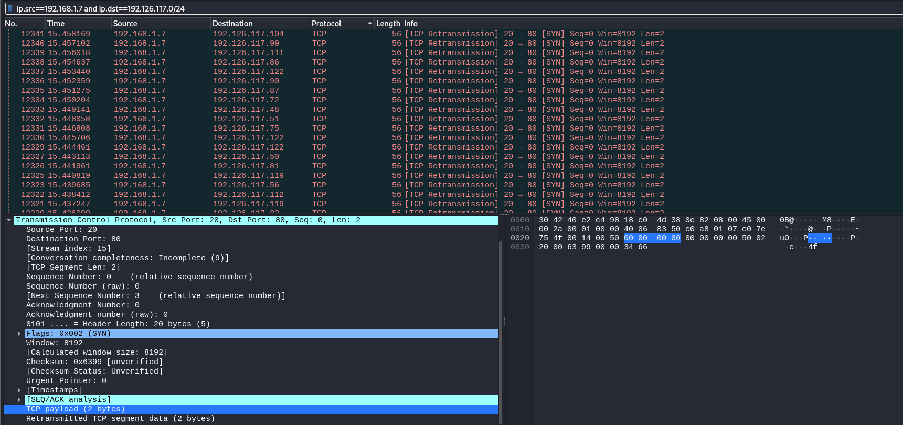

# Solve Missey
### https://cybertalents.com/challenges/network/missey

#### Challenge Description
Seems someone tried to bruteforce on IPs, so can you reveal what he hides?

## Analyze with wireshark

### Auto analysis all the packets with [auto.py](auto.py)
```bash
└─$ python auto.py
UDP Payloads: ['907851923713a7f300024aecbede00015a7951274f6bb43af0c107d999c119f50242e3a778da7456560097bb1b50b3f7e92daed1022b035d3e6c064b86fe53e764edb2164d26cbf53120ad22643697d75027c60e8f30ffa40875e68a9d139d8eacf7cbe7ea446eb5431e0b6994694bf47c71db43fab7fb919e0586e3bc3eeba237877de39c977356bbf3e35b2a6a810c9107d1a8baa779999b13b1e691f9922a7c05e10a0200e05259321bd1d2f0a42162a1e2dc08231fc7ee58de9033177cc76565b44cc8912665485f2cd7f7d33a9fdaf4244be0c20000', '907851933713abb300024aecbede0001942429d5807c55cba1779146ecfc067575c5e7910c98987e9361cf4f1282e2dbf209f56e6b2ff8b8d8e6391a797f2ef995def0f0b05ec1f27280281adfd41d8611b4659674f02fb5c3cb27709ba3af87b6855b98699a6970164b0419a197f4e18135d720f516fc92ef8a6219c3ea13ea5eeb728d5f1a6e0424475e83fd2574c2ff1735ae41dad03e2fae97c66b2354acf6d1945101a84eb608f51dfa6738a637d03b09750ec986adcefb7593e39bdb53a62dbae9beaaf4426a5db90078e1c20000', '907851943713af7300024aecbede00018518d04d536d12cd9f91bb4af34d5173795ea7a647cdd81d66677f0bb424687131e55abd2acfc99e0d9d661f87fd7c2194eaa0683f15c7efe3210c633f3e896f5174752fb19f2f5216f21f8247ec2654698d74f696e807852339d494c5d126f20a6171713f0c38a696f30f0c843a3ff8fcd5578bb3babbe1fad093b9b3868e36f240c99f47da3de048c6d79872ba05e09ac6fc91f0be7daf33c9229c7757844a7cc02bfc2892a4842a907e73cffd0f22f5139a490fac3a9e09e04de2c20000', '907851953713b33300024aecbede00019f9ef022a4a48468658d5fabf658fe8e6f52818ea708c9dbe1e25b660562ae82c1ed9d1dad5d57c1e16450a76a2422f0383012ce14936362ff4e3cdb9873f08b76013f82f6ea6d46cc3ead68a9b7b9374a70f37850734020ec46bea718948961a4a75dacc063d87c32f8ef2698069287b9bc82e246356e8d9984d519f646e159effe228da3bbdc89a7d674aaa976f72f5e7bb4b6c2962b7860debe29f209a23de1af9bde85e8a0592a2ee17f8c64bbecb8815496a993bbe3c20000', '907851963713b6f300024aecbede0001dcb0568e33d65dd125fec095638a9642fc7f587c6de8467da9ec99ed8bc9239da67389f4c4ca91f3f16a85c2ffe8e7630c232d8294327afb35c3de06fce0f60574a3a6cb661e7cb1f9ecb585b6e014d980fab92bae3d1621fb05883dd3c79a18f78dad9429028d7811438fe14839cf78457bd241e82116363f9b444b61e93f89a3b8a7a857fb14eaaa5b7274c027a42e6c2152c634226cb6631d4fdf3051685d5475a196b6a65adafce16b6ba42ea8dbc54289a73df7e1fa484737e4c20000']
TCP Payloads: ['1703030033872ef8cac5045d12dcf6b27361f0e1357a97161b26be41de05449e4b70cb9a330455841ea2937926d0247b54e8bd41fd31d439', '139c00000000', '170303014807b048e8e1d5897a39f0c8901a41f75b2e552ff47f7b8c28e6d0b6cb736f10e250d9e6dd7841e0b9ae265a4dfd72c03e1a74171e5a037e415a2d83cc642b765daced8de840fe826acd270f421ef3111ccc7e73a7c12e0a8f013e0088c084ad8914d37da01df9204b4767b30c396c8734123f90013f182762a1f1446e0521f361f111aa4b6dfa0b52caf6f7420039de83e9afeb7b28a0c5472c006e281e62efd3200b12906223b03ac1bbe6f38e3348fdbe48b865b2cacfde5c08e54df09e7f47ba2f96121e674479f8e94eb77de784ba1d00eb9501d59a6ff97c247bd108000003c8fdceaecd6a859bd56c1edad0f9a0f65ec7a1a4f082fb8aa646674bd6298310c685d682aca3ea3ad6eceecb545d85b274f0f7ad3098e9283c3d282ed8f92483b4406d0b429132d1999b4b7a027b546a4e8391825c68694027657de97bb4af7405260144bff61e', '1703030032f52bcc4ebb5f3b39d6b947548cb0b44dcce46544b6a10b8fd10785db46e026a001e16ecde9d198b82acdf729bb09a630d8e0', '1703030044ea6a51dfcf522da28c3a68225826a24ff1e047ba2dfa6e88d7df6b04ea8c1b019a4f3df6201068d387f4b401c0ac8bade3355a45c785e2038788e92f7fa495ee612d6fcf']
ICMP Payloads: ['4500002a000100003b068847c0a80107c07e75580014005000000000000000005002200062be000035380000000000000000000000000000000000000000000000000000', '4500002a000100003b06886bc0a80107c07e75340014005000000000000000005002200064e6000033340000000000000000000000000000000000000000000000000000', '4500002a000100003b06884fc0a80107c07e75500014005000000000000000005002200062ce000035300000000000000000000000000000000000000000000000000000', '4500002a000100003b06884fc0a80107c07e75500014005000000000000000005002200062ce000035300000000000000000000000000000000000000000000000000000']
ARP Requests: [{'sender_ip': '192.168.1.7', 'target_ip': '192.168.1.1'}, {'sender_ip': '192.168.1.1', 'target_ip': '192.168.1.7'}]
DNS Queries: ['play.google.com.', 'play.google.com.']

```

### manually analyze the payloads
```bash
└─$ python3         
Python 3.11.8 (main, Feb  7 2024, 21:52:08) [GCC 13.2.0] on linux
Type "help", "copyright", "credits" or "license" for more information.
>>> hex_payload = "907851923713a7f300024aecbede00015a7951274f6bb43af0c107d999c119f50242e3a778da7456560097bb1b50b3f7e92daed1022b035d3e6c064b86fe53e764edb2164d26cbf53120ad22643697d75027c60e8f30ffa40875e68a9d139d8eacf7cbe7ea446eb5431e0b6994694bf47c71db43fab7fb919e0586e3bc3eeba237877de39c977356bbf3e35b2a6a810c9107d1a8baa779999b13b1e691f9922a7c05e10a0200e05259321bd1d2f0a42162a1e2dc08231fc7ee58de9033177cc76565b44cc8912665485f2cd7f7d33a9fdaf4244be0c20000"
>>> decoded_payload = bytes.fromhex(hex_payload).decode("utf-8", errors="ignore")
>>> print(decoded_payload)
xQ7JZyQ'Ok:BxtVV-+]>lKSdM&1 "d6P'u抝DnC
                                       iiK|qC>7}㜗sV[*j
                                                       Ѩy*|
RY2#Xސ3|eeLȑ&eH_,:$K
>>> hex_payload = "1703030033872ef8cac5045d12dcf6b27361f0e1357a97161b26be41de05449e4b70cb9a330455841ea2937926d0247b54e8bd41fd31d439"
>>> decoded_payload = bytes.fromhex(hex_payload).decode("utf-8", errors="ignore")
>>> print(decoded_payload)
3.]sa5zADKp˚3Uy&${TA19
>>> hex_payload = "4500002a000100003b068847c0a80107c07e75580014005000000000000000005002200062be000035380000000000000000000000000000000000000000000000000000"
>>> decoded_payload = bytes.fromhex(hex_payload).decode("utf-8", errors="ignore")
>>> print(decoded_payload)
E*;G~uXPP b58
>>> tcp_payload = bytes.fromhex("1703030033872ef8cac5045d12dcf6b27361f0e1357a97161b26be41de05449e4b70cb9a330455841ea2937926d0247b54e8bd41fd31d439")
>>> if tcp_payload[0] == 0x16:
...     print("This is a TLS handshake.")
... else:
...     print("This is not a TLS handshake.")
... 
This is not a TLS handshake.
>>> exit()

```

### Decode all the payloads with [decode.py](decode.py)

#### Example output
*You can find the full output in [decodeOutput.txt](decodeOutput.txt)*
```bash
=== UDP Payloads ===
UDP Payload 1:
  Hex Decoded: xQ7JZyQ'Ok:ٙBxtV#Xސ3|eeLȑ&eH_,:$K
  Base64 Decoded: N_v߽wkM6᧜m^M5]oG5ӷ}5n6{vZz4վtow{ݝium~]Ӯ뇝omzݺq]iݶ{Ms}{wiqy8}^Ѿu7}}u9my߿;׷{~zm{~[ٮ]];wVm}woWWm9{]m4{Nvշuwgkf{g\ͷ;y|ut}{;랹osuۮ_{wݯ_uێG6M4
----------------------------------------
=== TCP Payloads ===
TCP Payload 1:
  Hex Decoded: 3.]sa5zDKp˚3Uy&${TA19
  Base64 Decoded: ׽7}4;q9ӎ]g\~Gߞzսm5u9^qZ}88~ۧtێ燼m5}w
----------------------------------------
ICMP Payload 1:
  Hex Decoded: E*;G~uXPP b58
  Base64 Decoded: 4MM5M4ݽ:;sF];sN|MxNtM4M4M4M4M6M4fM4ߝM4M4M4M4M4M4M4M4M4M4M4M4M4
```
No usefull information from the decoded payloads

### Analyze TCP packets with wireshark
 
We found that most of the tcp connections is from 192.168.1.7 to 192.126.117.0/24
### Extract all the tcp payloads with [tcpPayloads.py](tcpPayloads.py)
*You can find the full output in [tcp_payloads.txt](tcp_payloads.txt)*

#### Decode the tcp payloads with xxd
```bash
cat tcp_payloads.txt | xxd -r -p | xxd -r -p | grep -i "flag"
pPQv3PpXRWzuX23KZOUjJV82vQu8w4CcVjWHW4Qo88QuQcprUrj8xhXZjHZCXVQrQJ43CKQx8huO8OKCPpvVr6hqcUk0JPvxoCp6KXkvUVcZCuxzv4XC6XozO30WJ38uPzwkHjjpZvzxJP9499PPWKOp2KhrxxjxpCZq4QrZ9C9rquZUJKhrH6XXx24OC8uhwXQkv42K6wjw20ZzvOQ6KcuUZU4rvQRRCxv6Xvvzpz3kpPjopxVQqkrvr9OwwPUPj9VCU8x08COC4J0phr6kxVwQvW4zhXjQKjCHxo6Hk4xvwW6Xuw8qpR6xvu0KRXH8H8PPQOcj6rK8Wh9uPC3uw8Z6rQw4rqoH0Z3xVc6vu3vxCVpZKCxrv8CPZWh4P3xjU92pxcR4q8jzqrK43HU46xqjj3VxUpCXxJChK99okqCZjXzHC4qpH8zOcJhUHupC8CRqvhvWXZU6uoR2HH2kvzpRoQuw6uz3HK4PzvRvJ4Zw09woPJORozRzZRHOpujJ6qxRXwoZjHkkZowH4UUPJPqcOcK0CH9pRoxv2Cr|FLAG{M15SED_INBY73$}|4ZvpcqrXruoZ0XuWrOOWKhVJQwUVJPhk4hX0hh6w62j40o20JuokU04U8Ww3VrPjc33Q3U6XJQ0PX4HjKH6WCcCCohRzVWPOVWZ3qjp6Qo9WppJqHV9Qw0Qq6pK0pkj2Xvop4CHrKwQj99OwzooOZO3zjvU0oKZ8Vc236kV6W3w8XC992zoq9o6CO34rZU334oU
```

The flag is `FLAG{M15SED_INBY7$}`

>Find More on ==> github.com/MedhatHassan