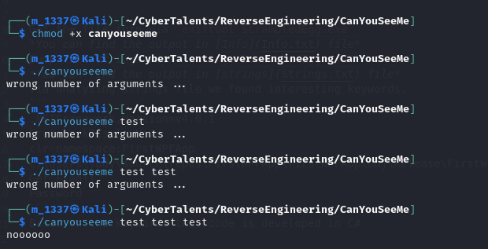

# Can you see me 
##### https://cybertalents.com/challenges/malware/can-you-see-me

### Try to run 



Get the file info via `exiftool canyouseeme`
*You can find the output in [Info](Info.txt) file* 
Dump file strings with `strings canyouseeme`
*You can find the output in [strings](Strings.txt) file* 
Via analyzing strings file we found interesting keywords.
```
/lib/ld-linux.so.2
libc.so.6
_IO_stdin_used
puts
strlen
__libc_start_main
random
wrong number of arguments ... 
noooooo
not gooood enough :(
Good J0b!!!
;*2$"
GCC: (Ubuntu 4.8.4-2ubuntu1~14.04.3) 4.8.4
```
Based on the keywords this code is developed in C/C++


### analyze with ghidra

#### Main

```c

undefined4 main(int param_1,int param_2)

{
  char cVar1;
  char *__s;
  undefined4 uVar2;
  size_t input3;
  long lVar4;
  char local_1d;
  int local_1c;
  
  if (param_1 == 4) {
    __s = *(char **)(param_2 + 0xc);
    input3 = strlen(__s);
    if (input3 == 0x16) {
      local_1d = '\0';
      for (local_1c = 0; local_1c < 0x219a6e; local_1c = local_1c + 1) {
        lVar4 = random();
        if (visited[lVar4] == '\0') {
          visited[lVar4] = 1;
          cVar1 = __s[lVar4];
          input3 = strlen(*(char **)(xflag + local_1d * 4));
          local_1d = local_1d + '\x01';
          if ((int)cVar1 != input3) {
            puts("not gooood enough :(");
            return 0xffffffff;
          }
        }
      }
      puts("Good J0b!!!");
      uVar2 = 0;
    }
    else {
      puts("noooooo");
      uVar2 = 0xffffffff;
    }
  }
  else {
    puts("wrong number of arguments ... ");
    uVar2 = 0xffffffff;
  }
  return uVar2;
}
```
#### Code break down 
The program expects four command-line arguments.
The **third argument** should be a string of length **22**.
It performs a randomized check over a large number of iterations.
If the character at a random index of the string matches the length of a certain string (presumably from an `xflag` array), it continues.
If all checks pass, it prints `"Good J0b!!!"`.
If any check fails, it prints an *error message*.

### Debug with gdb 
Use the [flag.gdb](flag.gdb) to debug the code 

```bash
gdb -x flag.gdb ./canyouseeme
```
review the output in [flag](unorderdflag.txt)

after reordering `flag{hidden_in_spaces}`

>Find More on ==> github.com/MedhatHassan 