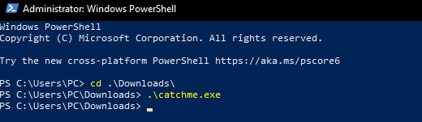

# Solve Catch me
##### https://cybertalents.com/challenges/malware/catch-me

### Try to run the exe 



Get the file info via `exiftool catchme.exe`
*You can find the output in [Info](Info.txt) file* 
Dump file strings with `strings catchme.exe `
*You can find the output in [strings](Strings.txt) file* 
Via analyzing strings file we found interesting keywords.
```
C:\Users\tonix\source\repos\Project1\Debug\Project1.pdb
Catch Me If You Can
IsDebuggerPresent
GetModuleFileNameA
<?xml version='1.0' encoding='UTF-8' standalone='yes'?>
<assembly xmlns='urn:schemas-microsoft-com:asm.v1' manifestVersion='1.0'>
  <trustInfo xmlns="urn:schemas-microsoft-com:asm.v3">
    <security>
      <requestedPrivileges>
        <requestedExecutionLevel level='asInvoker' uiAccess='false' />
      </requestedPrivileges>
    </security>
  </trustInfo>
</assembly>
```
Based on the keywords this code is developed in C/C++

### Analyze with ghidra

#### FUN_004116f0
```c
void FUN_004116f0(void)

{
  int iVar1;
  uint uVar2;
  uint *puVar3;
  undefined8 uVar4;
  uint local_1ac [52];
  undefined4 local_dc [21];
  uint local_88;
  CHAR local_7c [108];
  char *local_10;
  uint local_8;
  
  puVar3 = local_1ac;
  for (iVar1 = 0x6a; iVar1 != 0; iVar1 = iVar1 + -1) {
    *puVar3 = 0xcccccccc;
    puVar3 = puVar3 + 1;
  }
  local_8 = DAT_0041a01c ^ (uint)&stack0xfffffffc;
  IsDebuggerPresent();
  uVar4 = __RTC_CheckEsp();
  if ((int)uVar4 == 0) {
    local_10 = s_Catch_Me_If_You_Can_0041a000;
    GetModuleFileNameA((HMODULE)0x0,local_7c,100);
    __RTC_CheckEsp();
    uVar4 = thunk_FUN_00411990(local_7c,"i_got_it");
    if ((int)uVar4 != 0) {
      local_dc[0] = 0x25;
      local_dc[1] = 0xd;
      local_dc[2] = 0x15;
      local_dc[3] = 4;
      local_dc[4] = 0x13;
      local_dc[5] = 0x74;
      local_dc[6] = 1;
      local_dc[7] = 0x36;
      local_dc[8] = 0x7f;
      local_dc[9] = 0x78;
      local_dc[10] = 0x35;
      local_dc[11] = 0x7f;
      local_dc[12] = 0x1e;
      local_dc[13] = 0x5f;
      local_dc[14] = 0x45;
      local_dc[15] = 100;
      local_dc[16] = 0x79;
      local_dc[17] = 0x48;
      local_dc[18] = 0x13;
      uVar2 = (uint)((ulonglong)uVar4 >> 0x20);
      for (local_88 = 0; uVar4 = CONCAT44(uVar2,local_88), (int)local_88 < 0x13;
          local_88 = local_88 + 1) {
        s_Catch_Me_If_You_Can_0041a000[local_88] =
             s_Catch_Me_If_You_Can_0041a000[local_88] ^ (byte)local_dc[local_88];
        uVar2 = local_88;
      }
      local_1ac[1] = local_88;
      if (0x13 < local_88) {
        uVar4 = ___report_rangecheckfailure();
      }
      s_Catch_Me_If_You_Can_0041a000[local_1ac[1]] = '\0';
    }
  }
  @_RTC_CheckStackVars@8(uVar4);
  @__security_check_cookie@4();
  local_8 = 0x4118c8;
  __RTC_CheckEsp();
  return;
}

```

#### FUN_00411990
```c
void FUN_00411990(char *param_1,char *param_2)

{
  int iVar1;
  undefined4 *puVar2;
  undefined4 local_c4 [47];
  undefined4 uStack_8;
  
  puVar2 = local_c4;
  for (iVar1 = 0x30; iVar1 != 0; iVar1 = iVar1 + -1) {
    *puVar2 = 0xcccccccc;
    puVar2 = puVar2 + 1;
  }
  strstr(param_1,param_2);
  uStack_8 = 0x4119ce;
  __RTC_CheckEsp();
  return;
}
```
### code break down 
`FUN_004116f0` performe several operations related to stack *initialization, debugging checks, and XOR-based decryption*.

1. **Initialization:**
Initializes a local array local_1ac with `0xcccccccc`.

2. Debugging Checks:
Calls `IsDebuggerPresent()` and `__RTC_CheckEsp()` to check for a debugger.

3. **Decryption Logic:**
Uses `GetModuleFileNameA` to retrieve the module file name into `local_7c`.
Calls `thunk_FUN_00411990` with the module file name and a string `"i_got_it"`.
If the function returns a **non-zero** value, it proceeds with decryption.

4. **XOR Decryption:**
An array `local_dc` is initialized with specific values.
A loop iterates over the first **19 characters** of `s_Catch_Me_If_You_Can_0041a000` and XORs each character with the corresponding value from `local_dc`.
The decrypted string is then terminated with a *null character*.
Post-Operations:
Calls `___report_rangecheckfailure()` if the loop index exceeds **19**.
Checks the stack variables with `@_RTC_CheckStackVars@8` and ensures security with `@__security_check_cookie@4`.

### Simple code form 

```c 
void DecryptFlag(void)
{
    int counter;
    uint check;
    uint *ptr;
    undefined8 result;
    uint buffer[52];
    undefined4 key[21];
    uint index;
    CHAR filename[108];
    char *encryptedString;
    uint securityCookie;
    
    ptr = buffer;
    for (counter = 0x6a; counter != 0; counter = counter - 1) {
        *ptr = 0xcccccccc;
        ptr = ptr + 1;
    }
    securityCookie = DAT_0041a01c ^ (uint)&stack0xfffffffc;
    IsDebuggerPresent();
    result = __RTC_CheckEsp();
    if ((int)result == 0) {
        encryptedString = "Catch_Me_If_You_Can";
        GetModuleFileNameA((HMODULE)0x0, filename, 100);
        __RTC_CheckEsp();
        result = CheckCondition(filename, "i_got_it");
        if ((int)result != 0) {
            key[0] = 0x25;
            key[1] = 0x0d;
            key[2] = 0x15;
            key[3] = 0x04;
            key[4] = 0x13;
            key[5] = 0x74;
            key[6] = 0x01;
            key[7] = 0x36;
            key[8] = 0x7f;
            key[9] = 0x78;
            key[10] = 0x35;
            key[11] = 0x7f;
            key[12] = 0x1e;
            key[13] = 0x5f;
            key[14] = 0x45;
            key[15] = 100;
            key[16] = 0x79;
            key[17] = 0x48;
            key[18] = 0x13;
            check = (uint)((ulonglong)result >> 0x20);
            for (index = 0; result = CONCAT44(check, index), (int)index < 0x13; index = index + 1) {
                encryptedString[index] = encryptedString[index] ^ (byte)key[index];
                check = index;
            }
            buffer[1] = index;
            if (0x13 < index) {
                result = ___report_rangecheckfailure();
            }
            encryptedString[buffer[1]] = '\0';
        }
    }
    @_RTC_CheckStackVars@8(result);
    @__security_check_cookie@4();
    securityCookie = 0x4118c8;
    __RTC_CheckEsp();
    return;
}

```

### Reverse the encryption
You can reverse the encryption by xor the values of encryptedString with the key. 
*You can find the python script in [rev](rev.py) file* 

>Find More on ==> github.com/MedhatHassan 