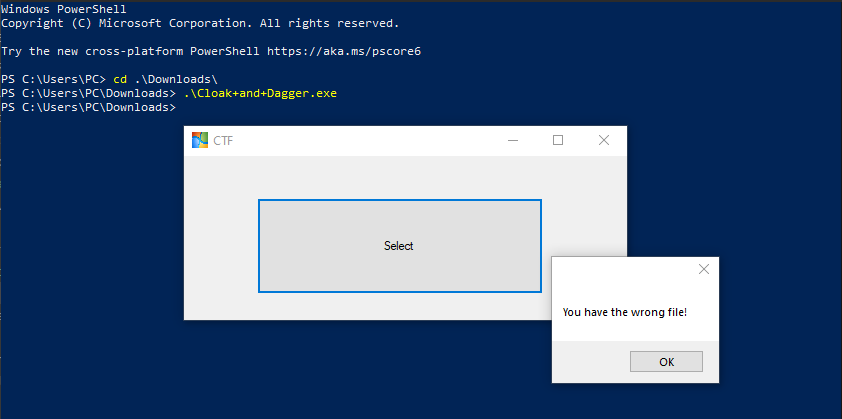
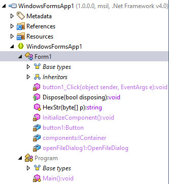
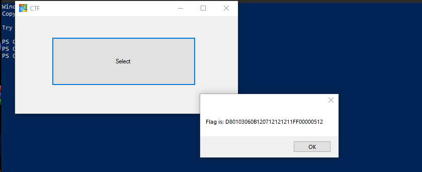

# Solve Elementary
#### https://cybertalents.com/challenges/malware/cloak-dagger

### Try to run

Get the file info via `exiftool elementary`
*You can find the output in [Info](Info.txt) file* 
Dump file strings with `strings elementary`
*You can find the output in [strings](Strings.txt) file* 
Via analyzing strings file we found interesting keywords.
```
<?xml version="1.0" encoding="UTF-8" standalone="yes"?>
<assembly xmlns="urn:schemas-microsoft-com:asm.v1" manifestVersion="1.0">
  <assemblyIdentity version="1.0.0.0" name="MyApplication.app"/>
  <trustInfo xmlns="urn:schemas-microsoft-com:asm.v2">
    <security>
      <requestedPrivileges xmlns="urn:schemas-microsoft-com:asm.v3">
        <requestedExecutionLevel level="asInvoker" uiAccess="false"/>
      </requestedPrivileges>
    </security>
  </trustInfo>
```

From this data the code is writen in C#

### Analyze the file with dotPeek:

Program tree structure:


#### The Decompiled main function:
```
private static void Main()
    {
      Application.EnableVisualStyles();
      Application.SetCompatibleTextRenderingDefault(false);
      Application.Run((Form) new Form1());
    }
```
The main create a `Form1` object from `Form` class

#### The Decompiled Form class:
```
using System;
using System.ComponentModel;
using System.Drawing;
using System.IO;
using System.Windows.Forms;

namespace WindowsFormsApp1
{
  public class Form1 : Form
  {
    private IContainer components;
    private Button button1;
    private OpenFileDialog openFileDialog1;

    public Form1() => this.InitializeComponent();

    public static string HexStr(byte[] p)
    {
      char[] chArray = new char[p.Length * 2 + 2];
      chArray[0] = '0';
      chArray[1] = 'x';
      int index1 = 0;
      int index2 = 2;
      while (index1 < p.Length)
      {
        byte num1 = (byte) ((uint) p[index1] >> 4);
        chArray[index2] = num1 > (byte) 9 ? (char) ((int) num1 + 55) : (char) ((int) num1 + 48);
        byte num2 = (byte) ((uint) p[index1] & 15U);
        int num3;
        chArray[num3 = index2 + 1] = num2 > (byte) 9 ? (char) ((int) num2 + 55) : (char) ((int) num2 + 48);
        ++index1;
        index2 = num3 + 1;
      }
      return new string(chArray);
    }

    private void button1_Click(object sender, EventArgs e)
    {
      if (this.openFileDialog1.ShowDialog() != DialogResult.OK)
        return;
      string fileName = this.openFileDialog1.FileName;
      try
      {
        string str1 = "FF0003060C1204121212000100C40307";
        BinaryReader binaryReader = new BinaryReader((Stream) new FileStream(fileName, FileMode.Open, FileAccess.Read, FileShare.None));
        binaryReader.BaseStream.Position = 0L;
        byte[] p = binaryReader.ReadBytes(256);
        binaryReader.Close();
        string str2 = Form1.HexStr(p).Substring(2, 2) + Form1.HexStr(p).Substring(34, 2) + Form1.HexStr(p).Substring(66, 2) + Form1.HexStr(p).Substring(98, 2) + Form1.HexStr(p).Substring(130, 2) + Form1.HexStr(p).Substring(162, 2) + Form1.HexStr(p).Substring(194, 2) + Form1.HexStr(p).Substring(226, 2) + Form1.HexStr(p).Substring(258, 2) + Form1.HexStr(p).Substring(290, 2) + Form1.HexStr(p).Substring(322, 2) + Form1.HexStr(p).Substring(354, 2) + Form1.HexStr(p).Substring(386, 2) + Form1.HexStr(p).Substring(418, 2) + Form1.HexStr(p).Substring(450, 2) + Form1.HexStr(p).Substring(482, 2);
        string str3 = Form1.HexStr(p).Substring(4, 2) + Form1.HexStr(p).Substring(36, 2) + Form1.HexStr(p).Substring(68, 2) + Form1.HexStr(p).Substring(100, 2) + Form1.HexStr(p).Substring(132, 2) + Form1.HexStr(p).Substring(164, 2) + Form1.HexStr(p).Substring(196, 2) + Form1.HexStr(p).Substring(228, 2) + Form1.HexStr(p).Substring(260, 2) + Form1.HexStr(p).Substring(292, 2) + Form1.HexStr(p).Substring(324, 2) + Form1.HexStr(p).Substring(356, 2) + Form1.HexStr(p).Substring(388, 2) + Form1.HexStr(p).Substring(420, 2) + Form1.HexStr(p).Substring(452, 2) + Form1.HexStr(p).Substring(484, 2);
        if (str2 == str1)
        {
          int num1 = (int) MessageBox.Show("Flag is: " + str3);
        }
        else
        {
          int num2 = (int) MessageBox.Show("You have the wrong file!");
        }
      }
      catch (IOException ex)
      {
      }
    }

    protected override void Dispose(bool disposing)
    {
      if (disposing && this.components != null)
        this.components.Dispose();
      base.Dispose(disposing);
    }

    private void InitializeComponent()
    {
      ComponentResourceManager componentResourceManager = new ComponentResourceManager(typeof (Form1));
      this.button1 = new Button();
      this.openFileDialog1 = new OpenFileDialog();
      this.SuspendLayout();
      this.button1.Location = new Point(73, 42);
      this.button1.Name = "button1";
      this.button1.Size = new Size(286, 96);
      this.button1.TabIndex = 0;
      this.button1.Text = "Select";
      this.button1.UseVisualStyleBackColor = true;
      this.button1.Click += new EventHandler(this.button1_Click);
      this.openFileDialog1.FileName = "openFileDialog1";
      this.AutoScaleDimensions = new SizeF(6f, 13f);
      this.AutoScaleMode = AutoScaleMode.Font;
      this.ClientSize = new Size(443, 194);
      this.Controls.Add((Control) this.button1);
      this.Icon = (Icon) componentResourceManager.GetObject("$this.Icon");
      this.Name = nameof (Form1);
      this.Text = "CTF";
      this.ResumeLayout(false);
    }
  }
}


```

This class Opens a file dialog to select a file then Reads the first **256 bytes** of the file, converts its contents to a *hexadecimal* string with `HexStr` method, and constructs two specific strings from it. If the first constructed string matches a predefined value `predefinedStr` , it shows a message box with the second string as the **flag**. Otherwise, it shows a message indicating the wrong file.

extract any embedded or appended files
```bash
binwalk --dd=".*" Cloak+and+Dagger.exe
```

check for the bytes at the previous indices array `FF0003060C1204121212000100C40307`
*Code is in [FindFile.py](FindFile.py) file*
Note you must extract appended files first.

