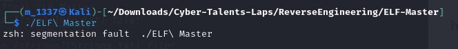

# Solve ELF Master
#### https://cybertalents.com/challenges/malware/elf-master

### Try to run

Get the file info via `exiftool ELF Master`
*You can find the output in [Info](Info.txt) file* 
Dump file strings with `strings ELF Master`
*You can find the output in [strings](Strings.txt) file* 
Via analyzing strings file we found interesting keywords.
```
GCC: (Ubuntu 9.3.0-17ubuntu1~20.04) 9.3.0
/lib64/ld-linux-x86-64.so.2
libc.so.6
```

The program developed in C/C++

```c
undefined8 FUN_00101169(void)

{
  long in_FS_OFFSET;
  int local_3c;
  undefined8 local_38;
  undefined8 local_30;
  undefined8 local_28;
  undefined8 local_20;
  undefined2 local_18;
  long local_10;
  
  local_10 = *(long *)(in_FS_OFFSET + 0x28);
  local_38 = 0xc6a9dde2fef8f5ff;
  local_30 = 0xd5c6f2a9a9d5c6a8;
  local_28 = 0xaac6f7adc6aaf2a8;
  local_20 = 0xaaedeaadd4c6dfd5;
  local_18 = 0xe4eb;
  for (local_3c = 0; local_3c < 0x22; local_3c = local_3c + 1) {
    putchar((uint)(*(byte *)((long)&local_38 + (long)local_3c) ^ 0x99));
  }
  putchar(10);
  if (local_10 != *(long *)(in_FS_OFFSET + 0x28)) {
                    /* WARNING: Subroutine does not return */
    __stack_chk_fail();
  }
  return 0;
}
```
Encoded Data Initialization:
The encoded data is stored in several variables of types `uint64_t` and `uint16_t`.
Buffer to Hold All Bytes:
An array `data` is used to hold all the bytes together. This is necessary for iterating and decoding the bytes.
Copying Segments into the Data Buffer:
The `memcpy` function is used to copy the contents of each variable into the `data` buffer.
Decoding Loop:
Each byte in the `data` buffer is XORed with `0x99` to decode it, and then printed to the screen using `putchar`.


Reverse the code
*You can find the code in [Rev.c](Rev.c)*

>Find More on ==> github.com/MedhatHassan 
