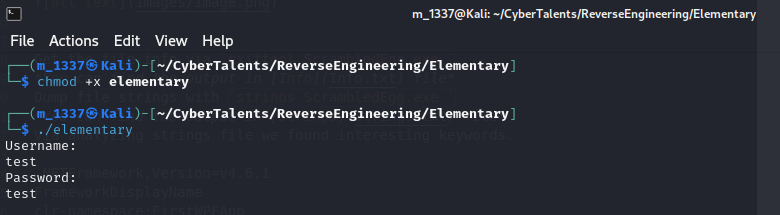
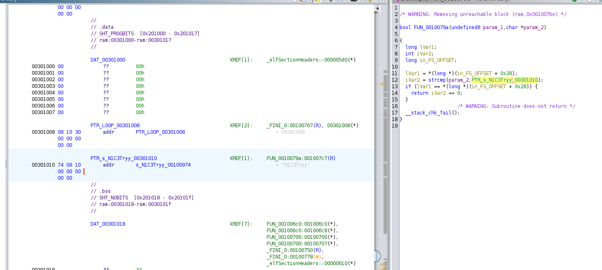

# Solve Elementary
#### https://cybertalents.com/challenges/malware/elementary

### Try to run



Get the file info via `exiftool elementary`
*You can find the output in [Info](Info.txt) file* 
Dump file strings with `strings elementary`
*You can find the output in [strings](Strings.txt) file* 
Via analyzing strings file we found interesting keywords.
```
/lib64/ld-linux-x86-64.so.2
libc.so.6
exit
puts
strcmp
read
Username: 
Password:
GCC: (Ubuntu 7.3.0-16ubuntu3) 7.3.0
```
Based on the keywords this code is developed in C/C++

### Decompile with ghidra

#### Main 
```c
void processEntry entry(undefined8 param_1,undefined8 param_2)

{
  undefined auStack_8 [8];
  
  __libc_start_main(FUN_00100824,param_2,&stack0x00000008,FUN_001008f0,FUN_00100960,param_1,
                    auStack_8);
  do {
    
  } while( true );
}

```
#### Function 1
```c
undefined8 FUN_00100824(void)

{
  int iVar1;
  long in_FS_OFFSET;
  undefined username [8];
  undefined local_1a;
  undefined password [8];
  undefined local_11;
  long local_10;
  
  local_10 = *(long *)(in_FS_OFFSET + 0x28);
  local_1a = 0;
  local_11 = 0;
  puts("Username: ");
  read(0,username,8);
  puts("Password: ");
  read(0,password,8);
  iVar1 = FUN_0010079a(username,password);
  if (iVar1 == 0) {
    FUN_00100816();
  }
  else {
    FUN_00100803();
  }
  if (local_10 == *(long *)(in_FS_OFFSET + 0x28)) {
    return 0;
  }
                    /* WARNING: Subroutine does not return */
  __stack_chk_fail();
}
```

#### Function 2
```c
bool FUN_0010079a(undefined8 username,char *password)

{
  long lVar1;
  int iVar2;
  long in_FS_OFFSET;
  
  lVar1 = *(long *)(in_FS_OFFSET + 0x28);
  iVar2 = strcmp(password,PTR_s_N1C3Tryy_00301010);
  if (lVar1 == *(long *)(in_FS_OFFSET + 0x28)) {
    return iVar2 == 0;
  }
  __stack_chk_fail();
}
```
#### Function 3
```c
void FUN_00100803(void)

{
  puts("nice!");
  return;
}
```

### Break the code down 
#### Main
Function Call: __libc_start_main is called with several parameters.
**FUN_00100824**: This is the main function of the binary.
param_2 and param_1: These are parameters passed to processEntry.
`&stack0x00000008`, `FUN_001008f0`, `FUN_00100960`: These are additional parameters for setting up the stack and other initializations.
Infinite Loop: The do { } while ( true ); creates an infinite loop, but it's not relevant after __libc_start_main is called because this function doesn't return.

#### Function 1
Input Handling:
username and password arrays are initialized to store user input.
read(0,username,8) and read(0,password,8) read 8 bytes from standard input for both username and password.
Password Validation: Calls `FUN_0010079a(username, password)` to validate the username and password.
Conditional Actions:
If the validation function returns 0, it calls `FUN_00100816()` **exit**.
Otherwise, it calls `FUN_00100803()` **Prints nice!**.
#### Function 2
Stack Protection: lVar1 is used to store a value for stack protection.
Password Comparison:
Compares the password input to a hardcoded password string at `PTR_s_N1C3Tryy_00301010` using `strcmp`.
Return Value:
Returns true if strcmp returns 0 **(passwords match)**, otherwise returns false.


### Search for value of `PTR_s_N1C3Tryy_00301010`


### Try to login with `N1C3Tryy`


>Find More on ==> github.com/MedhatHassan 