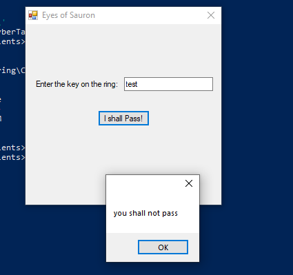
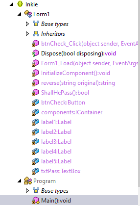

# Solve Eye of Sauron 
##### https://cybertalents.com/challenges/malware/eye-of-sauron
Try to run the exe 


Get the file info via `exiftool Inkie.exe`
*You can find the output in Info file* 
Dump file strings with `strings Inkie.exe`
*You can find the output in strings file* 
Via analyzing strings file we found interesting keywords [ShallHePass , Main , Default] Also XML code that expose versions and user privileges.

### Analyze the file with dotPeek:

Program tree structure:


The **Decompiled main** function:
```
private static void Main()
    {
      Application.EnableVisualStyles();
      Application.SetCompatibleTextRenderingDefault(false);
      Application.Run((Form) new Form1());
    }
```
The main create a Form1 object from Form class

The **Decompiled ShallHePass** function:
```
private bool ShallHePass{
return this.txtPass.Text == this.reverse(this.label2.Text + this.label3.Text + this.label4.Text + this.label5.Text);
}
```
The function check on pass with the string returned from the reverse function input of labels values.
The **Decompiled reverse** function:
```
 private string reverse(string original)
    {
      char[] charArray = original.ToCharArray();
      Array.Reverse((Array) charArray);
      return new string(charArray);
    }

```
The function simple take a string and reverse it.

The **Decompiled Form1** function:
```
this.label2.Text = "d0248b4e";
this.label3.AutoSize = true;
this.label3.ForeColor = SystemColors.Control;
this.label3.Location = new Point(12, 178);
this.label3.Name = "label3";
this.label3.Size = new Size(55, 13);
this.label3.TabIndex = 4;
this.label3.Text = "47886655";
this.label4.AutoSize = true;
this.label4.ForeColor = SystemColors.Control;
this.label4.Location = new Point(12, 191);
this.label4.Name = "label4";
this.label4.Size = new Size(53, 13);
this.label4.TabIndex = 5;
this.label4.Text = "83f05688";
this.label5.AutoSize = true;
this.label5.ForeColor = SystemColors.Control;
this.label5.Location = new Point(12, 204);
this.label5.Name = "label5";
this.label5.Size = new Size(54, 13);
this.label5.TabIndex = 6;
this.label5.Text = "c154b6ea";
```
The labels values are [d0248b4e , 47886655 , 83f05688 ,c154b6ea]

When the form will be loaded the text for the label4 will be changed and we can conclude that with this private function.

he previously value for label4 is `83f05688` and the new one is `83f05689`. So, we need to change this value.

```
private void btnCheck_Click(object sender, EventArgs e)
    {
      this.label3.Text = "47996655";
      int num = (int) MessageBox.Show(this.ShallHePass() ? "you shall pass" : "you shall not pass");
    }
```
The previously value for label3 is `47886655` and the new value after click the button is `47996655`.

So the last label values are [d0248b4e , 47996655 , 83f05689 ,c154b6ea]

with the combination  and reverse the labels values with python we get the key.
*You can find the script in reverse.py file*

>Find More on ==> github.com/MedhatHassan