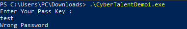

# Solve Find-the-hash.exe
#### https://cybertalents.com/challenges/malware/Find-the-hash.exe

### Try to run

Get the file info via `exiftool Find-the-hash.exe`
*You can find the output in [Info](Info.txt) file* 
Dump file strings with `strings Find-the-hash.exe`
*You can find the output in [strings](Strings.txt) file* 
Via analyzing strings file we found interesting keywords.

Developed in c/c++

### Analyze with ghidra
the address of the main function: 0x401150
the address of the function that Validate the input: 0x401100
the address of the hardcoded hash  : 0x403018

flag{0x401150|0x401100|0x403018}
>Find More on ==> github.com/MedhatHassan 
