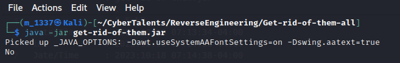
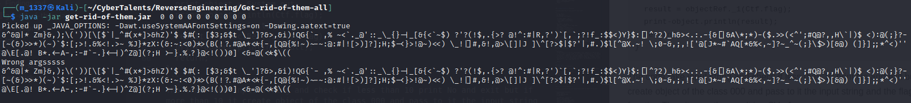

# Solve Get rid of them all

##### https://cybertalents.com/challenges/malware/get-rid-of-them-all
Try to run: 
<br>


Get the file info via `exiftool get-rid-of-them-all`
*You can find the output in Info file* 
Dump file strings with `strings get-rid-of-them-all`
*You can find the output in strings file* 
Via analyzing strings file we found `ctf/ooo.class` program classes names.

## Analyze the file with ghidra:
The program is divided into 2 classes 
### CTF class

The **Decompiled main** function:
```
void main_java.lang.String[]_void(String[] param1)

{
  String pSVar1;
  ooo objectRef;
  PrintStream pPVar2;
  
  if (param1.length < 10) {
    pPVar2 = System.out;
    pPVar2.println("No");
    return;
  }
  objectRef = new ooo();
  pSVar1 = objectRef._2(Ctf.flag,param1);
  Ctf.flag = pSVar1;
  pPVar2 = System.out;
  pPVar2.println(Ctf.flag);
  pPVar2 = System.out;
  pSVar1 = objectRef._1(Ctf.flag);
  pPVar2.println(pSVar1);
  return;
}

```

The **Simplified main** function:
```
void main_java.lang.String[]_void(String[] input)

{
  String result;
  ooo objectRef;
  PrintStream print-object;
  
  if (input.length < 10) {
    print-object = System.out;
    print-object.println("No");
    return;
  }
  objectRef = new ooo();
  result = objectRef._2(Ctf.flag,input);
  Ctf.flag = result;
  print-object = System.out;
  print-object.println(Ctf.flag);
  print-object = System.out;
  result = objectRef._1(Ctf.flag);
  print-object.println(result);
  return;
}
```
The code take input string and check if less than 10 print No and exit but if more than 10 it create object of the class 000 and pass to it the input string and the flag from `clinit` function.Then it save the result in `pSVar1`.
The value of Ctf.flag is updated with the value of pSVar1 (result).
It calls the _1 method of the objectRef instance, passing Ctf.flag as an argument. The result is stored in pSVar1.
Finally prints the result stored in pSVar1.

Try to run the program with 10 arguments.
<br>


The **Decompiled clinit** function:
```
void <clinit>_void(void)

{
  Ctf.flag = 
  "&^&@|* Zm}&,);\\(\'))[\\[$`|_^#(x*]>&hZ)\'$ $#(: [$3;&$t \\_\']?&>,&i)!QG{`- ,% ~<`._@\'::_\\_{}- |_[&{<`~$) ?\'?(!$,.{>? @!^:#|R,?\')`[,`;?!f_:$$<)Y}$:[|^?2)_h&><.:.-{&[|&A\\*;*)-($.>>(<^\';#Q@?, ,H\\`|)$ <):@(;}?-[~(&)>>*)(~)`$:[;>!.&%<!.>~ %J}*zX:(&:~:<0)*>(B(!?.#@A*<*{-,[Q@{%!~)~-~:@:#|![>) ]?];H;$-<}>!@~)<<) \\_!|]#,&!,@>\\[]|J ]\\^[?>$|$?\'|,#.)$l[^@X.~! \\;0-&,;,![\'@[J*~#`AQ[*&%<,~]? ~_^~(;}\\$>)[&@) (]}];;*^<)\'\'@\\E[.@! B*.<-A-,:-#`-.}<-|)^Z@](?;H >-}.%.?}@<!())0] <&=@(<*$\\(("
  ;
  return;
}
```
### 000 class
The **Decompiled** function 1:
```
String _1_java.lang.String_java.lang.String(undefined4 param_1,String param1)

{
  Base64$Decoder decoder_object;
  byte[] pbVar1;
  String string_object;
  String output;
  
  string_object = new(String);
  output = string_object;
  decoder_object = Base64.getDecoder();
  pbVar1 = objectRef.decode(param1);
  string_object.<init>(pbVar1);
  return output;
}
```
```
String UndefinedFunction_00010017(void)

{
  String in_localVariableArray_00000004;
  PrintStream pPStack00000000;
  
  pPStack00000000 = System.out;
  pPStack00000000.println("Wrong argsssss");
  pPStack00000000 = System.out;
  pPStack00000000.println(in_localVariableArray_00000004);
  return "";
}
```

The **Simplified** function 1:
```
String _1_java.lang.String_java.lang.String(integer parameter,String input)

{
  Base64$Decoder objectRef;
  byte[] pbVar1;
  String objectRef_00;
  String pSVar2;
  
  objectRef_00 = new(String);
  pSVar2 = objectRef_00;
  objectRef = Base64.getDecoder();
  pbVar1 = objectRef.decode(input);
  objectRef_00.<init>(pbVar1);
  return pSVar2;
}
```
Function 1 trys to base64 decode the flag with the input arguments if it can't be done it prints `Wrong argsssss`.
The **Decompiled** function 2:
```
String _2_java.lang.String_java.lang.String[]_java.lang.String
                 (undefined4 param_1,void string_1,int string_2)

{
  int iVar1;
  StringBuilder pSVar2;
  char cVar4;
  String output;
  int iVar5;
  int iVar6;
  int iVar7;
  int iVar8;
  
  output = "";
  iVar5 = 0;
  while( true ) {
    iVar6 = iVar5;
    iVar7 = string_1.length();
    if (iVar6 == iVar7) break;
    iVar6 = 0;
    iVar7 = 0;
    while( true ) {
      if (iVar6 == string_2.length) break;
      cVar4 = string_1.charAt(iVar5);
      iVar8 = (int)cVar4;
      iVar1 = Integer.parseInt((string_2 + iVar6 * 4)[0]);
      if (iVar8 == iVar1) {
        iVar7 = 1;
      }
      iVar6 = iVar6 + 1;
    }
    if (iVar7 == 0) {
      pSVar2 = new StringBuilder();
      pSVar2 = pSVar2.append(output);
      cVar4 = string_1.charAt(iVar5);
      pSVar2 = pSVar2.append(cVar4);
      output = pSVar2.toString();
    }
    iVar5 = iVar5 + 1;
  }
  return output;
}
```

The **Simplified** function 2:
```
String _2_java.lang.String_java.lang.String[]_java.lang.String
                 (undefined4 integer_1,void param1,int param2)

{
  int comparisonValue;
  StringBuilder StringBuilder_object;
  char cVar4;
  String output;
  int outer_counter;
  int inner_counter;
  int inputLength;
  int filterChar;
  
  output = ""; 
  outer_counter = 0;
  while( true ) {
    inner_counter = outer_counter;
    inputLength = param1.length();
    if (inner_counter == inputLength) break;
    inner_counter = 0;
    inputLength = 0;
    while( true ) {
      if (inner_counter == param2.length) break;
      cVar4 = param1.charAt(outer_counter);
      filterChar = (int)cVar4;
      comparisonValue = Integer.parseInt((param2 + inner_counter * 4)[0]);
      if (filterChar == comparisonValue) {
        inputLength = 1;
      }
      inner_counter = inner_counter + 1;
    }
    if (inputLength == 0) {
      StringBuilder_object = new StringBuilder();
      StringBuilder_object = StringBuilder_object.append(output);
      cVar4 = param1.charAt(outer_counter);
      StringBuilder_object = StringBuilder_object.append(cVar4);
      output = StringBuilder_object.toString();
    }
    outer_counter = iVar5 + 1;
  }
  return output;
}
```

We found that the program tries to encode the flag with base64 but, if we try to decode with base64 it can't be done due unwanted values in the flag.
we removed all unwanted values and decode the flag via python.
*You can find the script in flag.py*
>Find More on ==> github.com/MedhatHassan 
