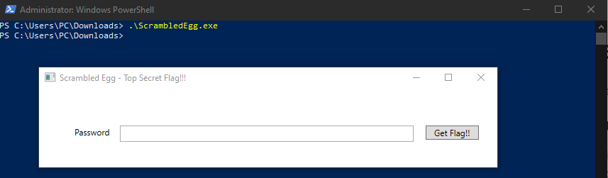
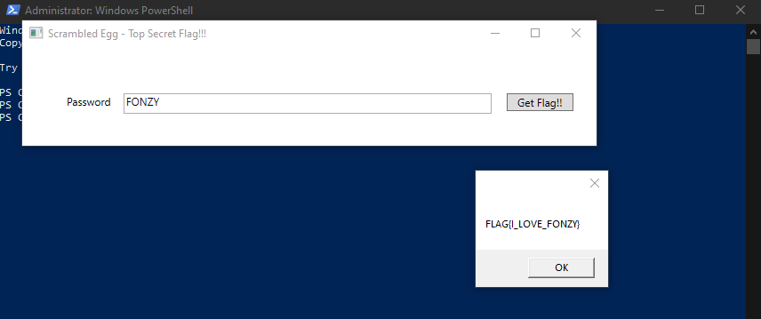

# I love this guy
##### https://cybertalents.com/challenges/malware/i-love-this-guy

### Try to run the exe 



Get the file info via `exiftool ScrambledEgg.exe `
*You can find the output in [Info](Info.txt) file* 
Dump file strings with `strings ScrambledEgg.exe `
*You can find the output in [strings](Strings.txt) file* 
Via analyzing strings file we found interesting keywords.
```
.NETFramework,Version=v4.6.1
FrameworkDisplayName
clr-namespace:FirstWPFApp
c:\users\fady\source\repos\FirstWPFApp\FirstWPFApp\obj\Release\FirstWPFApp.pdb
Get Flag!!
Password
```
Based on the keywords this code is developed in C#

### Analyze with dotpeak
*You can find the full code in [main](main.cs) file*
```java
private void Button_Click(object sender, RoutedEventArgs e)
{
    if (!this.TextBox1.Text.Equals(new string(new char[5]
    {
        this.Letters[5],  // 'F'
        this.Letters[14], // 'O'
        this.Letters[13], // 'N'
        this.Letters[25], // 'Z'
        this.Letters[24]  // 'Y'
    })))
        return;

    int num = (int) MessageBox.Show(new string(new char[18]
    {
        this.Letters[5],  // 'F'
        this.Letters[11], // 'L'
        this.Letters[0],  // 'A'
        this.Letters[6],  // 'G'
        this.Letters[26], // '{'
        this.Letters[8],  // 'I'
        this.Letters[28], // '_'
        this.Letters[11], // 'L' 
        this.Letters[14], // 'O'
        this.Letters[21], // 'V'
        this.Letters[4],  // 'E'
        this.Letters[28], // '_'
        this.Letters[5],  // 'F'
        this.Letters[14], // 'O'
        this.Letters[13], // 'N'
        this.Letters[25], // 'Z'
        this.Letters[24], // 'Y'
        this.Letters[27]  // '}'
    }));
}

```

It checks if the input is `FONZY` then prints `FLAG{I_LOVE_FONZY}`




>Find More on ==> github.com/MedhatHassan 