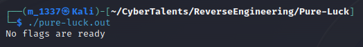
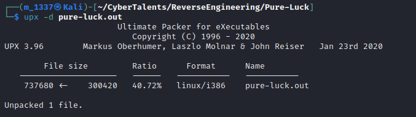

# Solve Pure Luck
##### https://cybertalents.com/challenges/malware/pure-luck
Try to run: 


Get the file info via `exiftool pure-luck`
*You can find the output in Info file* 
Dump file strings with `strings pure-luck`
*You can find the output in strings file* 
Via analyzing strings file we found `$Info: This file is packed with the UPX executable packer http://upx.sf.net $$Id: UPX 3.92 Copyright (C) 1996-2016 the UPX Team. All Rights Reserved. $`

UPX is `executable file compressor` 

Try to run UPX via `upx -d pure-luck.out` to unpack the file



##Analyze the file with ghidra:

The **Decompiled main** function:
```
undefined4 main(undefined4 param_1,undefined4 param_2)

{
  FILE *__stream;
  undefined4 uVar1;
  int in_GS_OFFSET;
  int local_3c;
  int local_38;
  int local_34;
  undefined local_2c;
  undefined local_2b;
  undefined local_2a;
  undefined local_29;
  undefined local_28;
  undefined local_27;
  undefined local_26;
  undefined local_25;
  undefined local_24;
  undefined local_23;
  undefined local_22;
  undefined local_21;
  undefined local_20;
  undefined local_1f;
  undefined local_1e;
  undefined local_1d;
  undefined local_1c;
  undefined local_1b;
  undefined local_1a;
  undefined local_19;
  undefined local_18;
  undefined local_17;
  undefined local_16;
  undefined local_15;
  int local_14;
  undefined4 *local_c;
  
  local_c = &param_1;
  local_14 = *(int *)(in_GS_OFFSET + 0x14);
  __stream = popen("/bin/date +\"%H %M %S\"","r");
  if (__stream == (FILE *)0x0) {
    printf("unexpected error ");
    uVar1 = 0xffffffff;
  }
  else {
    __isoc99_fscanf(__stream,"%d%d%d");
    local_2c = 0x66;
    local_2b = 0x6c;
    local_2a = 0x61;
    local_29 = 0x67;
    local_28 = 0x7b;
    local_27 = 0x55;
    local_26 = 0x50;
    local_25 = 0x58;
    local_24 = 0x5f;
    local_23 = 0x69;
    local_22 = 0x73;
    local_21 = 0x5f;
    local_20 = 0x73;
    local_1f = 0x6f;
    local_1e = 0x5f;
    local_1d = 0x65;
    local_1c = 0x61;
    local_1b = 0x61;
    local_1a = 0x61;
    local_19 = 0x61;
    local_18 = 0x73;
    local_17 = 0x79;
    local_16 = 0x79;
    local_15 = 0x7d;
    pclose(__stream);
    if (((local_3c == local_38) && (local_38 == local_34)) && (local_3c == local_34)) {
      printf("%s",&local_2c);
    }
    else {
      printf("No flags are ready");
    }
    uVar1 = 0;
  }
  if (local_14 != *(int *)(in_GS_OFFSET + 0x14)) {
                    /* WARNING: Subroutine does not return */
    __stack_chk_fail();
  }
  return uVar1;
}
```
Frist hex value of local2c is `0x66` if we convert it into char we get `f`
From lab description flag format : `flag{}`
we convert all values and combine1 them in one string via python.
*You can find the script in flag.py*
>Find More on ==> github.com/MedhatHassan