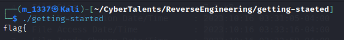

# Solve Getting started
##### https://cybertalents.com/challenges/malware/getting-started
Try to run: 

Get the file info via `exiftool getting-started`
*You can find the output in Info file* 
Dump file strings with `strings getting-started`
*You can find the output in strings file* 
Via analyzing strings file we found GCC info:`GCC: (Ubuntu 5.4.0-6ubuntu1~16.04.4) 5.4.0 20160609` and the flag string :`j}j1j_jljejvjejlj_jojtj_jejmjojcjljejwj{jgjajljf`

From lab description flag format : `flag{}`
we remove j (rubbish data) from the flag and reverse it.
*You can find the script in flag.py*
>Find More on ==> github.com/MedhatHassan