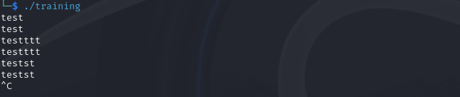

# Solve training
#### https://cybertalents.com/challenges/malware/training

### Try to run


Get the file info via `exiftool training`
*You can find the output in [Info](Info.txt) file* 
Dump file strings with `strings training`
*You can find the output in [strings](Strings.txt) file* 
Via analyzing strings file we found interesting keywords.
```
/lib64/ld-linux-x86-64.so.2
libstdc++.so.6
GCC: (Ubuntu 7.3.0-16ubuntu3) 7.3.0
```
The program is developed in C/C++

## Analyze with ghidra

### Main function
```c
void processEntry entry(undefined8 param_1,undefined8 param_2)

{
  undefined auStack_8 [8];
  
  __libc_start_main(FUN_0010159d,param_2,&stack0x00000008,FUN_00102670,FUN_001026e0,param_1,
                    auStack_8);
  do {
                    /* WARNING: Do nothing block with infinite loop */
  } while( true );
}
```
Main start and call FUN_0010159d then infinite loop to keep the program running.

I tried to smplify all the codes to preveiw the Raw functions check *[RowFunctions.md](RowFunctions.md)*


### processInput (FUN_0010159d) function

```c
undefined8 processInput(void)
{
  bool inputValid;
  char compareResult;
  long *inputPointer;
  basic_ostream *outputStream;
  long stackOffset;
  allocator<char> charAllocator;
  basic_string inputString [32];
  basic_string processedString [32];
  basic_string<> compareString [32];
  basic_string outputString [40];
  long stackCheck;
  
  stackCheck = *(long *)(stackOffset + 0x28);
  basic_string();
  
  // Initialize processing
  initializeProcessing();
  
  while (true) {
    // Read input
    inputPointer = (long *) >>((basic_istream *)std::cin, inputString);
    
    // Check if input is valid
    inputValid = std::basic_ios::operator.cast.to.bool ((basic_ios *)((long)inputPointer + *(long *)(*inputPointer + -0x18)));
    if (!inputValid) break;
    
    // Process input
    basic_string(processedString);
    processString(compareString, processedString);
    
    // Compare processed string
    compareResult = compareStrings(compareString, &DAT_003046a0);
    if (compareResult == '\0') {
      basic_string(outputString);
    } else {
      std::allocator<char>::allocator();
      basic_string((char *)outputString, (allocator *)"correct");
    }
    
    // Output result
    outputStream = <<((basic_ostream *)std::cout, outputString);
    std::basic_ostream<>::operator<<((basic_ostream<> *)outputStream, std::endl<>);
    
    // Clean up
    ~basic_string((basic_string<> *)outputString);
    if (compareResult != '\0') {
      std::allocator<char>::~allocator(&charAllocator);
    }
    ~basic_string(compareString);
    ~basic_string((basic_string<> *)processedString);
  }
  
  // Clean up input string
  ~basic_string((basic_string<> *)inputString);
  
  // Check stack integrity
  if (stackCheck != *(long *)(stackOffset + 0x28)) {
    __stack_chk_fail();
  }
  
  return 0;
}
```

#### initializeProcessing (FUN_0010130a) Function
```c
void FUN_0010130a(void)
{
  long in_FS_OFFSET;
  int j;
  uint i;
  int k;
  long local_10;
  
  local_10 = *(long *)(in_FS_OFFSET + 40);
  for (i = 2; (int)i < 1024; i = i + 1) {
    (&DAT_00304280)[(int)i] = (i & 1) != 0;
  }
  for (j = 3; j < 1024; j = j + 2) {
    if ((&DAT_00304280)[j] != '\0') {
      FUN_001019d0(&DAT_00304260,&j);//Dumy function
      for (k = j * j; k < 1024; k = k + j) {
        (&DAT_00304280)[k] = 0;
      }
    }
  }
  if (local_10 != *(long *)(in_FS_OFFSET + 40)) {
                    /* WARNING: Subroutine does not return */
    __stack_chk_fail();
  }
  return;
}
```

#### compareStrings (FUN_00101a6c) function
```c
undefined8 FUN_00101a6c(void)

{
  int iVar1;
  long lVar2;
  long lVar3;
  undefined8 uVar4;
  undefined8 uVar5;
  undefined8 uVar6;
  
  lVar2 = std::__cxx11::basic_string<>::size();
  lVar3 = std::__cxx11::basic_string<>::size();
  if (lVar2 == lVar3) {
    uVar4 = std::__cxx11::basic_string<>::size();
    uVar5 = std::__cxx11::basic_string<>::data();
    uVar6 = std::__cxx11::basic_string<>::data();
    memcmpResult = FUN_001018bf(uVar6,uVar5,uVar4);
    if (memcmpResult == 0) {
      return 1;
    }
  }
  return 0;
}

```

### FUN_0010178e function
```c
void FUN_0010178e(int param_1,int param_2)

{
  long in_FS_OFFSET;
  allocator<char> local_21;
  long local_20;
  
  local_20 = *(long *)(in_FS_OFFSET + 0x28);
  if ((param_1 == 1) && (param_2 == 0xffff)) {
    std::ios_base::Init::Init((Init *)&DAT_00304680);
    __cxa_atexit(std::ios_base::Init::~Init,&DAT_00304680,&PTR_LOOP_00304008);
    std::allocator<char>::allocator();
                    /* try { // try from 0010180d to 00101811 has its CatchHandler @ 00101863 */
    std::__cxx11::basic_string<>::basic_string
              (&DAT_003046a0,(allocator *)"IQHR}nxio_vtvk_aapbijsr_vnxwbbmm{");
    std::allocator<char>::~allocator(&local_21);
    __cxa_atexit(std::__cxx11::basic_string<>::~basic_string,&DAT_003046a0,&PTR_LOOP_00304008);
    FUN_001019b4(&DAT_00304260);
    __cxa_atexit(FUN_0010261e,&DAT_00304260,&PTR_LOOP_00304008);
  }
  if (local_20 != *(long *)(in_FS_OFFSET + 0x28)) {
                    /* WARNING: Subroutine does not return */
    __stack_chk_fail();
  }
  return;
}

```


### encryption (FUN_001013db) function 
```c
basic_string *encryption(basic_string *result, ulong input)
{
  char currentChar;
  int tempVar1;
  char *charPtr;
  int *intPtr;
  byte *bytePtr;
  undefined *undefinedPtr;
  int localIndex;
  uint localSum;

  localIndex = 0;

  // Loop through each character in the input string
  while (charPtr = (char *)(input), *charPtr != '\0') {
    charPtr = (char *)(input);
    currentChar = *charPtr;

    // Get some integer value based on `localIndex`
    intPtr = (int *)GetIntValue(&DAT_00304260, (long)localIndex);
    localSum = *intPtr + (int)currentChar;

    charPtr = (char *)(input);
    currentChar = IsLowerCase((int)*charPtr);

    if (currentChar == '\0') {
      charPtr = (char *)(input);
      currentChar = IsUpperCase((int)*charPtr);
      if (currentChar == '\0') {
        charPtr = (char *)(input);
        tempVar1 = (int)*charPtr;
      } else {
        tempVar1 = 0x5a;  // 'Z'
      }
    } else {
      tempVar1 = 0x7a;  // 'z'
    }

    // Adjust `localSum` to wrap around within alphabet range
    while (tempVar1 < (int)localSum) {
      localSum = localSum - 0x1a;
    }

    charPtr = (char *)(input);
    if (*charPtr == '{') {
      localSum = 0x7d;  // '}'
    } else {
      charPtr = (char *)(input);
      if (*charPtr == '}') {
        localSum = 0x7b;  // '{'
      } else {
        charPtr = (char *)(input);
        currentChar = IsSpecialChar((int)*charPtr);
        if (currentChar == '\0') {
          bytePtr = (byte *)(input);
          localSum = (uint)*bytePtr;
        }
      }
    }

    undefinedPtr = (undefined *)(input);
    *undefinedPtr = (char)localSum;
    localIndex = localIndex + 1;
  }

  // Initialize result string
  std::__cxx11::basic_string<>::basic_string(result);
  return result;
}
```
Note: DAT_00304260 is `IQHR}nxio_vtvk_aapbijsr_vnxwbbmm{}` from `FUN_0010178e` function

If we try to Simulate the encryption on the input we will find it's type a rotation encryption
*You can find the Simulate of encryption in [Simulate.py](Simulate.py)*
Reverese the encryption with the hex key dumped from the program 
*You can find Reverese script in [rev.py](rev.py)*


### Resources
[memcmp documentation](https://cplusplus.com/reference/cstring/memcmp/)
[GetIntValue documentation](https://learn.microsoft.com/en-us/dotnet/api/microsoft.visualstudio.testtools.execution.icontextaccessor.getintvalue?view=visualstudiosdk-2022)


>Find More on ==> github.com/MedhatHassan 