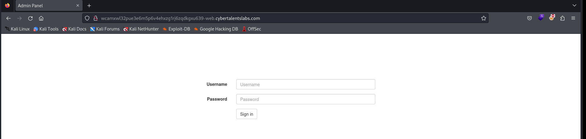
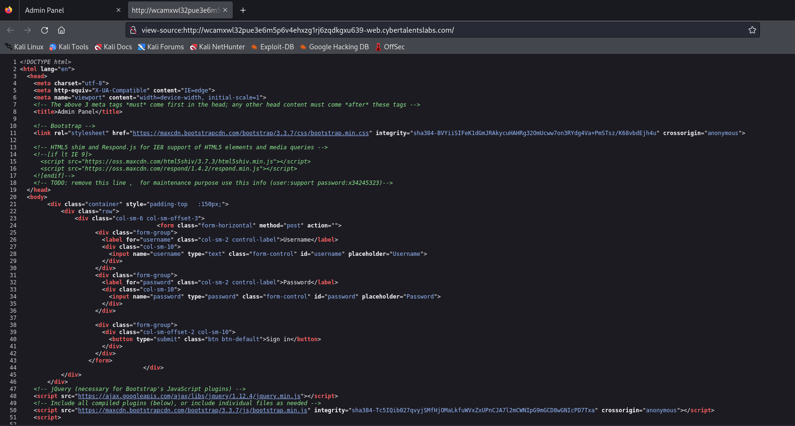
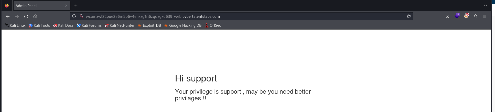
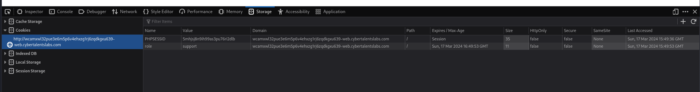
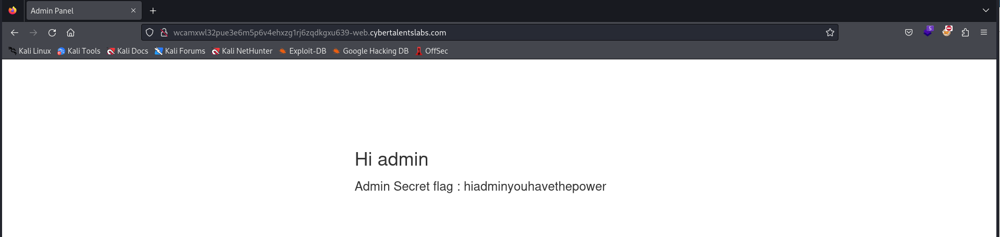

# Solve Admin has the power
### https://cybertalents.com/challenges/web/admin-has-the-power

#### By viewing the source code 

we found `user:support password:x34245323`

#### Login with support Credentials 

#### By reviewing the Cookies 

Change support into admin

flag `hiadminyouhavethepower`

>Find More on ==> github.com/MedhatHassan 