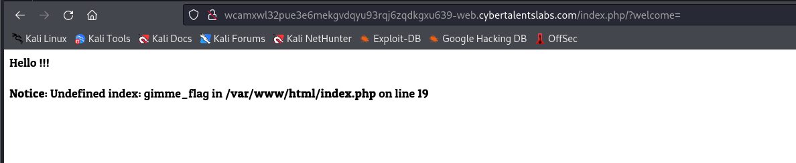
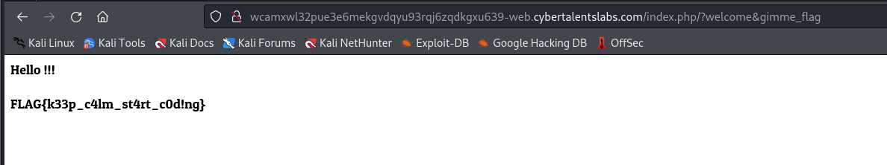

# Solve Cheers
##### https://cybertalents.com/challenges/web/cheers


### Run Directory bruteforce

```bash
dirsearch -u http://wcamxwl32pue3e6mekgvdqyu93rqj6zqdkgxu639-web.cybertalentslabs.com -x 403,404
```

No output 

in the error message the website has an error in **welcome** **parameter** 

### add welcome parameter 

```http
http://wcamxwl32pue3e6mekgvdqyu93rqj6zqdkgxu639-web.cybertalentslabs.com/index.php/?welcome=
```


in the error message the website has an error in **gimme_flag**  **parameter** 

### add welcome gimme_flag

```
http://wcamxwl32pue3e6mekgvdqyu93rqj6zqdkgxu639-web.cybertalentslabs.com/index.php/?welcome&gimme_flag
```



Run Directory bruteforce