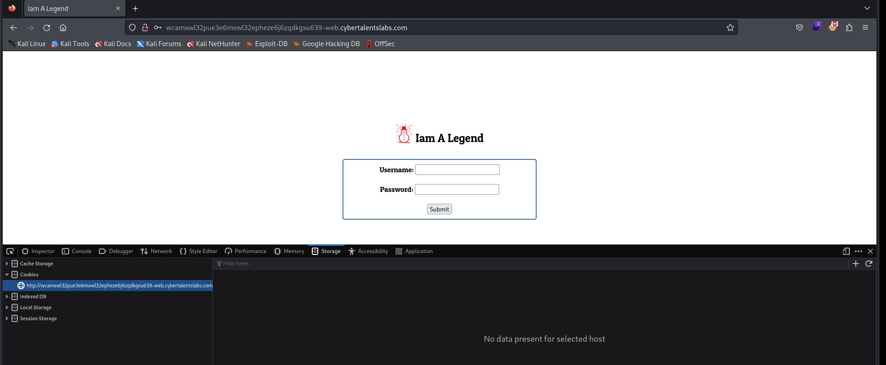

# Solve I am legend 
### https://cybertalents.com/challenges/web/iam-legend


#### Directory bruteforce with dirsearech
`dirsearch -u http://wcamxwl32pue3e6mxwl32epheze6j6zqdkgxu639-web.cybertalentslabs.com/ -x 404,403`

No dircetories found !!

#### Analyize the request with burp 
```
POST / HTTP/1.1
Host: wcamxwl32pue3e6mxwl32epheze6j6zqdkgxu639-web.cybertalentslabs.com
User-Agent: Mozilla/5.0 (X11; Linux x86_64; rv:109.0) Gecko/20100101 Firefox/115.0
Accept: text/html,application/xhtml+xml,application/xml;q=0.9,image/avif,image/webp,*/*;q=0.8
Accept-Language: en-US,en;q=0.5
Accept-Encoding: gzip, deflate
Origin: http://wcamxwl32pue3e6mxwl32epheze6j6zqdkgxu639-web.cybertalentslabs.com
Connection: close
Referer: http://wcamxwl32pue3e6mxwl32epheze6j6zqdkgxu639-web.cybertalentslabs.com/
Upgrade-Insecure-Requests: 1
Content-Type: application/x-www-form-urlencoded
Content-Length: 19

user=test&pass=test

```
#### In the source code we found obfuscated JS code 
*The obfuscated code in [JS](js.txt) file*

Flag -> `FLAG{J4V4_Scr1Pt_1S_S0_D4MN_FUN}`

>Find More on ==> github.com/MedhatHassan 