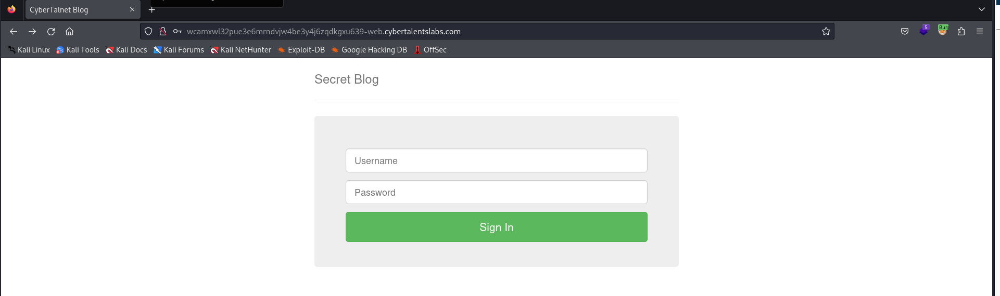
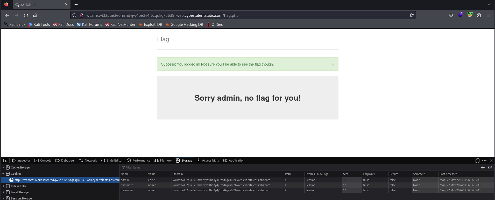
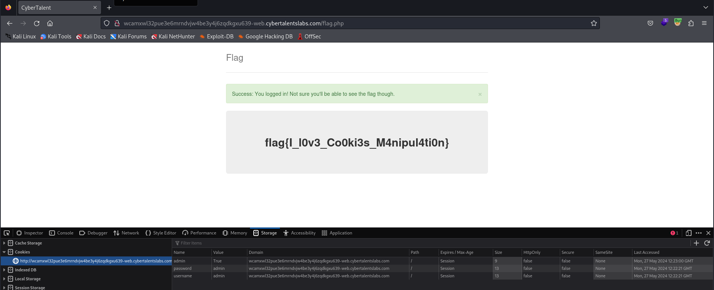

# Solve Secret Blog
#### https://cybertalents.com/challenges/web/secret-blog


### try ro login with admin 
username: admin
pawword: admin


### directory brute force with dirsearech
`dirsearch -u http://wcamxwl32pue3e6mle435rka8v5xj6zqdkgxu639-web.cybertalentslabs.com/ -x 404,403`
Output:
```bash
200 -  560B  - /flag.php                                         
302 -    0B  - /login.php  ->  ./flag.php  
```

### Change admin value to `True` in the cookies


>Find More on ==> github.com/MedhatHassan 