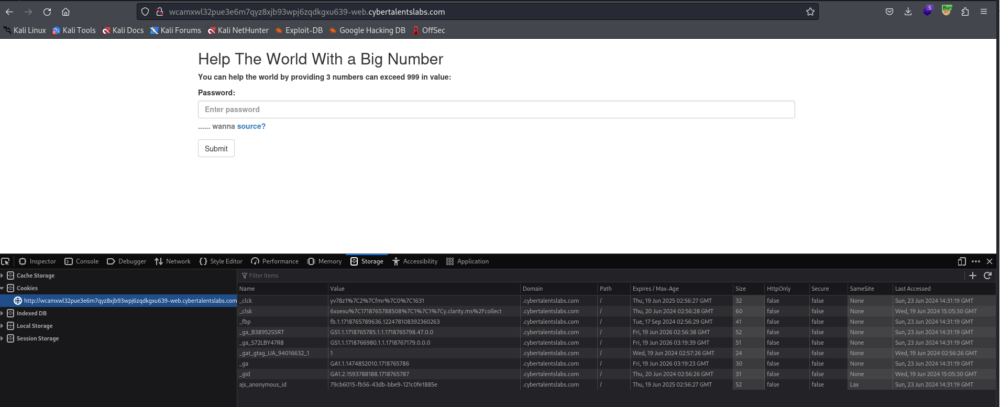
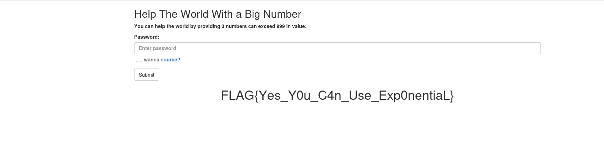

# Solve big-number
#### https://cybertalents.com/challenges/web/big-number


### Run Directory bruteforce
`dirsearch -u http://wcamxwl32pue3e6m7qyz8xjb93wpj6zqdkgxu639-web.cybertalentslabs.com -x 403,404`
*you can find the output in [Directories.txt](Directories.txt)*

```php
 <?php if (isset($_GET['password'])) {
    if (is_numeric($_GET['password'])){
        if (strlen($_GET['password']) < 4){
            if ($_GET['password'] > 999)
                die($flag);
            else
                print 'Too little';
        } else
                print 'Too long';
    } else
        print 'Password is not numeric';
}
?> 
```

To print the flag `password` must be less than **4** digits and it's value is more than **999**.

And in php we have the notation of `1e` Where:
```txt
1e is a scientific notation used for numbers
1000 = 10^3 = 1 * 10^3 = 1 e3

Also this ->
100 == 1e2
300 == 3e2
5000 == 5e3
```
Use `password` = `1e3`


>Find More on ==> github.com/MedhatHassan 
