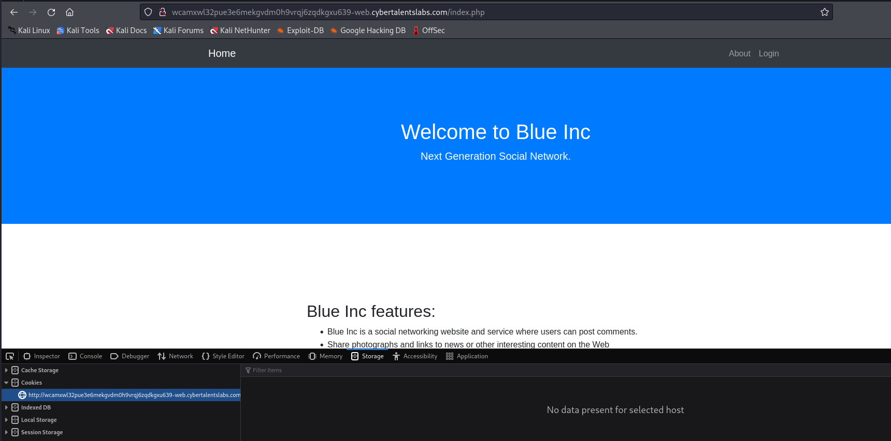
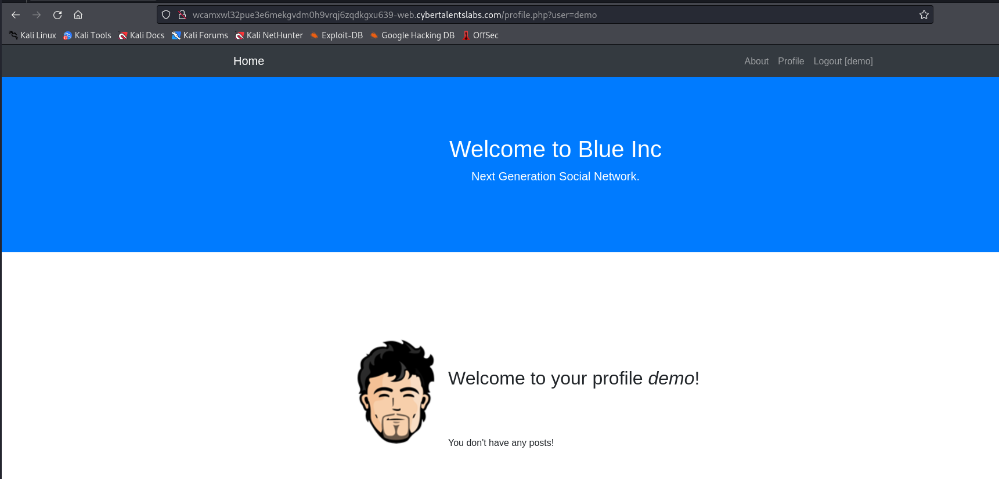
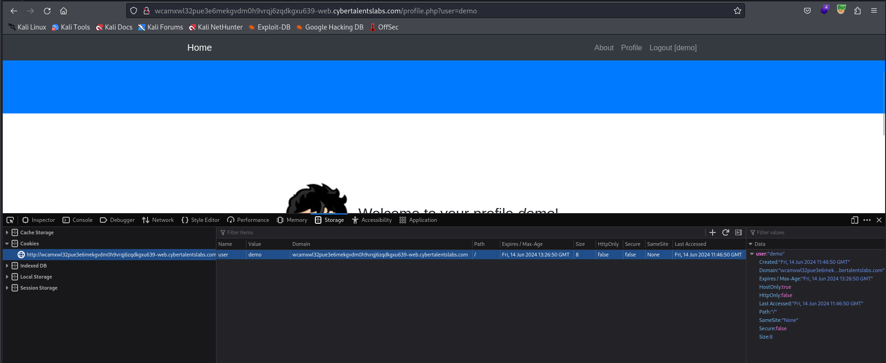

# Solve blue-inc
#### http://wcamxwl32pue3e6mekgvdm0h9vrqj6zqdkgxu639-web.cybertalentslabs.com

Description: 
Blue Inc is a new social media website that's still under construction, However it doesn't have registration yet, but if you are interested in seeing our website then you can login with **demo/demo**.

### Run Directory bruteforce

`dirsearch -u http://wcamxwl32pue3e6mekgvdm0h9vrqj6zqdkgxu639-web.cybertalentslabs.com -x 403,404`
*you can find the output in [Directories.txt](Directories.txt)*

### Try login with demo/demo

### Analyze cookies 

Change the value to admin 

>Find More on ==> github.com/MedhatHassan 
