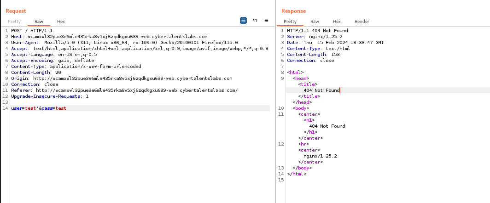
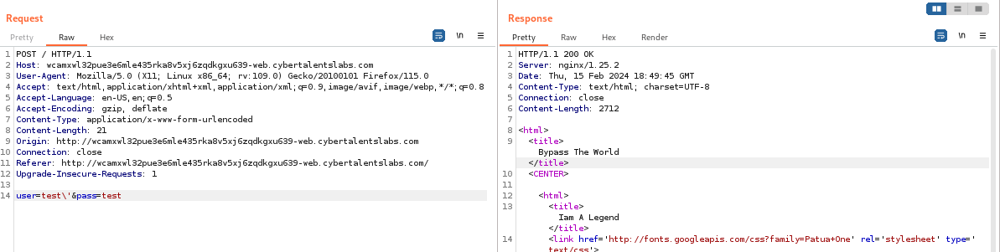
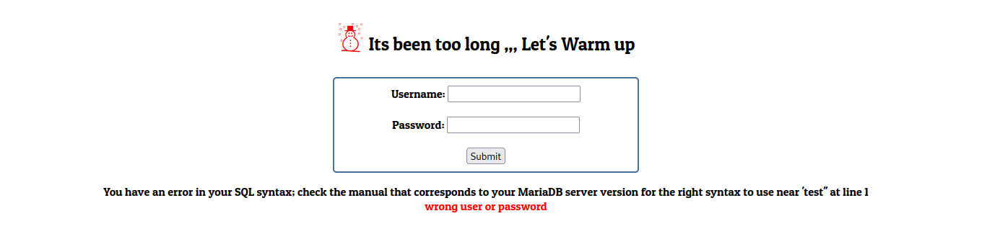

# Solve bypass the world
##### https://cybertalents.com/challenges/web/bypass-the-world


We have white box challenge
*the source code in source.php*

##### By directory brute force with dirsearech
`dirsearch -u http://wcamxwl32pue3e6mle435rka8v5xj6zqdkgxu639-web.cybertalentslabs.com/ -x 404,403` we found only index.php

##### By causing error in the application we found 

server -> `nginx/1.14.2` 

##### By reviewing the source code of backend 
`preg_replace(patterns, replacements, input, limit, count)`
using of `preg_replace` to remove single quotes `'` from the `$name` variable.

Blocked inputs:
 - any number of '
 - URL encoded payloads
 - dual URL encoding  
 - ASCII encoding
 - UTF-16
 - Percent Encoding
  
#### We try to use escape character
In PHP the escape character is the backslash `\`. The backslash is used to escape special characters in strings. When you precede a special character with a backslash, it is treated as a literal character rather than its special meaning.

Common escape sequences in PHP include:
- `\\` for a literal backslash
- `\"` for a literal double quote
- `\'` for a literal single quote
- `\n` for a newline
- `\t` for a tab
- `\r` for a carriage return

*More about escape characters [stackoverflow](https://stackoverflow.com/questions/767714/how-to-escape-in-php-using-preg-replace)*
##### try to use it 

**it bypassed!!!**

database -> `MariaDB`
Payload: 
```SELECT * FROM users where name=\' AND password=OR 1=1# ```
Note that in PHP `$var` put the strings between '' 
The full sql query:
``` sql
    SELECT * FROM users where name = ''' and password = 'OR 1=1#'
```
Note that we Skiped `and password =` as string So MariaDB will understand it as string(any value) OR 1=1 so it will return `true`.  

>Find More on ==> github.com/MedhatHassan 