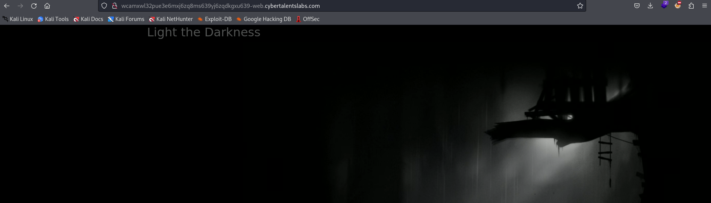

# Solve darkside
#### https://cybertalents.com/challenges/web/darkside


### Run Directory bruteforce
`dirsearch -u http://wcamxwl32pue3e6mxj6zq8ms639yj6zqdkgxu639-web.cybertalentslabs.com -x 403,404`

No output

### Analyze the source code 
I found JS file `disable.js`
```js
document.addEventListener('contextmenu', function(e) {
    e.preventDefault();
    alert('NO NO NO ;)');
});

// FLAG{OkaY_I_FailEd_tO_kEEp_yOu_awAy_hEre_iS_yOur_fLAg}
```

flag : FLAG{OkaY_I_FailEd_tO_kEEp_yOu_awAy_hEre_iS_yOur_fLAg}

>Find More on ==> github.com/MedhatHassan 
