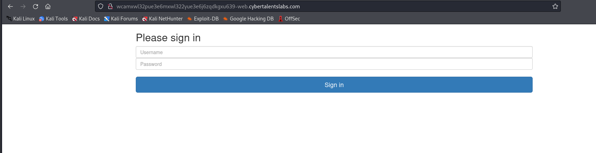
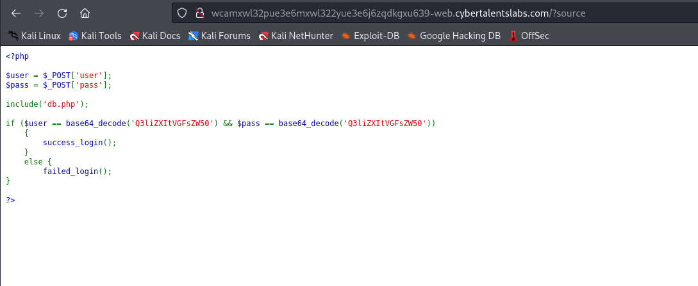
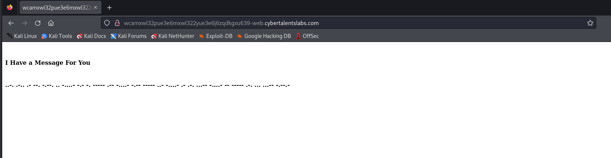

# Solve easy-message
#### https://cybertalents.com/challenges/web/easy-message


### Run Directory bruteforce
`dirsearch -u http://wcamxwl32pue3e6mxwl322yue3e6j6zqdkgxu639-web.cybertalentslabs.com -x 403,404`
*you can find the output in [Directories.txt](Directories.txt) *

We found `robots.txt`
`curl http://wcamxwl32pue3e6mxwl322yue3e6j6zqdkgxu639-web.cybertalentslabs.com/robots.txt`

We found
```
User-agent: *
Disallow: /?source
```
### Analyze /?source


```php
<?php

$user = $_POST['user'];
$pass = $_POST['pass'];

include('db.php');

if ($user == base64_decode('Q3liZXItVGFsZW50') && $pass == base64_decode('Q3liZXItVGFsZW50'))
    {
        success_login();
    }
    else {
        failed_login();
}

?> 

```
The Backend code checks if user and password **base64** encoded values = Q3liZXItVGFsZW50

#### Base64 decode 
`hURL -b "Q3liZXItVGFsZW50"` -> Cyber-Talent

### Login with Cyber-Talent/Cyber-Talent


```
..-. .-.. .- --. -.--. .. -....- -.- -. ----- .-- -....- -.-- ----- ..- -....- .- .-. ...-- -....- -- ----- .-. ... ...-- -.--.- 
```

We got morse code 

decrypted -> FLAG(I-KN0W-Y0U-AR3-M0RS3)

### Resources
[morse-code decrypter](https://www.dcode.fr/morse-code)

>Find More on ==> github.com/MedhatHassan 
