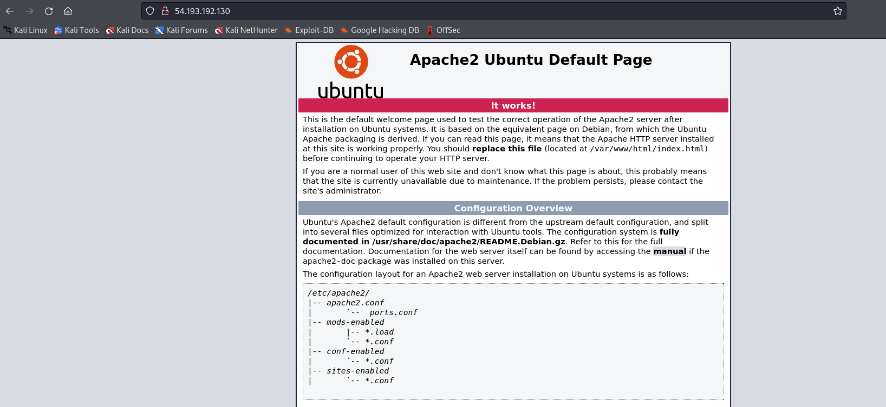

# Solve hidden
#### https://cybertalents.com/challenges/web/hidden

### Run Directory bruteforce
`dirsearch -u http://54.193.192.130/ -x 403,404`
*you can find the output in [Directories.txt](Directories.txt)*

The flag is directory name : secret

>Find More on ==> github.com/MedhatHassan 
