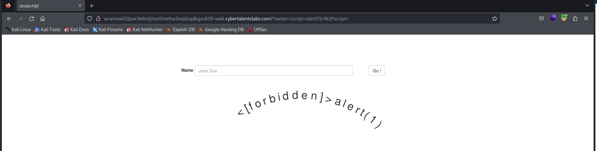
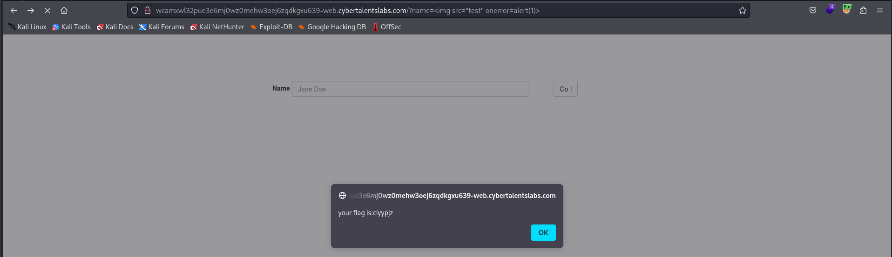

We find that our input reflected in the page 
We Try XXS normal payload `<script>alert(1)</script>`

But we gety the output 


We found a obfuscated Function in source code 
*you can find it in [JS](js.txt) file*

```
var deobfuscatedFunction = function(p,a,c,k,e,d){
    e = function(c){
        return (c < a ? '' : e(parseInt(c/a))) + ((c = c % a) > 35 ? String.fromCharCode(c + 29) : c.toString(36))
    };
    if (!''.replace(/^/,String)){
        while (c--){
            d[e(c)] = k[c] || e(c);
        }
        k = [function(e){return d[e]}];
        e = function(){return '\\w+'};
        c = 1;
    }
    while (c--){
        if (k[c]){
            p = p.replace(new RegExp('\\b' + e(c) + '\\b', 'g'), k[c]);
        }
    }
    return p;
};

```

Try XSS payload ``


The flag is ciyypjz

>Find More on ==> github.com/MedhatHassan 